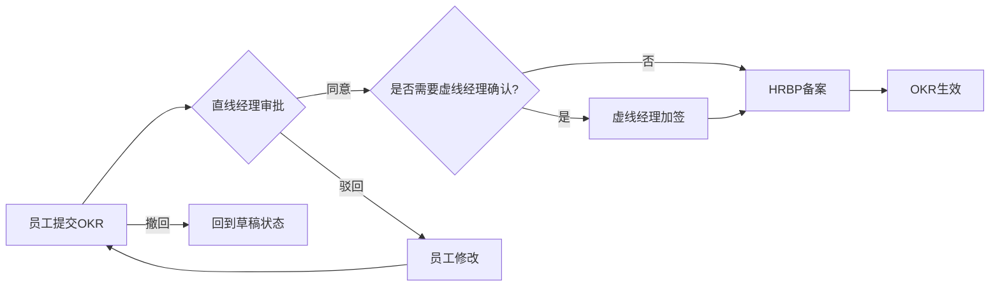

# 北森绩效云复刻 - OKR模块详细设计

**版本**: v1.0  
**最后更新**: 2026-05-17  
**关联主文档**: `files/beisen-performance-replication-plan.md`  
**适用对象**: 简道云管理员、HRBP、系统实施顾问

---

## 一、模块概述

OKR模块是北森绩效云中实现"敏捷管理"的核心载体，遵循 **PDCA（计划-执行-检查-处理）** 闭环，强调目标的挑战性与协同性。

### 1.1 功能全景

```
┌─────────────────────────────────────────────┐
│              OKR 模块功能树                   │
├──────────────────┬──────────────────────────┤
│   员工自助        │     管理配置              │
├──────────────────┼──────────────────────────┤
│ • 我的OKR        │ • OKR计划                │
│   - OKR制定      │ • OKR模板                │
│   - OKR审批      │ • OKR进度看板            │
│   - OKR协同      │ • OKR设置                │
│   - OKR地图      │ • 分目标审批             │
│   - 四象限复盘   │ • 多维权限管理           │
│ • OKR看板        │ • 进度自动更新           │
│   - 制定分析     │                          │
│   - 执行分析     │                          │
│   - 结果分析     │                          │
│ • 团队OKR        │                          │
└──────────────────┴──────────────────────────┘
```

---

## 二、数据模型设计

### 2.1 核心表单清单

| 表单名称 | 类型 | 说明 | 关键字段数 |
|---------|------|------|-----------|
| OKR周期表 | 普通表单 | 管理OKR周期（季度/半年度/年度） | 8 |
| OKR主表 | 流程表单 | 存储员工OKR主体信息 | 15 |
| KR子表 | 子表单 | 嵌入OKR主表，存储关键结果 | 8 |
| OKR对齐关系表 | 普通表单 | 记录OKR之间的对齐关系 | 6 |
| OKR审批记录表 | 普通表单 | 记录审批历史 | 7 |
| OKR评论表 | 普通表单 | 存储评论和@提及 | 8 |
| OKR任务表 | 普通表单 | O-KR-T任务管理体系 | 10 |
| OKR复盘表 | 流程表单 | 四象限复盘记录 | 12 |

### 2.2 OKR主表字段设计

```yaml
表单名称: OKR主表
表单类型: 流程表单

字段列表:
  - 字段名: okr_id
    类型: 流水号
    说明: OKR唯一标识
    规则: 自动生成，格式 OKR-YYYYMMDD-XXXX

  - 字段名: cycle_id
    类型: 关联字段
    关联表单: OKR周期表
    说明: 关联当前OKR所属周期

  - 字段名: employee_id
    类型: 成员字段
    说明: OKR所有者
    规则: 默认当前登录用户

  - 字段名: department_id
    类型: 部门字段
    说明: 所属部门
    规则: 自动从员工信息获取

  - 字段名: objective
    类型: 富文本
    说明: 目标描述（O）
    规则: 必填，最多500字

  - 字段名: kr_list
    类型: 子表单
    关联子表: KR子表
    说明: 关键结果列表
    规则: 至少2个KR，最多8个KR

  - 字段名: alignment_targets
    类型: 关联字段（多选）
    关联表单: OKR主表
    说明: 对齐的上级OKR
    规则: 可选，建议至少对齐1个

  - 字段名: visibility_scope
    类型: 多选
    选项: [全员可见, 仅上级可见, 指定人员可见]
    说明: 可见范围
    默认值: 全员可见

  - 字段名: specified_viewers
    类型: 成员字段（多选）
    说明: 指定可见人员
    显隐规则: 当visibility_scope="指定人员可见"时显示

  - 字段名: confidence_index
    类型: 单选
    选项: [高信心, 中信心, 低信心]
    说明: 信心指数
    默认值: 中信心

  - 字段名: risk_level
    类型: 单选
    选项: [无风险, 低风险, 中风险, 高风险]
    说明: 风险等级
    默认值: 无风险

  - 字段名: status
    类型: 单选
    选项: [草稿, 审批中, 已生效, 已驳回, 已撤回]
    说明: OKR状态
    默认值: 草稿

  - 字段名: electronic_signature
    类型: 签名
    说明: 电子签名
    显隐规则: 仅在"已生效"状态后显示

  - 字段名: signed_pdf
    类型: 附件
    说明: 签署后的PDF文件
    显隐规则: 智能助手生成后自动填充

  - 字段名: progress_percentage
    类型: 数字
    说明: 整体进度百分比
    规则: 自动计算（基于KR完成度加权平均）
    公式: SUM(KR权重 * KR完成度) / SUM(KR权重)
```

### 2.3 KR子表字段设计

```yaml
子表名称: KR子表
父表单: OKR主表

字段列表:
  - 字段名: kr_description
    类型: 文本
    说明: 关键结果描述
    规则: 必填，SMART原则校验

  - 字段名: kr_weight
    类型: 数字
    说明: KR权重（%）
    规则: 必填，所有KR权重之和必须=100

  - 字段名: kr_target_value
    类型: 数字
    说明: 目标值
    规则: 必填

  - 字段名: kr_current_value
    类型: 数字
    说明: 当前完成值
    规则: 可手动更新或通过智能助手自动同步

  - 字段名: kr_completion_rate
    类型: 数字
    说明: 完成度（%）
    规则: 自动计算 = (当前值 / 目标值) * 100
    上限: 100%

  - 字段名: kr_confidence
    类型: 单选
    选项: [高, 中, 低]
    说明: 该KR的信心指数

  - 字段名: kr_deadline
    类型: 日期
    说明: 截止日期

  - 字段名: kr_tasks
    类型: 关联字段（多选）
    关联表单: OKR任务表
    说明: 关联的任务列表
```

### 2.4 OKR对齐关系表

```yaml
表单名称: OKR对齐关系表
表单类型: 普通表单

字段列表:
  - 字段名: child_okr_id
    类型: 关联字段
    关联表单: OKR主表
    说明: 子OKR ID

  - 字段名: parent_okr_id
    类型: 关联字段
    关联表单: OKR主表
    说明: 父OKR ID

  - 字段名: alignment_type
    类型: 单选
    选项: [纵向对齐, 横向对齐]
    说明: 对齐类型

  - 字段名: created_by
    类型: 成员字段
    说明: 创建人

  - 字段名: created_time
    类型: 日期时间
    说明: 创建时间
    默认值: 当前时间

  - 字段名: status
    类型: 单选
    选项: [有效, 已解除]
    说明: 关系状态
```

---

## 三、流程设计

### 3.1 OKR审批流程



#### 流程节点配置

| 节点名称 | 节点类型 | 负责人规则 | 操作权限 | 限时处理 |
|---------|---------|-----------|---------|---------|
| 员工提交 | 填写节点 | 当前登录用户 | 新增/编辑/提交/撤回 | - |
| 直线经理审批 | 审批节点 | 直线经理（自动匹配） | 同意/驳回/加签/转交 | 3个工作日 |
| 虚线经理加签 | 审批节点（可选） | 虚线经理（手动选择） | 同意/驳回 | 2个工作日 |
| HRBP备案 | 填写节点 | HRBP（按部门分配） | 查看/备注 | - |
| OKR生效 | 系统节点 | - | 自动流转 | - |

#### 流转规则

| 规则名称 | 触发条件 | 执行动作 |
|---------|---------|---------|
| 权重校验 | 提交时 | 检查所有KR权重之和是否=100%，否则阻止提交 |
| SMART校验 | 提交时 | 检查O和KR是否符合SMART原则（通过前端事件提示） |
| 对齐提醒 | 提交时 | 若未对齐任何上级OKR，弹出提醒但不阻止提交 |
| 防打扰合并 | 同一周期重复提交 | 若经理已有待办且未处理，不推送新待办 |
| 自动提醒 | 节点停留超过2天 | 发送IM提醒给当前处理人 |

### 3.2 OKR复盘流程


#### 四象限复盘字段

| 象限 | 字段名 | 说明 |
|------|--------|------|
| 第一象限 | keep_items | 继续保持的事项 |
| 第二象限 | stop_items | 需要停止的事项 |
| 第三象限 | start_items | 需要开始的事项 |
| 第四象限 | improve_items | 需要改进的事项 |

---

## 四、权限设计

### 4.1 多维权限管理体系

北森支持三级权限体系：**系统预置 / HR自定义 / 员工临时指定**

#### 权限层级

| 权限层级 | 控制主体 | 配置位置 | 说明 |
|---------|---------|---------|------|
| L1: 系统预置 | 系统管理员 | OKR设置 > 全局权限 | 默认权限规则，适用于全员 |
| L2: HR自定义 | HRBP/HR管理员 | OKR设置 > 部门权限 | 按部门/岗位定制权限 |
| L3: 员工临时指定 | 员工本人 | OKR编辑页 > 可见范围 | 员工可临时调整单个OKR的可见性 |

#### 权限矩阵

| 角色 | 查看自己的OKR | 查看下属OKR | 查看同级OKR | 查看全员OKR | 编辑自己的OKR | 编辑下属OKR | 审批OKR |
|------|--------------|------------|------------|------------|--------------|------------|--------|
| 员工 | ✓ | - | 取决于可见范围 | 取决于可见范围 | ✓（草稿状态） | - | - |
| 直线经理 | ✓ | ✓ | 取决于可见范围 | 取决于可见范围 | - | - | ✓ |
| 虚线经理 | ✓ | 取决于可见范围 | 取决于可见范围 | 取决于可见范围 | - | - | 可选 |
| HRBP | ✓ | ✓（本部门） | ✓ | ✓ | - | - | 备案 |
| 系统管理员 | ✓ | ✓ | ✓ | ✓ | - | - | - |

### 4.2 简道云权限组配置

```yaml
权限组1: 员工角色
  - 数据权限: 仅查看/编辑自己的OKR
  - 字段权限: 
    - 可查看: 所有字段
    - 可编辑: objective, kr_list, alignment_targets, visibility_scope（仅草稿状态）
    - 只读: status, approval_history, signed_pdf

权限组2: 直线经理角色
  - 数据权限: 查看本部门所有员工的OKR
  - 字段权限:
    - 可查看: 所有字段
    - 可编辑: confidence_index, risk_level（仅查看模式下的评论权限）
    - 审批权限: 同意/驳回/加签

权限组3: HRBP角色
  - 数据权限: 查看负责部门的所有OKR
  - 字段权限:
    - 可查看: 所有字段
    - 可编辑: 无（仅备案备注权限）

权限组4: 系统管理员角色
  - 数据权限: 查看所有OKR
  - 字段权限: 所有字段可编辑（用于数据纠错）
```

---

## 五、智能助手Pro配置

### 5.1 OKR进度自动更新

**场景**: 当KR关联的任务完成时，自动更新KR完成度

```yaml
智能助手名称: OKR进度自动更新
触发类型: 表单触发
触发条件: OKR任务表.任务状态 变更为 "已完成"

执行节点:
  1. 查询节点:
    - 查询对象: OKR主表
    - 查询条件: okr_id = {{触发记录.关联OKR ID}}
    
  2. 计算节点:
    - 计算公式: 新完成度 = (原当前值 + 任务贡献值) / 目标值 * 100
    
  3. 更新节点:
    - 更新对象: OKR主表.KR子表
    - 更新字段: kr_current_value, kr_completion_rate
    
  4. 通知节点:
    - 通知方式: IM推送（飞书/钉钉）
    - 通知对象: OKR所有者
    - 消息内容: "您的OKR进度已自动更新至{{新完成度}}%"
```

### 5.2 OKR审批待办推送

**场景**: 员工提交OKR后，自动推送审批待办给直线经理

```yaml
智能助手名称: OKR审批待办推送
触发类型: 表单触发
触发条件: OKR主表.status 变更为 "审批中"

执行节点:
  1. 查询节点:
    - 查询对象: 员工信息表
    - 查询条件: employee_id = {{触发记录.employee_id}}
    - 获取字段: direct_manager_id（直线经理ID）
    
  2. HTTP请求节点:
    - 请求方式: POST
    - 请求URL: 飞书机器人Webhook地址
    - 请求体:
      {
        "msg_type": "interactive",
        "card": {
          "title": "OKR审批待办",
          "content": "{{employee_name}}提交了{{cycle_name}}周期的OKR，请及时审批",
          "actions": [
            {
              "type": "button",
              "text": "去审批",
              "url": "{{approval_link}}"
            }
          ]
        }
      }
      
  3. 写入节点:
    - 写入对象: OKR审批记录表
    - 写入内容: 记录推送时间和接收人
```

### 5.3 OKR到期提醒

**场景**: OKR周期结束前7天，提醒员工更新进度

```yaml
智能助手名称: OKR到期提醒
触发类型: 定时触发
触发频率: 每天上午9:00

执行节点:
  1. 查询节点:
    - 查询对象: OKR周期表
    - 查询条件: end_date = TODAY() + 7 days AND status = "进行中"
    
  2. 循环容器:
    - 循环对象: 查询结果集
    
    循环内执行:
      a. 查询节点:
        - 查询对象: OKR主表
        - 查询条件: cycle_id = {{当前周期ID}} AND status = "已生效"
        
      b. 循环容器:
        - 循环对象: 该周期下所有OKR
        
        循环内执行:
          i. HTTP请求节点:
            - 推送IM提醒给OKR所有者
            - 消息内容: "您的{{cycle_name}}周期OKR将在7天后结束，请及时更新进度"
```

---

## 六、仪表盘设计

### 6.1 OKR制定分析（经理视角）

**数据集**: 聚合表 OKR制定分析数据集

**图表组件**:

| 图表名称 | 图表类型 | 维度 | 指标 | 说明 |
|---------|---------|------|------|------|
| 按时提交率 | 饼图 | 部门 | 按时提交人数/总人数 | 监控各部门OKR制定进度 |
| 审批通过率 | 柱状图 | 部门 | 通过数/提交总数 | 评估OKR质量 |
| 平均KR数量 | 数字卡片 | - | AVG(KR数量) | 监控OKR粒度是否合理 |
| 对齐率 | 进度条 | - | 已对齐OKR数/总OKR数 | 战略贯通程度 |
| 制定进度趋势 | 折线图 | 日期 | 累计提交数 | 跟踪制定阶段进展 |

### 6.2 OKR执行分析（经理视角）

**数据集**: 聚合表 OKR执行分析数据集

**图表组件**:

| 图表名称 | 图表类型 | 维度 | 指标 | 说明 |
|---------|---------|------|------|------|
| 信心指数分布 | 饼图 | 信心等级 | OKR数量 | 识别风险OKR |
| 进度分布 | 直方图 | 进度区间(0-25%/25-50%/50-75%/75-100%) | OKR数量 | 监控整体执行情况 |
| 高风险OKR列表 | 表格 | OKR标题/所有者/进度/风险等级 | - | 重点关注对象 |
| 部门进度对比 | 雷达图 | 部门 | 平均进度% | 跨部门对比 |
| 进度更新频率 | 折线图 | 日期 | 更新次数 | 评估过程管理活跃度 |

### 6.3 OKR结果分析（经理视角）

**数据集**: 聚合表 OKR结果分析数据集

**图表组件**:

| 图表名称 | 图表类型 | 维度 | 指标 | 说明 |
|---------|---------|------|------|------|
| 完成率分布 | 直方图 | 完成率区间 | OKR数量 | 评估目标达成情况 |
| 挑战度分析 | 散点图 | X轴:目标值 Y轴:完成值 | - | 识别高挑战高完成OKR |
| 优秀OKR案例 | 卡片列表 | OKR标题/完成率/评语 | - | 最佳实践分享 |
| 与绩效关联度 | 相关系数图 | OKR完成率 vs 绩效等级 | 相关系数 | 验证软连接效果 |

---

## 七、关键场景方案

### 7.1 OKR与绩效软连接

**需求**: OKR完成度不直接等同于绩效分数，但作为绩效评价的输入

**实现方案**:

1. **数据隔离**: OKR表和绩效表独立，不直接关联得分
2. **参考引用**: 在绩效评估环节，经理可查看下属OKR完成度作为评分参考
3. **定性评价**: 经理在绩效评语中需说明OKR执行情况对绩效的影响
4. **权重配置**: 若企业希望量化关联，可在绩效模板中设置"OKR完成度"考核项，权重建议≤20%

### 7.2 OKR批量复制

**需求**: 员工可复制上一周期OKR，减少重复劳动

**实现方案**:

1. **复制按钮**: 在OKR列表页添加"批量复制"按钮
2. **智能助手逻辑**:
   ```yaml
   触发类型: 自定义按钮触发
   触发条件: 员工点击"批量复制"
   
   执行节点:
     1. 查询节点:
       - 查询对象: OKR主表
       - 查询条件: employee_id = {{当前用户}} AND cycle_id = {{上一周期ID}}
       
     2. 循环容器:
       - 循环对象: 查询结果集
       
       循环内执行:
         a. 新增节点:
           - 新增对象: OKR主表
           - 新增内容: 复制O和KR，清空进度和状态
           - 设置: cycle_id = {{当前周期ID}}, status = "草稿"
           
         b. 对齐继承:
           - 若原OKR有对齐关系，自动复制到新OKR
   ```

### 7.3 OKR地图可视化

**需求**: 图形化展示OKR对齐关系

**实现方案**:

1. **简道云原生方案**: 使用层级视图展示父子OKR关系（受限，仅展示树形结构）
2. **二开方案**（推荐）:
   - 开发自定义前端页面，使用 D3.js 或 ECharts 绘制力导向图
   - 调用简道云 API 获取OKR对齐关系数据
   - 支持缩放、拖拽、点击查看详情
   - 嵌入简道云仪表盘（通过iframe）

---

## 八、电子签署功能

### 8.1 签署流程


### 8.2 技术实现

**前置条件**: 简道云企业版及以上（支持自定义打印模板和API）

**步骤**:

1. **配置打印模板**:
   - 进入"打印模板" > "新建模板"
   - 选择Excel/Word模板，设计OKR目标书格式
   - 插入签名字段和图片占位符

2. **智能助手配置**:
   ```yaml
   触发类型: 表单触发
   触发条件: OKR主表.status 变更为 "已生效"
   
   执行节点:
     1. HTTP请求节点:
       - 请求方式: POST
       - 请求URL: 二开服务API地址 /api/generate-okr-pdf
       - 请求体:
         {
           "okr_id": "{{okr_id}}",
           "template_id": "OKR_TEMPLATE_001",
           "signature_image": "{{electronic_signature}}"
         }
         
     2. 等待节点:
       - 等待时长: 5秒（等待PDF生成）
       
     3. 更新节点:
       - 更新对象: OKR主表
       - 更新字段: signed_pdf = {{API返回的PDF URL}}
       
     4. 通知节点:
       - 推送IM消息给员工和经理
   ```

3. **二开服务代码**（Node.js示例）:
   ```javascript
   // /api/generate-okr-pdf
   app.post('/generate-okr-pdf', async (req, res) => {
     const { okr_id, template_id, signature_image } = req.body;
     
     // 1. 调用简道云API获取OKR数据
     const okrData = await jiandaoyun.getData('okr_main', okr_id);
     
     // 2. 使用PDF库生成带签名的PDF
     const pdfBuffer = await generatePDF(okrData, template_id, signature_image);
     
     // 3. 上传PDF到简道云附件存储
     const pdfUrl = await jiandaoyun.uploadAttachment(pdfBuffer);
     
     // 4. 返回PDF URL
     res.json({ pdf_url: pdfUrl });
   });
   ```

---

## 九、多语言配置

### 9.1 字段设计

为支持中英文切换，需为每个文本字段创建双语版本：

| 中文字段 | 英文字段 | 说明 |
|---------|---------|------|
| objective | objective_en | 目标描述 |
| kr_description | kr_description_en | KR描述 |
| keep_items | keep_items_en | 复盘中继续保持事项 |
| stop_items | stop_items_en | 复盘中需停止事项 |
| start_items | start_items_en | 复盘中需开始事项 |
| improve_items | improve_items_en | 复盘中需改进事项 |

### 9.2 语言切换实现

**方案**: 通过用户偏好表 + 前端事件动态显示

1. **用户偏好表**:
   ```yaml
   表单名称: 用户偏好表
   字段:
     - user_id: 成员字段
     - preferred_language: 单选 [中文, English]
   ```

2. **前端事件配置**:
   ```javascript
   // 表单加载时执行
   const userLang = getUserPreferredLanguage(); // 从用户偏好表读取
   
   if (userLang === 'English') {
     hideField('objective');
     showField('objective_en');
     hideField('kr_description');
     showField('kr_description_en');
     // ... 隐藏所有中文字段，显示英文字段
   } else {
     hideField('objective_en');
     showField('objective');
     hideField('kr_description_en');
     showField('kr_description');
     // ... 隐藏所有英文字段，显示中文字段
   }
   ```

---

## 十、IM集成配置

### 10.1 飞书集成

**配置步骤**:

1. **启用第三方集成**:
   - 进入"系统管理" > "第三方集成" > "飞书"
   - 授权简道云访问飞书API

2. **配置智能助手HTTP节点**:
   - 获取飞书机器人Webhook地址
   - 在智能助手中配置HTTP POST请求

3. **消息模板示例**:
   ```json
   {
     "msg_type": "interactive",
     "card": {
       "config": {
         "wide_screen_mode": true
       },
       "header": {
         "title": {
           "tag": "plain_text",
           "content": "OKR审批待办"
         },
         "template": "blue"
       },
       "elements": [
         {
           "tag": "div",
           "text": {
             "tag": "lark_md",
             "content": "**{{employee_name}}** 提交了 **{{cycle_name}}** 周期的OKR\n\n请尽快审批"
           }
         },
         {
           "tag": "action",
           "actions": [
             {
               "tag": "button",
               "text": {
                 "tag": "plain_text",
                 "content": "去审批"
               },
               "type": "primary",
               "url": "{{approval_link}}"
             }
           ]
         }
       ]
     }
   }
   ```

### 10.2 @提及功能

**实现**: 在消息内容中包含 `@user_id`

```json
{
  "content": "请 @ou_xxx123 审批OKR"
}
```

飞书会自动将 `@ou_xxx123` 渲染为可点击的用户链接。

---

## 十一、常见问题与解决方案

### 11.1 OKR权重之和不等于100%

**问题**: 员工提交的OKR中，KR权重之和不等于100%

**解决方案**:
- **前端校验**: 在提交按钮上绑定前端事件，实时计算权重之和
- **流程校验**: 在审批节点前添加"提交条件"，若权重≠100%则阻止提交
- **智能提醒**: 当员工修改KR权重时，实时显示当前权重总和

### 11.2 OKR对齐关系断裂

**问题**: 被对齐的上级OKR被删除，导致对齐关系断裂

**解决方案**:
- **删除保护**: 当员工尝试删除已被下级对齐的OKR时，系统弹出警告
- **自动通知**: 若上级OKR确实需要删除，系统自动通知所有下级OKR所有者
- **对齐重映射**: 提供"重新对齐"功能，让员工快速找到新的对齐目标

### 11.3 进度更新不及时

**问题**: 员工忘记更新OKR进度，导致看板数据失真

**解决方案**:
- **定时提醒**: 每周一定期推送进度更新提醒
- **自动同步**: 若KR关联了任务系统，通过智能助手自动同步任务进度
- **管理者督促**: 在看板中高亮显示"超过7天未更新"的OKR

---

## 十二、附录：字段映射表

### 12.1 北森字段 → 简道云字段映射

| 北森字段名 | 北森字段类型 | 简道云字段名 | 简道云字段类型 | 备注 |
|-----------|------------|-------------|--------------|------|
| Objective | 文本 | objective | 富文本 | 支持格式化 |
| Key Result | 子表 | kr_list | 子表单 | 嵌入主表 |
| Weight | 数字 | kr_weight | 数字 | 百分比 |
| Progress | 数字 | kr_completion_rate | 数字 | 自动计算 |
| Confidence | 枚举 | confidence_index | 单选 | 高/中/低 |
| Alignment | 关联 | alignment_targets | 关联字段 | 多选 |
| Visibility | 枚举 | visibility_scope | 多选 | 权限控制 |
| Status | 枚举 | status | 单选 | 状态机 |
| Signature | 签名 | electronic_signature | 签名 | 手写签名 |
| Comments | 评论 | - | 独立表单 | OKR评论表 |

---

**文档维护说明**:
- 本工作表为主文档 `files/beisen-performance-replication-plan.md` 的详细补充
- 每次字段/流程调整需同步更新版本号
- 所有飞书云文档需自动添加 Frank (ou_1e87f1890876b57a6f2ab437a3fce415) 为编辑协作者
