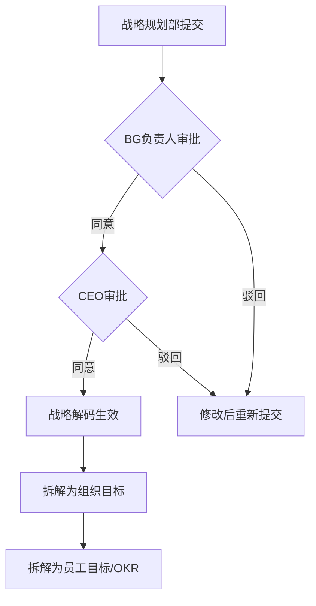
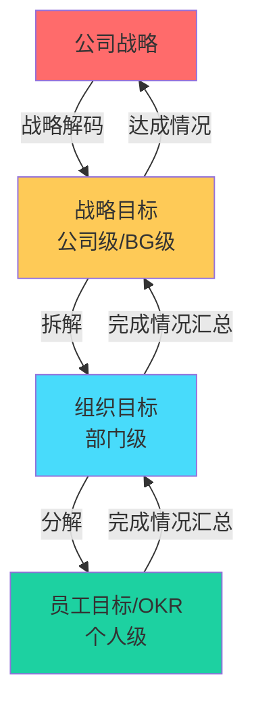

# 北森绩效云复刻 - 组织模块与战略解码详细设计

**版本**: v1.0  
**最后更新**: 2026-05-17  
**关联主文档**: `files/beisen-performance-replication-plan.md`  
**适用对象**: 简道云管理员、HRBP、战略规划部门

---

## 一、文档范围

本文档涵盖北森绩效云中的 **3大组织级模块**：
1. 组织目标模块
2. 组织绩效模块
3. 战略解码模块

---

## 二、组织目标模块

### 2.1 功能全景

```
┌─────────────────────────────────────────────┐
│           组织目标模块功能树                  │
├──────────────────┬──────────────────────────┤
│   组织目标计划    │     组织目标设置          │
├──────────────────┼──────────────────────────┤
│ • 制定计划       │ • 自动规则               │
│ • 添加制定组织   │ • 可见范围               │
│ • 设置自动规则   │ • 审批权限               │
│ • 开启监控       │ • 定量分配               │
│ • 下发目标       │ • 电子签                 │
│ • 设置代理人     │ • 沟通评论               │
│ • 更新负责人     │ • 字段映射               │
│ • 明细项管理     │                        │
│ • 导出名单       │                        │
│ • 电子签署       │                        │
│ • 导出目标书     │                        │
│ • 模板           │                        │
└──────────────────┴──────────────────────────┘
```

### 2.2 数据模型设计

#### 核心表单清单

| 表单名称 | 类型 | 说明 | 关键字段数 |
|---------|------|------|-----------|
| 组织目标周期表 | 普通表单 | 管理组织目标周期 | 8 |
| 组织目标主表 | 流程表单 | 存储组织目标主体信息 | 15 |
| 组织目标明细子表 | 子表单 | 嵌入主表，存储具体目标项 | 8 |
| 组织目标代理人表 | 普通表单 | 记录目标代理人信息 | 5 |
| 组织目标配置表 | 普通表单 | 存储配置项 | 10 |

#### 组织目标主表字段设计

```yaml
表单名称: 组织目标主表
表单类型: 流程表单

字段列表:
  - org_target_id: 流水号（组织目标ID）
  - cycle_id: 关联字段（关联组织目标周期表）
  - organization_id: 部门字段（所属组织）
  - responsible_person: 成员字段（目标负责人）
  - delegate_person: 成员字段（代理人，可选）
  - target_content: 富文本（目标内容）
  - target_items: 子表单（目标明细项列表）
  - alignment_targets: 关联字段（多选，对齐的上级目标）
  - weight: 数字（权重%）
  - target_value: 数字（目标值）
  - current_value: 数字（当前完成值）
  - completion_rate: 数字（完成度%，自动计算）
  - visibility_scope: 多选（可见范围）
  - status: 单选（草稿/审批中/已生效/已完成/已驳回）
  - electronic_signature: 签名（电子签名）
  - signed_pdf: 附件（签署后的PDF）
```

#### 组织目标明细子表字段设计

```yaml
子表名称: 组织目标明细子表
父表单: 组织目标主表

字段列表:
  - item_name: 文本（目标项名称）
  - item_weight: 数字（权重%）
  - target_value: 数字（目标值）
  - current_value: 数字（当前完成值）
  - completion_rate: 数字（完成度%，自动计算）
  - unit: 下拉（计量单位）
  - deadline: 日期（截止日期）
  - remarks: 文本域（备注）
```

### 2.3 关键功能实现

#### 2.3.1 设置代理人

**需求**: 目标负责人休假或离职时，由代理人接管

**实现方案**:

```yaml
表单名称: 组织目标代理人表
字段:
  - org_target_id: 关联组织目标主表
  - original_responsible: 成员字段（原负责人）
  - delegate_person: 成员字段（代理人）
  - start_date: 日期（代理开始日期）
  - end_date: 日期（代理结束日期，留空表示长期有效）
  - status: 单选（有效/已失效）

智能助手: 代理人权限自动生效
触发类型: 表单触发
触发条件: 组织目标代理人表.status 变更为 "有效"

执行节点:
  1. 更新节点:
    - 更新对象: 组织目标主表
    - 更新条件: org_target_id = {{org_target_id}}
    - 更新字段: delegate_person = {{delegate_person}}
    
  2. 通知节点:
    - 推送IM给代理人："您已被设置为{{目标内容}}的代理人"
```

#### 2.3.2 电子签署

同员工目标模块，参考 `files/beisen-target-detail.md` 中的电子签署章节。

#### 2.3.3 导出目标书

**实现方案**:
1. 配置打印模板（Word格式）
2. 智能助手触发PDF生成
3. 回传至signed_pdf字段
4. 提供"导出"按钮下载PDF

---

## 三、组织绩效模块

### 3.1 功能全景

```
┌─────────────────────────────────────────────┐
│           组织绩效模块功能树                  │
├──────────────────┬──────────────────────────┤
│   组织绩效活动    │     组织绩效设置          │
├──────────────────┼──────────────────────────┤
│ • 发起考核       │ • 组织待办类型           │
│ • 配置考核项     │ • 组织绩效模板           │
│ • 设置评价人     │ • 组织绩效流程           │
│ • 结果汇总       │ • 组织评价角色           │
│                  │ • 菜单及授权             │
└──────────────────┴──────────────────────────┘
```

### 3.2 数据模型设计

#### 核心表单清单

| 表单名称 | 类型 | 说明 | 关键字段数 |
|---------|------|------|-----------|
| 组织绩效周期表 | 普通表单 | 管理组织绩效周期 | 8 |
| 组织绩效主表 | 流程表单 | 存储组织绩效主体信息 | 12 |
| 组织绩效考核项子表 | 子表单 | 嵌入主表，存储考核指标 | 10 |
| 组织绩效评价记录表 | 普通表单 | 存储评价记录 | 8 |
| 组织绩效配置表 | 普通表单 | 存储配置项 | 10 |

#### 组织绩效主表字段设计

```yaml
表单名称: 组织绩效主表
表单类型: 流程表单

字段列表:
  - org_performance_id: 流水号
  - cycle_id: 关联字段（关联组织绩效周期表）
  - organization_id: 部门字段（所属组织）
  - assessment_items: 子表单（考核项列表）
  - total_score: 数字（总分，自动计算）
  - performance_grade: 单选（A/B/C/D）
  - evaluator_comments: 文本域（评价人评语）
  - status: 单选（待评估/评估中/已完成）
  - created_by: 成员字段（创建人）
  - created_time: 日期时间
  - completed_time: 日期时间（完成时间）
```

#### 组织绩效考核项子表字段设计

```yaml
子表名称: 组织绩效考核项子表
父表单: 组织绩效主表

字段列表:
  - indicator_name: 文本（指标名称）
  - indicator_type: 单选（财务类/客户类/内部流程类/学习成长类）
  - weight: 数字（权重%）
  - target_value: 数字（目标值）
  - actual_value: 数字（实际值）
  - completion_rate: 数字（完成度%，自动计算）
  - score: 数字（得分）
  - evaluation_comments: 文本域（评语）
  - data_source: 文本（数据来源说明）
  - attachment: 附件（支撑材料）
```

### 3.3 组织与个人绩效联动

**需求**: 组织绩效结果影响个人绩效的强制分布比例和奖金系数

**实现方案**:

#### 联动规则

| 组织绩效等级 | 部门A等级比例上限 | 部门B等级比例下限 | 奖金系数调节 |
|------------|-----------------|-----------------|------------|
| A | 30% | 60% | ×1.2 |
| B | 20% | 70% | ×1.0 |
| C | 10% | 70% | ×0.8 |
| D | 5% | 65% | ×0.5 |

#### 智能助手配置

```yaml
智能助手名称: 组织绩效联动个人绩效
触发类型: 表单触发
触发条件: 组织绩效主表.status 变更为 "已完成"

执行节点:
  1. 查询节点:
    - 查询对象: 组织绩效主表
    - 获取字段: organization_id, performance_grade, total_score
    
  2. 根据组织绩效等级确定调节参数:
    - 若grade = A → a_ratio_max = 30%, bonus_multiplier = 1.2
    - 若grade = B → a_ratio_max = 20%, bonus_multiplier = 1.0
    - ...
    
  3. 更新节点:
    - 更新对象: 分布规则表
    - 更新条件: department_id = {{organization_id}}
    - 更新字段: 
      - grade_a_max_percentage = {{a_ratio_max}}
      - bonus_coefficient_multiplier = {{bonus_multiplier}}
      
  4. 查询节点:
    - 查询对象: 绩效主表
    - 查询条件: department_id = {{organization_id}} AND cycle_id = {{当前周期}}
    
  5. 循环容器:
    - 循环对象: 该部门所有员工的绩效记录
    
    循环内执行:
      a. 计算节点:
        - 调整后奖金系数 = 原奖金系数 × bonus_multiplier
        
      b. 更新节点:
        - 更新对象: 绩效主表
        - 更新字段: adjusted_bonus_coefficient = {{调整后奖金系数}}
        
  6. 通知节点:
    - 推送IM给部门经理："您部门的绩效分布比例和奖金系数已根据组织绩效调整"
```

---

## 四、战略解码模块

### 4.1 功能全景

```
┌─────────────────────────────────────────────┐
│           战略解码模块功能树                  │
├──────────────────┬──────────────────────────┤
│   基础配置        │     战略解码计划          │
├──────────────────┼──────────────────────────┤
│ • 解码模板       │ • 制定计划               │
│ • 解码规则       │ • 设定周期               │
│                  │                        │
│   制定战略解码    │     审批战略解码          │
├──────────────────┼──────────────────────────┤
│ • 战略目标拆解   │ • 多级审批流             │
│ • 关键举措定义   │                        │
│                  │                        │
│   进度管理        │     与目标联动            │
├──────────────────┼──────────────────────────┤
│ • 执行进度跟踪   │ • 战略→组织→员工三级联动  │
│ • 风险预警       │                        │
└──────────────────┴──────────────────────────┘
```

### 4.2 业务逻辑

战略解码是将公司级战略目标逐层拆解为可执行的行动计划的过程：

```
公司战略（愿景/使命/3-5年战略目标）
    ↓ 战略解码
BG/事业部战略（年度战略目标）
    ↓ 目标拆解
组织目标（部门年度目标）
    ↓ 目标分解
员工目标/OKR（个人季度/月度目标）
```

### 4.3 数据模型设计

#### 核心表单清单

| 表单名称 | 类型 | 说明 | 关键字段数 |
|---------|------|------|-----------|
| 战略解码周期表 | 普通表单 | 管理战略解码周期（通常年度） | 8 |
| 战略解码主表 | 流程表单 | 存储战略解码主体信息 | 15 |
| 战略举措子表 | 子表单 | 嵌入主表，存储关键举措 | 10 |
| 战略解码审批记录表 | 普通表单 | 记录审批历史 | 7 |
| 战略解码进度表 | 普通表单 | 记录执行进度 | 8 |

#### 战略解码主表字段设计

```yaml
表单名称: 战略解码主表
表单类型: 流程表单

字段列表:
  - strategy_decoding_id: 流水号
  - cycle_id: 关联字段（关联战略解码周期表）
  - organization_level: 单选（公司级/BG级/事业部级）
  - organization_id: 部门字段（所属组织）
  - strategic_theme: 文本（战略主题）
  - vision_statement: 富文本（愿景描述）
  - strategic_objectives: 子表单（战略目标列表）
  - key_initiatives: 子表单（关键举措列表）
  - success_metrics: 文本域（成功衡量标准）
  - budget_allocation: 数字（预算分配，万元）
  - risk_assessment: 文本域（风险评估）
  - alignment_targets: 关联字段（多选，对齐的上级战略）
  - status: 单选（草稿/审批中/已生效/执行中/已完成/已驳回）
  - created_by: 成员字段（创建人）
  - approved_by: 成员字段（审批人）
  - approved_time: 日期时间（审批通过时间）
```

#### 战略目标子表字段设计

```yaml
子表名称: 战略目标子表
父表单: 战略解码主表

字段列表:
  - objective_name: 文本（战略目标名称）
  - objective_description: 文本域（目标描述）
  - weight: 数字（权重%）
  - target_year: 数字（目标年份）
  - kpi_indicators: 文本域（关键绩效指标）
  - baseline_value: 数字（基线值）
  - target_value: 数字（目标值）
  - responsible_department: 部门字段（责任部门）
  - deadline: 日期（截止日期）
  - remarks: 文本域（备注）
```

#### 关键举措子表字段设计

```yaml
子表名称: 关键举措子表
父表单: 战略解码主表

字段列表:
  - initiative_name: 文本（举措名称）
  - initiative_description: 文本域（举措描述）
  - related_objective: 关联字段（关联的战略目标）
  - action_steps: 文本域（行动步骤）
  - resource_requirements: 文本域（资源需求）
  - budget: 数字（预算，万元）
  - start_date: 日期（开始日期）
  - end_date: 日期（结束日期）
  - responsible_person: 成员字段（负责人）
  - progress_percentage: 数字（进度%）
```

### 4.4 流程设计

#### 战略解码审批流程



#### 流程节点配置

| 节点名称 | 节点类型 | 负责人规则 | 操作权限 | 限时处理 |
|---------|---------|-----------|---------|---------|
| 战略规划部提交 | 填写节点 | 战略规划部成员 | 新增/编辑/提交 | - |
| BG负责人审批 | 审批节点 | BG负责人 | 同意/驳回/加签 | 5个工作日 |
| CEO审批 | 审批节点 | CEO | 同意/驳回 | 5个工作日 |
| 战略解码生效 | 系统节点 | - | 自动流转 | - |

### 4.5 战略与目标联动

**需求**: 战略目标生效后，自动拆解为组织目标和员工目标

**实现方案**:

#### 联动规则

```
战略目标（公司级）
    ↓ 自动拆解
组织目标（BG/事业部级）
    ↓ 自动拆解
员工目标/OKR（个人级）
```

#### 智能助手配置

```yaml
智能助手名称: 战略解码联动组织目标
触发类型: 表单触发
触发条件: 战略解码主表.status 变更为 "已生效"

执行节点:
  1. 查询节点:
    - 查询对象: 战略解码主表
    - 查询条件: strategy_decoding_id = {{触发记录.strategy_decoding_id}}
    - 获取字段: strategic_objectives（战略目标子表）
    
  2. 循环容器:
    - 循环对象: 战略目标列表
    
    循环内执行:
      a. 新增节点:
        - 新增对象: 组织目标主表
        - 新增内容:
          - organization_id = {{触发记录.organization_id}}
          - target_content = {{objective_name}}
          - weight = {{objective_weight}}
          - target_value = {{target_value}}
          - alignment_targets = {{strategy_decoding_id}}
          - status = "草稿"
          
      b. 通知节点:
        - 推送IM给组织负责人："已根据战略目标为您创建了组织目标草案，请完善后提交"

智能助手名称: 组织目标联动员工目标
触发类型: 表单触发
触发条件: 组织目标主表.status 变更为 "已生效"

执行节点:
  1. 查询节点:
    - 查询对象: 组织目标主表
    - 查询条件: org_target_id = {{触发记录.org_target_id}}
    
  2. 查询节点:
    - 查询对象: 员工信息表
    - 查询条件: department_id = {{触发记录.organization_id}}
    
  3. 循环容器:
    - 循环对象: 该部门所有员工
    
    循环内执行:
      a. 新增节点:
        - 新增对象: 员工目标主表（草稿状态）
        - 新增内容:
          - employee_id = {{当前员工ID}}
          - target_title = "支撑组织目标: {{组织目标内容}}"
          - alignment_targets = {{org_target_id}}
          - status = "草稿"
          
      b. 通知节点:
        - 推送IM给员工："请根据组织目标制定您的个人目标"
```

### 4.6 进度管理与风险预警

#### 战略解码进度表

```yaml
表单名称: 战略解码进度表
字段:
  - strategy_decoding_id: 关联战略解码主表
  - reporting_period: 日期（报告期，如2026-Q1）
  - overall_progress: 数字（整体进度%）
  - key_milestones_completed: 文本域（已完成的关键里程碑）
  - key_challenges: 文本域（主要挑战）
  - risk_level: 单选（无风险/低风险/中风险/高风险）
  - corrective_actions: 文本域（纠偏措施）
  - reported_by: 成员字段（汇报人）
  - reported_time: 日期时间
```

#### 风险预警智能助手

```yaml
智能助手名称: 战略解码风险预警
触发类型: 定时触发
触发频率: 每周一上午9:00

执行节点:
  1. 查询节点:
    - 查询对象: 战略解码进度表
    - 查询条件: reporting_period = 最近一期 AND risk_level IN ("中风险", "高风险")
    
  2. 循环容器:
    - 循环对象: 高风险战略解码列表
    
    循环内执行:
      a. 查询节点:
        - 查询对象: 战略解码主表
        - 获取字段: responsible_person, strategic_theme
        
      b. HTTP请求节点:
        - 推送IM预警给负责人和CEO
        - 消息内容: "【战略预警】{{strategic_theme}}当前风险等级为{{risk_level}}，请及时干预"
```

---

## 五、三级目标联动总览

### 5.1 联动关系图



### 5.2 数据追溯

**需求**: 从任意层级目标可追溯到上层战略目标

**实现方案**:
- 在每一级目标表中设置`alignment_targets`字段（关联字段）
- 通过聚合表实现跨层级查询
- 仪表盘展示完整的目标对齐链路

**示例查询**:
```
查询某员工OKR对齐的组织目标 → 该组织目标对齐的战略目标 → 该战略目标对应的公司战略
```

---

## 六、常见问题与解决方案

### 6.1 战略目标拆解不及时

**问题**: 战略解码生效后，组织目标和员工目标未及时创建

**解决方案**:
- 检查智能助手是否正常触发
- 确认联动规则配置正确
- 手动触发批量拆解（提供"一键拆解"按钮）
- 设置拆解进度监控仪表盘

### 6.2 组织绩效与个人绩效联动失效

**问题**: 组织绩效完成后，个人绩效分布比例未调整

**解决方案**:
- 检查智能助手的触发条件是否正确
- 确认分布规则表中有对应部门的记录
- 查看智能助手执行日志定位错误
- 手动执行联动脚本作为临时方案

### 6.3 战略解码进度更新不及时

**问题**: 负责人忘记更新战略解码进度，导致预警失效

**解决方案**:
- 定时提醒：每月末推送进度更新提醒
- 简化更新流程：提供快速更新表单，仅需填写进度和风险等级
- 自动同步：若有关联的项目管理系统，自动同步项目进度

---

## 七、附录：字段映射表

### 7.1 北森字段 → 简道云字段映射

#### 组织目标模块

| 北森字段名 | 北森字段类型 | 简道云字段名 | 简道云字段类型 | 备注 |
|-----------|------------|-------------|--------------|------|
| Organization ID | 部门 | organization_id | 部门字段 | 所属组织 |
| Responsible Person | 成员 | responsible_person | 成员字段 | 目标负责人 |
| Delegate Person | 成员 | delegate_person | 成员字段 | 代理人 |
| Target Content | 文本 | target_content | 富文本 | 目标内容 |
| Weight | 数字 | weight | 数字 | 权重% |
| Completion Rate | 数字 | completion_rate | 数字 | 自动计算 |
| Signature | 签名 | electronic_signature | 签名 | 电子签名 |

#### 组织绩效模块

| 北森字段名 | 北森字段类型 | 简道云字段名 | 简道云字段类型 | 备注 |
|-----------|------------|-------------|--------------|------|
| Total Score | 数字 | total_score | 数字 | 自动计算 |
| Performance Grade | 枚举 | performance_grade | 单选 | A/B/C/D |
| Evaluator Comments | 文本域 | evaluator_comments | 文本域 | 评语 |

#### 战略解码模块

| 北森字段名 | 北森字段类型 | 简道云字段名 | 简道云字段类型 | 备注 |
|-----------|------------|-------------|--------------|------|
| Strategic Theme | 文本 | strategic_theme | 文本 | 战略主题 |
| Strategic Objectives | 子表 | strategic_objectives | 子表单 | 战略目标 |
| Key Initiatives | 子表 | key_initiatives | 子表单 | 关键举措 |
| Risk Level | 枚举 | risk_level | 单选 | 风险等级 |

---

**文档维护说明**:
- 本工作表为主文档 `files/beisen-performance-replication-plan.md` 的详细补充
- 每次字段/流程调整需同步更新版本号
- 所有飞书云文档需自动添加 Frank (ou_1e87f1890876b57a6f2ab437a3fce415) 为编辑协作者
