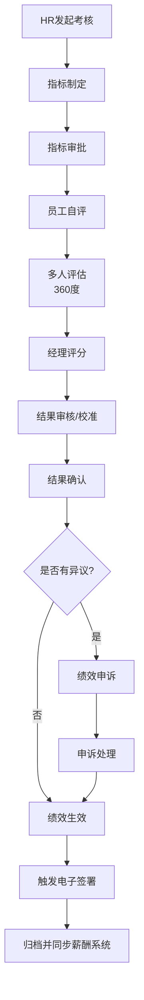
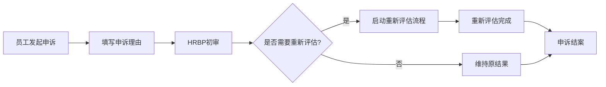

# 北森绩效云复刻 - 员工绩效模块详细设计

**版本**: v1.0  
**最后更新**: 2026-05-17  
**关联主文档**: `files/beisen-performance-replication-plan.md`  
**适用对象**: 简道云管理员、HRBP、系统实施顾问

---

## 一、模块概述

员工绩效模块是北森绩效云中实现"考核执行"的核心载体，支持KPI/OKR/BSC/PBC等多种考核模式，覆盖"指标制定-多人评估-结果校准-结果确认"全流程。

### 1.1 功能全景

```
┌─────────────────────────────────────────────┐
│           员工绩效模块功能树                  │
├──────────────────┬──────────────────────────┤
│   员工自助        │     管理配置              │
├──────────────────┼──────────────────────────┤
│ • 绩效首页       │ • 绩效活动                │
│ • 我的绩效       │   - 考核方案              │
│   - 指标制定     │   - 自动加人方案          │
│   - 指标审批     │   - 考核组                │
│   - 多人评估     │   - 分布规则              │
│   - 绩效评估     │   - 考核项                │
│   - 结果审核     │   - 绩效申诉              │
│   - 结果确认     │ • 绩效模板(9大模块)       │
│ • 我的改进计划   │ • 考核总览                │
│ • 团队绩效       │ • 绩效流程                │
│ • 我的申诉       │ • 绩效设置(30+配置项)     │
│ • 组织绩效       │ • 关键场景方案            │
└──────────────────┴──────────────────────────┘
```

---

## 二、数据模型设计

### 2.1 核心表单清单

| 表单名称 | 类型 | 说明 | 关键字段数 |
|---------|------|------|-----------|
| 绩效周期表 | 普通表单 | 管理绩效周期（季度/半年度/年度） | 8 |
| 考核方案表 | 普通表单 | 定义考核方案（KPI/OKR/BSC等） | 12 |
| 被考核人方案表 | 普通表单 | 记录哪些员工参与哪个考核方案 | 6 |
| 绩效主表 | 流程表单 | 存储员工绩效主体信息 | 20 |
| 指标评估子表 | 子表单 | 嵌入主表，存储KPI/OKR指标及评分 | 12 |
| 价值观评估子表 | 子表单 | 价值观评分 | 8 |
| 360评估记录表 | 普通表单 | 存储360度评价记录 | 10 |
| 绩效校准记录表 | 普通表单 | 记录校准会议结果 | 8 |
| 绩效申诉表 | 流程表单 | 员工申诉记录 | 10 |
| 改进计划表 | 流程表单 | 绩效改进计划 | 12 |
| 绩效配置表 | 普通表单 | 存储30+配置项 | 35 |

### 2.2 绩效主表字段设计

```yaml
表单名称: 绩效主表
表单类型: 流程表单

字段列表:
  - 字段名: performance_id
    类型: 流水号
    说明: 绩效唯一标识
    规则: 自动生成，格式 PERF-YYYYMMDD-XXXX

  - 字段名: cycle_id
    类型: 关联字段
    关联表单: 绩效周期表
    说明: 关联当前绩效所属周期

  - 字段名: plan_id
    类型: 关联字段
    关联表单: 考核方案表
    说明: 关联考核方案

  - 字段名: employee_id
    类型: 成员字段
    说明: 被考核人
    规则: 默认当前登录用户（员工视角）或手动选择（经理视角）

  - 字段名: department_id
    类型: 部门字段
    说明: 所属部门
    规则: 自动从员工信息获取

  - 字段名: position_level
    类型: 下拉
    选项: [高层, 中层, 基层]
    说明: 职级层级
    规则: 自动从员工信息获取

  - 字段名: assessment_modules
    类型: 子表单
    关联子表: 指标评估子表 / 价值观评估子表
    说明: 考核模块列表
    规则: 根据考核方案动态加载

  - 字段名: total_score
    类型: 数字
    说明: 总分
    规则: 自动计算 = SUM(模块得分 * 模块权重)

  - 字段名: performance_grade
    类型: 单选
    选项: [A, B, C, D]
    说明: 绩效等级
    规则: 根据总分和等级映射表自动计算，可人工调整

  - 字段名: forced_distribution_compliance
    类型: 布尔
    说明: 是否符合强制分布
    规则: 智能助手校验

  - 字段名: calibration_status
    类型: 单选
    选项: [未校准, 校准中, 已校准]
    说明: 校准状态
    默认值: 未校准

  - 字段名: confirmation_status
    类型: 单选
    选项: [待确认, 已确认, 有异议]
    说明: 结果确认状态
    默认值: 待确认

  - 字段名: electronic_signature_employee
    类型: 签名
    说明: 员工电子签名（确认结果时签署）
    显隐规则: 仅在"结果确认"节点显示

  - 字段名: electronic_signature_manager
    类型: 签名
    说明: 经理电子签名
    显隐规则: 仅在"结果审核"节点显示

  - 字段名: signed_pdf
    类型: 附件
    说明: 签署后的PDF文件
    显隐规则: 智能助手生成后自动填充

  - 字段名: appeal_status
    类型: 单选
    选项: [无申诉, 申诉中, 申诉已完成]
    说明: 申诉状态
    默认值: 无申诉

  - 字段名: improvement_plan_id
    类型: 关联字段
    关联表单: 改进计划表
    说明: 关联的改进计划
    显隐规则: 若绩效等级为C/D则显示

  - 字段名: status
    类型: 单选
    选项: [指标制定中, 审批中, 评估中, 校准中, 待确认, 已完成, 申诉中]
    说明: 绩效状态
    默认值: 指标制定中
```

### 2.3 指标评估子表字段设计

```yaml
子表名称: 指标评估子表
父表单: 绩效主表

字段列表:
  - 字段名: indicator_name
    类型: 文本
    说明: 指标名称
    规则: 从指标库引用或手动填写

  - 字段名: indicator_type
    类型: 单选
    选项: [KPI, OKR, BSC, PBC, 自定义]
    说明: 指标类型

  - 字段名: indicator_weight
    类型: 数字
    说明: 指标权重（%）
    规则: 必填，所有指标权重之和必须=100

  - 字段名: target_value
    类型: 数字
    说明: 目标值
    规则: 定量指标必填

  - 字段名: actual_value
    类型: 数字
    说明: 实际完成值
    规则: 期末填写或自动同步

  - 字段名: completion_rate
    类型: 数字
    说明: 完成度（%）
    规则: 自动计算 = (实际值 / 目标值) * 100

  - 字段名: self_score
    类型: 数字
    说明: 自评分数
    规则: 员工自评时填写

  - 字段名: manager_score
    类型: 数字
    说明: 经理评分
    规则: 经理评估时填写

  - 字段名: peer_avg_score
    类型: 数字
    说明: 同级平均分（360评估）
    规则: 自动计算

  - 字段名: final_score
    类型: 数字
    说明: 最终得分
    规则: 加权计算 = 自评*20% + 经理*50% + 同级*30%（权重可配置）

  - 字段名: score_comments
    类型: 文本域
    说明: 评分评语
    规则: 必填

  - 字段名: attachment
    类型: 附件
    说明: 支撑材料
```

---

## 三、绩效设置（30+配置项详解）

### 3.1 配置项分类

北森员工绩效模块包含 **30+配置项**，分为以下7类：

| 配置类别 | 配置项数量 | 说明 |
|---------|-----------|------|
| 基础类 | 4 | 指标分类、指标库、价值观、一票否决项 |
| 计算类 | 5 | 计算规则、计量单位、算分精度、排名等级、绩效系数 |
| 角色类 | 4 | 员工评价角色、评价规则、绩效等级、强分规则 |
| 流程类 | 5 | 流程自动规则、待办提醒、绩效改进待办、流程规则、兼职考核 |
| 集成类 | 5 | 字段映射、结果同步、IM集成、电子签、导出考核表设置 |
| 高级类 | 5 | 排行榜设置、多语言配置、矩阵对比评估、项目制绩效、特殊人群标识 |
| 权限类 | 3 | 登录设置、绩效-BP工作台、绩效工作台 |

### 3.2 核心配置项详解

#### 基础类配置

| 配置项名称 | 配置位置 | 配置方式 | 说明 |
|-----------|---------|---------|------|
| **指标分类** | 绩效设置 > 指标分类 | 树形结构编辑器 | 定义指标分类体系（如财务类/客户类/内部流程类/学习成长类） |
| **指标库** | 绩效设置 > 指标库 | 表单批量导入 | 预置常用指标，支持快速引用 |
| **价值观** | 绩效设置 > 价值观 | 文本列表 | 定义企业价值观评估维度（如客户第一/团队合作/诚信） |
| **一票否决项** | 绩效设置 > 一票否决项 | 布尔开关 + 条件配置 | 定义红线指标（如重大安全事故/严重违规），触发则绩效直接为D |

#### 计算类配置

| 配置项名称 | 配置位置 | 配置方式 | 说明 |
|-----------|---------|---------|------|
| **计算规则** | 绩效设置 > 计算规则 | 公式编辑器 | 定义总分计算公式（如加权平均/最高分/最低分） |
| **计量单位** | 绩效设置 > 计量单位 | 下拉选项配置 | 定义指标的计量单位（元/个/%/天/次） |
| **算分精度** | 绩效设置 > 算分精度 | 数字输入（小数位数） | 定义分数保留几位小数（默认2位） |
| **排名等级** | 绩效设置 > 排名等级 | 等级映射表 | 定义分数到等级的映射（如90-100=A, 80-89=B） |
| **绩效系数** | 绩效设置 > 绩效系数 | 系数表 | 定义各等级对应的奖金系数（如A=1.5, B=1.0, C=0.5, D=0） |

#### 角色类配置

| 配置项名称 | 配置位置 | 配置方式 | 说明 |
|-----------|---------|---------|------|
| **员工评价角色** | 绩效设置 > 评价角色 | 角色定义表 | 定义评价人角色（上级/同级/下级/自评/外部） |
| **评价规则** | 绩效设置 > 评价规则 | 权重配置表 | 定义各角色评分权重（如上级50%/同级30%/自评20%） |
| **绩效等级** | 绩效设置 > 绩效等级 | 等级列表 | 定义绩效等级（A/B/C/D或S/A/B/C） |
| **强分规则** | 绩效设置 > 强分规则 | 分布比例配置 | 定义强制分布比例（如A≤20%, B≥70%, C≤10%） |

#### 流程类配置

| 配置项名称 | 配置位置 | 配置方式 | 说明 |
|-----------|---------|---------|------|
| **流程自动规则** | 绩效设置 > 流程自动规则 | 智能助手配置 | 定义自动流转规则（如超时自动通过/自动驳回） |
| **待办提醒设置** | 绩效设置 > 待办提醒 | 定时任务配置 | 定义待办提醒频率（如每天上午9点推送） |
| **绩效改进待办类型** | 绩效设置 > 改进待办 | 待办类型配置 | 定义改进计划的待办类型（周跟进/月复盘） |
| **流程规则设置** | 绩效设置 > 流程规则 | 流程编辑器 | 定义审批流节点和操作权限 |
| **兼职考核** | 绩效设置 > 兼职考核 | 开关 + 规则配置 | 是否启用兼职考核（员工在多个部门任职时） |

#### 集成类配置

| 配置项名称 | 配置位置 | 配置方式 | 说明 |
|-----------|---------|---------|------|
| **字段映射** | 绩效设置 > 字段映射 | 字段对应表 | 映射外部系统字段到绩效表单 |
| **绩效结果同步设置** | 绩效设置 > 结果同步 | API配置 | 定义绩效结果同步到薪酬系统的规则 |
| **邀请反馈设置** | 绩效设置 > 邀请反馈 | 邮件/IM模板配置 | 定义360评估邀请模板 |
| **员工绩效电子签** | 绩效设置 > 电子签 | 开关 [启用/禁用] | 是否启用电子签署功能 |
| **导出考核表设置** | 绩效设置 > 导出设置 | 打印模板配置 | 定义导出的考核表格式 |

#### 高级类配置

| 配置项名称 | 配置位置 | 配置方式 | 说明 |
|-----------|---------|---------|------|
| **排行榜设置** | 绩效设置 > 排行榜 | 排序规则配置 | 定义绩效排行榜的排序规则（按部门/按职级） |
| **绩效多语言配置** | 绩效设置 > 多语言 | 开关 + 语言选择 | 是否启用多语言支持 |
| **矩阵对比评估** | 绩效设置 > 矩阵评估 | 二维矩阵配置 | 定义评估矩阵（如业绩vs能力四象限） |
| **项目制绩效** | 绩效设置 > 项目制 | 开关 + 规则配置 | 是否启用基于项目的绩效考核 |
| **特殊人群标识** | 绩效设置 > 特殊人群 | 标签配置 | 标识特殊人群（如试用期/实习生/外包）并应用差异化流程 |

---

## 四、绩效模板设计（9大模块）

### 4.1 模板模块清单

北森支持模块化绩效模板，简道云通过**子表单动态加载**实现：

| 模块类型 | 说明 | 简道云实现 | 字段数 |
|---------|------|-----------|--------|
| 指标评估模块 | KPI/OKR指标打分 | 子表单（指标评估子表） | 12 |
| 员工目标评估模块 | 目标完成度评估 | 关联员工目标表 + 自动计算 | 8 |
| 价值观模块 | 行为准则评估 | 子表单（价值观评估子表） | 8 |
| 360结果模块 | 多方评价汇总 | 独立表单 + 加权计算 | 10 |
| 绩效汇总模块 | 总分计算 | 计算字段 + 公式 | 5 |
| 组织绩效结果模块 | 组织业绩影响系数 | 关联组织绩效表 | 6 |
| 自定义模块 | 扩展字段 | 动态字段配置 | 可变 |
| 一票否决模块 | 红线指标 | 布尔字段 + 条件校验 | 4 |
| 总评模块 | 最终等级确定 | 等级映射表 + 人工确认 | 6 |

### 4.2 模板配置示例

```yaml
模板名称: 销售岗位绩效考核模板
适用岗位: 销售代表/销售经理

模块配置:
  - 模块1: 指标评估模块
    权重: 70%
    指标来源: 指标库（销售额/回款率/新客户数）
    
  - 模块2: 价值观模块
    权重: 20%
    评估维度: 客户第一/团队合作/诚信
    
  - 模块3: 360结果模块
    权重: 10%
    评价人: 上级(50%) + 同级(30%) + 下级(20%)
    
  - 模块4: 一票否决模块
    权重: N/A
    否决条件: 重大客户投诉/违规操作
    
  - 模块5: 总评模块
    权重: N/A
    等级映射: A(90-100) / B(80-89) / C(70-79) / D(<70)
```

---

## 五、流程设计

### 5.1 绩效考核全流程



#### 流程节点配置

| 节点名称 | 节点类型 | 负责人规则 | 操作权限 | 限时处理 |
|---------|---------|-----------|---------|---------|
| HR发起考核 | 系统节点 | HR管理员 | 批量发起 | - |
| 指标制定 | 填写节点 | 员工 + 经理协同 | 新增/编辑指标 | 5个工作日 |
| 指标审批 | 审批节点 | 直线经理 | 同意/驳回/调整 | 3个工作日 |
| 员工自评 | 填写节点 | 员工 | 自评分数 + 评语 | 5个工作日 |
| 多人评估 | 多人评估节点 | 评价人（上级/同级/下级） | 评分 + 评语（匿名） | 7个工作日 |
| 经理评分 | 填写节点 | 直线经理 | 综合评分 + 评语 | 5个工作日 |
| 结果审核 | 审批节点 | 直线经理 + HRBP | 查看/调整等级 | 5个工作日 |
| 在线校准 | 系统节点 | 校准会议参与者 | 拖拽调整等级（需二开） | 校准会议期间 |
| 结果确认 | 填写节点 | 员工 | 确认/提出异议 + 签名 | 3个工作日 |
| 绩效生效 | 系统节点 | - | 自动流转 | - |
| 电子签署 | 系统节点 | - | 触发智能助手 | - |

#### 流转规则

| 规则名称 | 触发条件 | 执行动作 |
|---------|---------|---------|
| 权重校验 | 指标制定提交时 | 检查所有指标权重之和是否=100%，否则阻止提交 |
| 超时自动提醒 | 节点停留超过限时处理的80% | 发送IM提醒给当前处理人 |
| 超时自动通过 | 节点停留超过限时处理的120% | 根据配置自动通过或驳回 |
| 强制分布校验 | 结果审核节点 | 检查各部门等级分布是否符合强分规则，超比例则警告 |
| 一票否决校验 | 全流程任意节点 | 若触发一票否决项，绩效等级直接设为D，跳过后续流程 |
| 申诉拦截 | 员工提出异议 | 暂停流程，进入申诉处理流程 |

### 5.2 绩效申诉流程



---

## 六、关键场景方案

### 6.1 360环评

**需求**: 支持上级/同级/下级/自评/外部多方评价，匿名互评

**实现方案**:

1. **评价人配置**:
   ```yaml
   评价人规则表:
     - 评价人角色: 上级
       权重: 50%
       人数: 1（直线经理）
       
     - 评价人角色: 同级
       权重: 30%
       人数: 3-5（同部门同事）
       
     - 评价人角色: 下级
       权重: 20%
       人数: 3-5（下属员工）
       
     - 评价人角色: 自评
       权重: 0%（仅参考，不计入总分）
       人数: 1（本人）
   ```

2. **匿名互评实现**:
   - 在"多人评估节点"启用"匿名评价"选项
   - 评价人看到的表单不显示被评价人姓名（脱敏处理）
   - 评价结果汇总时隐藏评价人身份
   - 通过权限组确保只有HR可查看原始评价记录

3. **智能助手逻辑**:
   ```yaml
   智能助手名称: 360评估邀请发送
   触发类型: 表单触发
   触发条件: 绩效主表.status 变更为 "评估中"
   
   执行节点:
     1. 查询节点:
       - 查询对象: 评价人规则表
       - 查询条件: plan_id = {{触发记录.plan_id}}
       
     2. 循环容器:
       - 循环对象: 查询结果集（各评价人角色）
       
       循环内执行:
         a. 查询节点:
           - 查询对象: 员工关系表
           - 查询条件: 根据评价人角色查找对应人员
           
         b. 循环容器:
           - 循环对象: 评价人列表
           
           循环内执行:
             i. HTTP请求节点:
               - 推送IM邀请给评价人
               - 消息内容: "请为{{被考核人姓名}}进行{{评价人角色}}评价"
               
             ii. 写入节点:
               - 写入360评估记录表
               - 记录邀请时间和评价人
   ```

### 6.2 双轨制绩效考核

**需求**: KPI与OKR并行，适配不同业务单元

**实现方案**:

1. **考核方案配置**:
   - 创建两个考核方案："KPI考核方案"和"OKR考核方案"
   - 在"被考核人方案表"中标注每个员工适用的方案

2. **差异化流程**:
   ```
   KPI方案流程:
   指标制定 → 审批 → 自评 → 经理评分 → 校准 → 确认
   
   OKR方案流程:
   OKR制定 → 审批 → 过程跟踪 → OKR完成度评估 → 经理定性评价 → 校准 → 确认
   ```

3. **软连接机制**:
   - OKR完成度不直接计入绩效分数
   - 经理在"定性评价"环节需说明OKR执行情况对绩效的影响
   - 可在绩效评语中引用OKR完成度作为佐证

### 6.3 强制分布方案

**需求**: 支持绩效等级强制分布（如A:20% B:70% C:10%）

**实现方案**:

1. **分布规则表**:
   ```yaml
   表单名称: 分布规则表
   字段:
     - plan_id: 关联考核方案
     - grade: 绩效等级（A/B/C/D）
     - min_percentage: 最低比例（%）
     - max_percentage: 最高比例（%）
     - target_percentage: 目标比例（%）
   ```

2. **实时计算**:
   - 使用**数据工厂**实时计算当前分布比例
   - 聚合表: 按部门和等级分组统计人数

3. **仪表盘预警**:
   - 图表: 各部门等级分布柱状图
   - 预警: 当某等级超比例时标红
   - 数字卡片: 显示当前A/B/C/D各等级人数和比例

4. **在线校准**（需二开）:
   - 开发自定义前端页面，支持拖拽员工头像调整等级
   - 调用简道云API批量更新绩效等级
   - 实时刷新分布比例图表

### 6.4 矩阵对比评估

**需求**: 二维矩阵评估（如业绩vs能力四象限）

**实现方案**:

1. **数据模型**:
   - 在绩效主表中增加"业绩得分"和"能力得分"两个字段
   - 通过数据工厂计算每个员工的坐标位置

2. **可视化**（需二开）:
   - 使用ECharts绘制散点图
   - X轴: 业绩得分，Y轴: 能力得分
   - 四象限划分:
     - 第一象限: 高业绩高能力（明星员工）
     - 第二象限: 低业绩高能力（潜力员工）
     - 第三象限: 低业绩低能力（待改进员工）
     - 第四象限: 高业绩低能力（骨干员工）

3. **简道云原生替代方案**:
   - 使用表格组件展示员工列表
   - 添加"业绩等级"和"能力等级"两列
   - 通过条件格式高亮不同象限的员工

### 6.5 项目制绩效

**需求**: 基于项目人力投入的绩效考核

**实现方案**:

1. **数据模型**:
   - 项目表: 项目名称/项目经理/起止日期/预算
   - 项目人力表: 项目ID/员工ID/投入比例/角色
   - 项目绩效表: 项目ID/项目评分/项目等级

2. **流程设计**:
   ```
   项目结项 → 项目经理评分 → 项目绩效生效
   → 智能助手根据员工投入比例分摊项目绩效
   → 计入员工个人绩效总分
   ```

3. **智能助手逻辑**:
   ```yaml
   智能助手名称: 项目绩效分摊
   触发类型: 表单触发
   触发条件: 项目绩效表.status 变更为 "已完成"
   
   执行节点:
     1. 查询节点:
       - 查询对象: 项目人力表
       - 查询条件: project_id = {{触发记录.project_id}}
       
     2. 循环容器:
       - 循环对象: 项目成员列表
       
       循环内执行:
         a. 计算节点:
           - 个人项目绩效 = 项目评分 * 投入比例
           
         b. 更新节点:
           - 更新对象: 绩效主表.指标评估子表
           - 更新字段: 新增"项目绩效"指标，填入个人项目绩效
   ```

### 6.6 组织绩效影响强制分布

**需求**: 组织绩效结果影响个人绩效的强制分布比例

**实现方案**:

1. **联动规则**:
   ```
   若组织绩效等级为A:
     - 该部门A等级比例可上浮至30%
     - B等级比例下调至60%
     - C等级比例保持10%
     
   若组织绩效等级为C:
     - 该部门A等级比例下调至10%
     - B等级比例保持70%
     - C等级比例上浮至20%
   ```

2. **智能助手逻辑**:
   ```yaml
   智能助手名称: 组织绩效联动分布调整
   触发类型: 表单触发
   触发条件: 组织绩效表.status 变更为 "已完成"
   
   执行节点:
     1. 查询节点:
       - 查询对象: 组织绩效表
       - 获取字段: organization_id, performance_grade
       
     2. 更新节点:
       - 更新对象: 分布规则表
       - 更新条件: department_id = {{organization_id}}
       - 更新内容: 根据组织绩效等级调整A/B/C比例
   ```

---

## 七、数据分析

### 7.1 绩效明细数据集

**数据集**: 聚合表 绩效V5数据集

**字段清单**:
- 员工基本信息（姓名/部门/岗位/职级）
- 考核方案信息（方案名称/周期/类型）
- 指标评估明细（指标名称/权重/目标值/实际值/完成度/自评分/经理评分/最终得分）
- 价值观评估明细（维度/自评分/经理评分/最终得分）
- 360评估明细（评价人角色/评分/评语）
- 总分/等级/排名
- 校准记录
- 申诉状态

### 7.2 绩效看板设计

**图表组件**:

| 图表名称 | 图表类型 | 维度 | 指标 | 说明 |
|---------|---------|------|------|------|
| 绩效等级分布 | 饼图 | 等级 | 人数 | 整体分布情况 |
| 部门绩效对比 | 柱状图 | 部门 | 平均分 | 跨部门对比 |
| 绩效趋势分析 | 折线图 | 周期 | 平均分 | 历史趋势 |
| 高风险员工列表 | 表格 | 员工/等级/分数 | - | C/D等级员工重点关注 |
| 强制分布合规性 | 进度条 | 部门 | 符合比例 | 监控合规情况 |
| 申诉率分析 | 数字卡片 | - | 申诉人数/总人数 | 评估公平性 |

---

## 八、电子签署功能

### 8.1 签署流程


### 8.2 技术实现

同OKR模块和目标模块，参考 `files/beisen-okr-detail.md` 和 `files/beisen-target-detail.md` 中的电子签署章节。

---

## 九、常见问题与解决方案

### 9.1 360评估评价人不配合

**问题**: 评价人迟迟不完成评估

**解决方案**:
- **定时提醒**: 每2天推送一次IM提醒
- **超时自动通过**: 若超过限时处理的150%，自动按平均分计算
- **评价人替换**: 允许经理更换评价人

### 9.2 强制分布导致不公平

**问题**: 优秀团队中部分员工因比例限制被迫降级

**解决方案**:
- **组织绩效联动**: 高绩效组织可获得更多A等级名额
- **校准会议**: 通过在线校准环节人工调整
- **申诉机制**: 员工可通过申诉流程提出异议

### 9.3 指标权重之和不等于100%

**解决方案**: 同OKR模块，通过前端校验 + 流程校验 + 智能提醒三重保障

---

## 十、附录：字段映射表

### 10.1 北森字段 → 简道云字段映射

| 北森字段名 | 北森字段类型 | 简道云字段名 | 简道云字段类型 | 备注 |
|-----------|------------|-------------|--------------|------|
| Performance ID | 文本 | performance_id | 流水号 | 唯一标识 |
| Assessment Modules | 子表 | assessment_modules | 子表单 | 考核模块 |
| Total Score | 数字 | total_score | 数字 | 自动计算 |
| Performance Grade | 枚举 | performance_grade | 单选 | A/B/C/D |
| Calibration Status | 枚举 | calibration_status | 单选 | 校准状态 |
| Employee Signature | 签名 | electronic_signature_employee | 签名 | 员工签名 |
| Manager Signature | 签名 | electronic_signature_manager | 签名 | 经理签名 |
| Status | 枚举 | status | 单选 | 状态机 |

---

**文档维护说明**:
- 本工作表为主文档 `files/beisen-performance-replication-plan.md` 的详细补充
- 每次字段/流程调整需同步更新版本号
- 所有飞书云文档需自动添加 Frank (ou_1e87f1890876b57a6f2ab437a3fce415) 为编辑协作者
