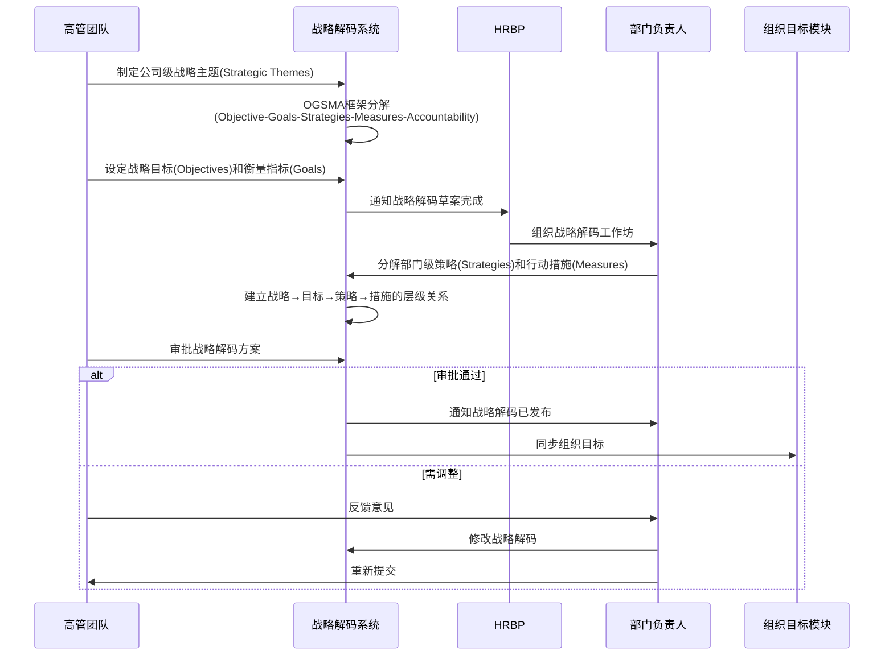
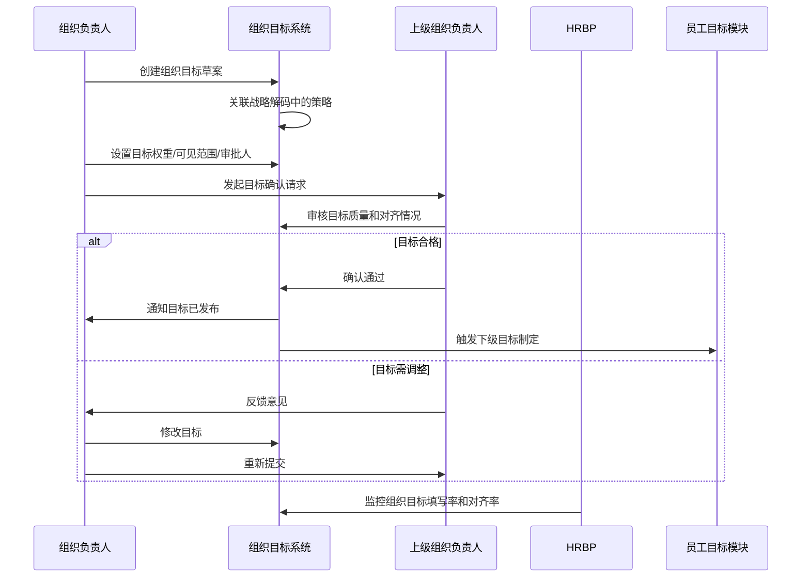
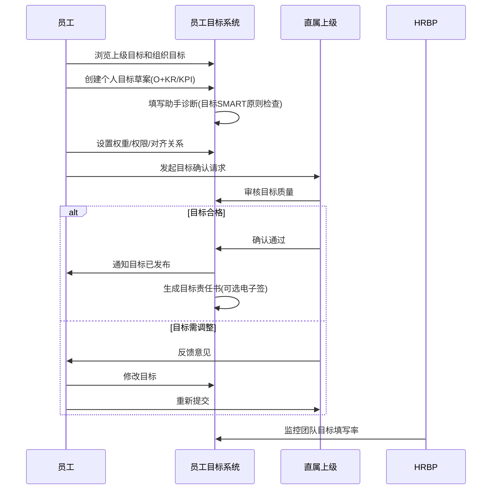
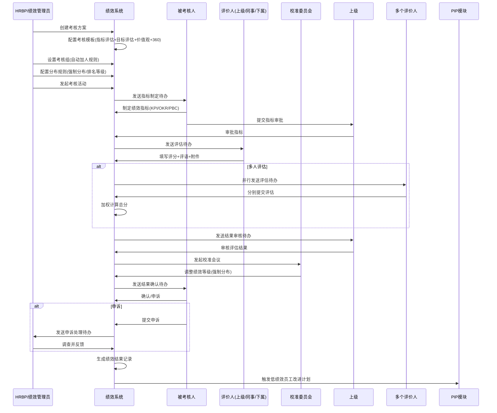
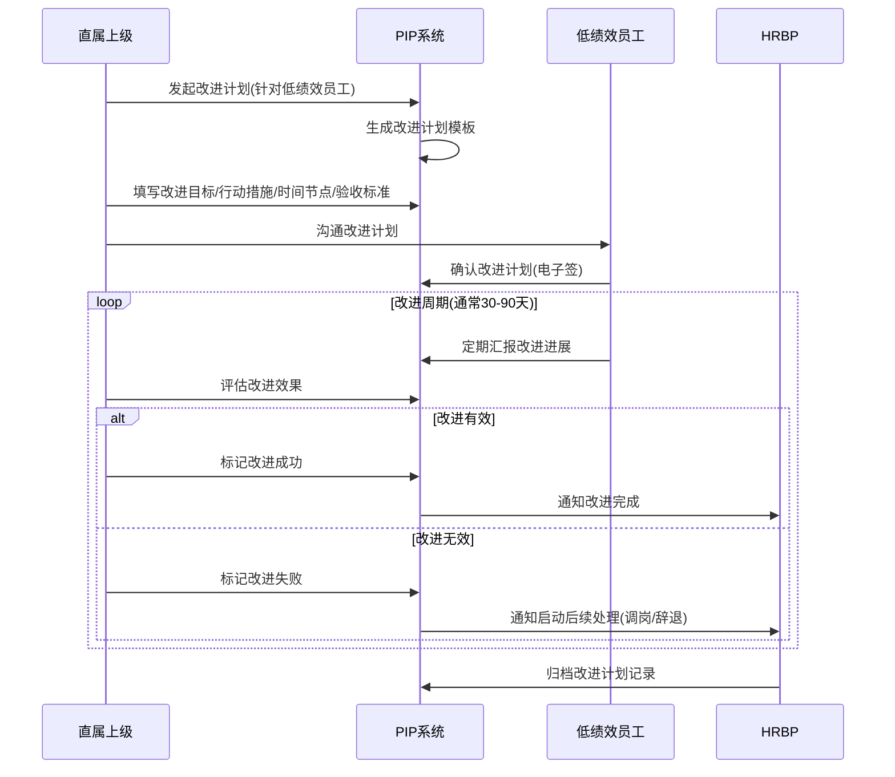
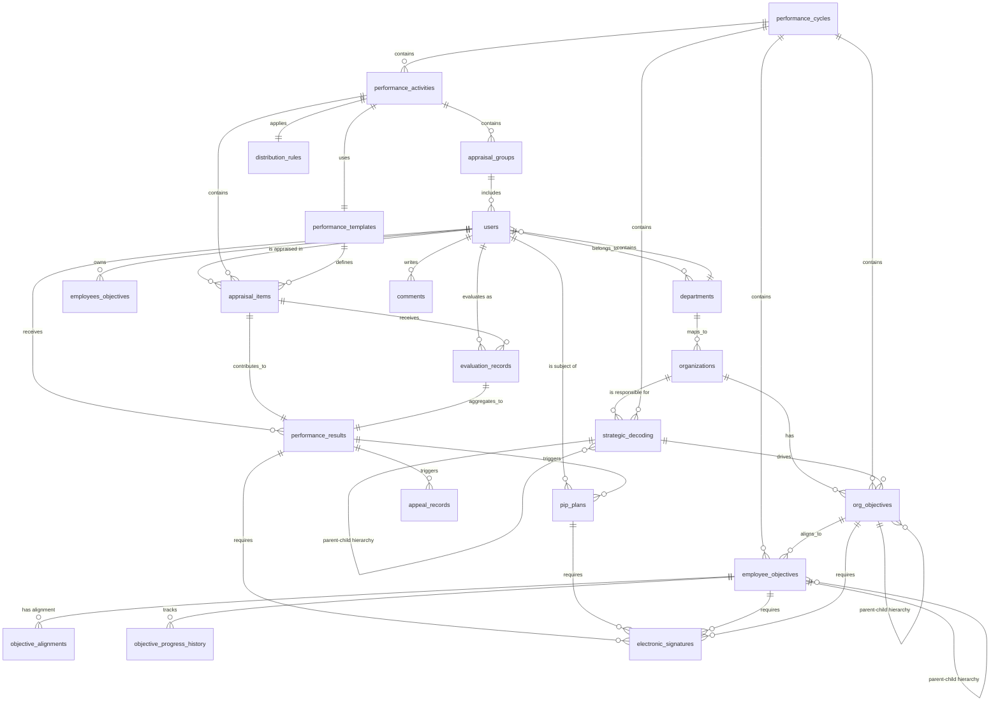
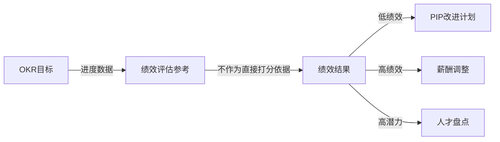
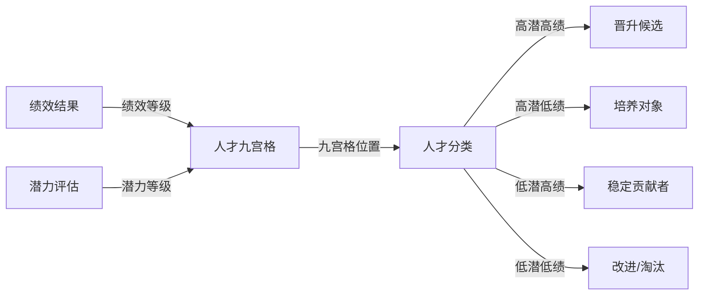
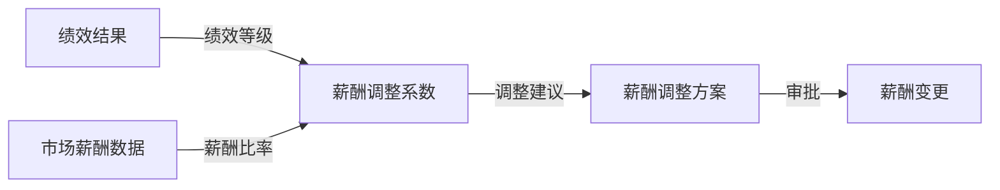

# 北森绩效云全功能复刻设计方案

**版本**: v1.0  
**创建日期**: 2026年5月17日  
**设计者**: Drucker (企业咨询顾问)  
**适用平台**: 简道云零代码平台 + 二开服务层  

---

## 目录

1. [执行摘要](#一执行摘要)
2. [北森绩效云功能架构分析](#二北森绩效云功能架构分析)
3. [数据库设计建议](#三数据库设计建议)
4. [简道云实现方案](#四简道云实现方案)
5. [与OKR/人才盘点/薪酬的衔接方案](#五与okrtalent-compensation的衔接方案)
6. [落地实施路线图](#六落地实施路线图)
7. [附录：关键配置清单](#七附录关键配置清单)

---

## 一、执行摘要

### 1.1 项目背景

本方案旨在基于**北森绩效云**的完整功能体系，设计一套可在简道云零代码平台上实现的综合绩效管理系统。方案遵循**战略人力资源管理(SHRM)**理论框架和**APQC流程架构**，将绩效管理从单一的"考核工具"升级为"战略解码→目标对齐→过程跟进→结果评估→改进发展"的闭环管理体系。

北森绩效云相比飞书OKR的核心差异在于：
- **多模式支持**: KPI/OKR/PBC/360/双轨制/项目制等多种绩效模式
- **战略解码**: OGSMA战略解码工具，实现战略到执行的穿透
- **组织维度**: 组织目标+组织绩效模块，支撑集团化管理
- **AI赋能**: 目标助手/进度追踪/考核辅助/发展建议
- **合规与公平**: PIP改进计划/电子签署/强制分布/多维权限管理

### 1.2 核心价值主张

| 维度 | 价值点 |
|------|--------|
| **战略穿透力** | 通过OGSMA战略解码，确保公司战略→组织目标→部门目标→个人目标的纵向贯通 |
| **多模式适配** | 支持KPI(结果导向)/OKR(目标对齐)/PBC(承诺制)/360(全方位)/双轨制(差异化)/项目制(临时团队) |
| **组织协同** | 组织目标+组织绩效模块，支撑集团化/矩阵式组织管理 |
| **公平与合规** | 强制分布/排名等级/电子签署/申诉机制，确保绩效评估的公平性和法律效力 |
| **持续改进** | PIP改进计划+问卷调查，形成"评估→反馈→改进→再评估"的闭环 |
| **数据驱动** | 预置数据集+报表设计，为HRBP和管理者提供决策支持 |

### 1.3 技术选型原则

- **零代码优先**: 70%功能通过简道云原生能力实现（表单+流程+仪表盘+智能助手Pro+数据工厂）
- **二开补充**: 30%复杂逻辑通过Node.js/Python中间件实现（如强制分布算法/矩阵对比评估/算分精度控制/多语言切换）
- **混合架构**: 简道云负责数据存储和基础交互，二开层负责复杂业务逻辑、自定义UI和外部系统集成

### 1.4 关键成功因素

1. **高层支持**: CEO/高管率先使用战略解码工具，公开组织目标和个人目标
2. **模式选择**: 根据业务特性选择合适的绩效模式（创新部门用OKR，成熟业务用KPI，管理层用PBC）
3. **试点验证**: 选择1-2个典型部门试点，积累经验后推广
4. **持续迭代**: 每季度复盘绩效实施效果，优化流程和工具
5. **培训先行**: 全员绩效管理理念培训，避免将绩效等同于扣钱工具

---

## 二、北森绩效云功能架构分析

### 2.1 功能模块全景图

```mermaid
graph TB
    A[北森绩效云系统] --> B[绩效员工自助模块]
    A --> C[OKR管理模块]
    A --> D[员工目标模块]
    A --> E[员工绩效模块]
    A --> F[数据分析模块]
    A --> G[组织目标模块]
    A --> H[组织绩效模块]
    A --> I[战略解码模块]
    
    B --> B1[我的OKR: 制定/审批/协同/地图/四象限复盘]
    B --> B2[我的目标: 制定/审批/协同/地图/复盘]
    B --> B3[我的绩效: 指标制定/审批/多人评估/结果审核/确认]
    B --> B4[我的改进计划: PIP待办]
    B --> B5[我的申诉]
    B --> B6[团队绩效/团队改进计划]
    
    C --> C1[OKR计划]
    C --> C2[OKR模板]
    C --> C3[OKR进度看板]
    C --> C4[OKR设置: 分目标审批/多维权限/进度自动更新]
    
    D --> D1[员工目标计划: 制定人员/自动规则/开启监控/下发生效]
    D --> D2[目标进度看板: 制定分析HR/执行分析HR]
    D --> D3[员工目标设置: 自动规则/可见范围/审批权限/定量分配/电子签]
    D --> D4[目标关键场景: BP工作台/人事调动联动/共背目标/分目标审批]
    D --> D5[年度目标拆解: 累计值/新版复盘/经理下发/经理分配]
    
    E --> E1[绩效活动: 考核方案/自动加人/考核组/分布规则/考核项/申诉/改进计划]
    E --> E2[绩效模板: 指标评估/目标评估/价值观/360结果/绩效汇总/组织绩效结果/自定义/一票否决/评价人/总评]
    E --> E3[考核总览: 结果变更记录/改进模板/定性定量得分显示/基础信息]
    E --> E4[绩效流程: 评估步骤/多人评估/结果审核/结果确认/改进流程]
    E --> E5[绩效设置: 指标库/价值观/计算规则/强分规则/排名等级/流程自动规则/标签规则/电子签/多语言/兼职考核]
    E --> E6[关键场景: 360环评/HRBP动态授权/双轨制/特殊人群标识/矩阵对比/强制分布/申诉/试用期/项目制]
    
    F --> F1[绩效明细]
    F --> F2[绩效看板]
    F --> F3[报表设计]
    F --> F4[预置数据集: 员工目标/OKR2.0/绩效V5/组织绩效/改进]
    
    G --> G1[组织目标计划: 制定组织/自动规则/开启监控/下发/代理人/电子签]
    G --> G2[组织目标设置: 自动规则/可见范围/审批权限/定量分配/电子签/字段映射]
    
    H --> H1[组织绩效活动]
    H --> H2[组织绩效结果]
    H --> H3[组织绩效设置: 待办类型/模板/流程/评价角色/菜单授权]
    
    I --> I1[战略解码基础配置]
    I --> I2[战略解码计划]
    I --> I3[制定战略解码]
    I --> I4[审批战略解码]
    I --> I5[战略解码进度管理]
    I --> I6[战略解码与目标联动]
```



### 2.2 核心业务流程

#### 流程1: 战略解码流程（年度初）



#### 流程2: 组织目标制定流程（季度初）



#### 流程3: 员工目标制定流程（季度初）



#### 流程4: 绩效活动发起流程（季度末）



#### 流程5: PIP改进计划流程



### 2.3 功能模块关联关系分析

| 模块 | 上游依赖 | 下游影响 | 关键数据流 |
|------|---------|---------|-----------|
| **战略解码** | 无（起点） | 组织目标、员工目标 | 战略主题→战略目标→策略→措施 |
| **组织目标** | 战略解码 | 员工目标、组织绩效 | 组织目标→分解为部门目标→个人目标 |
| **员工目标** | 组织目标 | 员工绩效、数据分析 | 目标定义→进度跟踪→绩效评估参考 |
| **员工绩效** | 员工目标+指标库 | 薪酬调整、人才盘点、PIP | 绩效结果→薪酬系数→晋升决策→改进计划 |
| **OKR管理** | 独立模块 | 员工绩效(可选参考) | OKR进度→绩效评估(不直接挂钩) |
| **组织绩效** | 组织目标 | 组织奖金池、组织负责人绩效 | 组织绩效结果→组织奖金分配→负责人考核 |
| **数据分析** | 所有模块 | HR决策、管理层报告 | 绩效数据→人才九宫格→薪酬调整建议 |
| **PIP改进** | 员工绩效(低分) | 员工留存/离职决策 | 改进计划→改进结果→人事决策 |

### 2.4 核心业务实体识别

基于APQC流程框架，识别以下核心业务实体：

1. **用户(User)**: 员工、管理者、HRBP、绩效管理员、校准委员会成员
2. **组织(Organization)**: 公司/事业部/部门/团队（树形结构）
3. **战略解码(StrategicDecoding)**: 战略主题/战略目标/策略/措施/责任人
4. **组织目标(OrgObjective)**: 组织级目标，有周期/权重/对齐关系
5. **员工目标(EmployeeObjective)**: 个人目标(O+KR或KPI)，有周期/权重/对齐关系
6. **绩效活动(PerformanceActivity)**: 考核方案/考核组/考核周期/分布规则
7. **绩效模板(PerformanceTemplate)**: 指标评估模块/目标评估模块/价值观模块/360模块/自定义模块
8. **考核项(AppraisalItem)**: 具体考核指标(KPI/OKR/PBC)，有权重/目标值/实际值
9. **评估记录(EvaluationRecord)**: 评价人对被考核人的评分+评语+附件
10. **绩效结果(PerformanceResult)**: 最终绩效等级/分数/排名/强制分布结果
11. **申诉记录(AppealRecord)**: 员工申诉内容/调查结果/处理意见
12. **改进计划(PIP)**: 改进目标/行动措施/时间节点/验收标准/改进结果
13. **评论(Comment)**: 目标/绩效的沟通评论
14. **电子签(ElectronicSignature)**: 目标责任书/绩效结果确认书/改进计划确认书的电子签名

---

## 三、数据库设计建议

### 3.1 核心数据表结构

#### 表1: 用户表 (users)

| 字段名 | 类型 | 说明 | 约束 |
|--------|------|------|------|
| user_id | VARCHAR(32) | 用户ID（主键） | PK, NOT NULL |
| name | VARCHAR(50) | 姓名 | NOT NULL |
| email | VARCHAR(100) | 邮箱 | UNIQUE |
| department_id | VARCHAR(32) | 所属部门ID | FK → departments |
| manager_id | VARCHAR(32) | 直属上级ID | FK → users |
| position | VARCHAR(100) | 职位 | |
| job_level | VARCHAR(20) | 职级(如P5/M3) | |
| status | TINYINT | 状态(1在职/0离职) | DEFAULT 1 |
| hire_date | DATE | 入职日期 | |
| created_at | DATETIME | 创建时间 | |
| updated_at | DATETIME | 更新时间 | |

#### 表2: 部门表 (departments)

| 字段名 | 类型 | 说明 | 约束 |
|--------|------|------|------|
| dept_id | VARCHAR(32) | 部门ID（主键） | PK, NOT NULL |
| dept_name | VARCHAR(100) | 部门名称 | NOT NULL |
| parent_dept_id | VARCHAR(32) | 父部门ID | FK → departments |
| dept_level | INT | 部门层级 | |
| dept_type | TINYINT | 部门类型(1公司/2事业部/3部门/4团队) | |
| org_code | VARCHAR(20) | 组织编码 | UNIQUE |
| created_at | DATETIME | 创建时间 | |

#### 表3: 组织表 (organizations)

| 字段名 | 类型 | 说明 | 约束 |
|--------|------|------|------|
| org_id | VARCHAR(32) | 组织ID（主键） | PK, NOT NULL |
| org_name | VARCHAR(100) | 组织名称 | NOT NULL |
| parent_org_id | VARCHAR(32) | 父组织ID | FK → organizations |
| org_level | INT | 组织层级 | |
| org_type | TINYINT | 组织类型(1公司/2事业部/3部门) | |
| leader_id | VARCHAR(32) | 组织负责人ID | FK → users |
| deputy_leader_id | VARCHAR(32) | 组织代理人ID | FK → users |
| created_at | DATETIME | 创建时间 | |

#### 表4: 绩效周期表 (performance_cycles)

| 字段名 | 类型 | 说明 | 约束 |
|--------|------|------|------|
| cycle_id | VARCHAR(32) | 周期ID（主键） | PK, NOT NULL |
| cycle_name | VARCHAR(50) | 周期名称（如"2026 Q1"） | NOT NULL |
| cycle_type | TINYINT | 周期类型(1年度/2季度/3月度/4半年度) | NOT NULL |
| start_date | DATE | 开始日期 | NOT NULL |
| end_date | DATE | 结束日期 | NOT NULL |
| status | TINYINT | 状态(1未开始/2进行中/3已结束/4已归档) | DEFAULT 1 |
| is_active | BOOLEAN | 是否当前活跃周期 | DEFAULT FALSE |
| created_by | VARCHAR(32) | 创建人ID | FK → users |
| created_at | DATETIME | 创建时间 | |

#### 表5: 战略解码表 (strategic_decoding)

| 字段名 | 类型 | 说明 | 约束 |
|--------|------|------|------|
| sd_id | VARCHAR(32) | 战略解码ID（主键） | PK, NOT NULL |
| cycle_id | VARCHAR(32) | 所属周期ID | FK → performance_cycles, NOT NULL |
| parent_sd_id | VARCHAR(32) | 父战略解码ID（上级战略） | FK → strategic_decoding |
| level | TINYINT | 层级(1战略主题/2战略目标/3策略/4措施) | NOT NULL |
| ogsma_type | TINYINT | OGSMA类型(1-O/2-G/3-S/4-M/5-A) | NOT NULL |
| title | VARCHAR(500) | 标题 | NOT NULL |
| description | TEXT | 详细描述 | |
| target_value | DECIMAL(15,2) | 目标值(仅G/M层级) | |
| current_value | DECIMAL(15,2) | 当前值(仅G/M层级) | |
| unit | VARCHAR(20) | 单位 | |
| weight | DECIMAL(5,2) | 权重(0-100) | DEFAULT 100 |
| responsible_org_id | VARCHAR(32) | 责任组织ID | FK → organizations |
| responsible_user_id | VARCHAR(32) | 责任人ID | FK → users |
| status | TINYINT | 状态(1草稿/2已发布/3已完成/4已归档) | DEFAULT 1 |
| progress_percent | DECIMAL(5,2) | 进度百分比(自动计算) | |
| created_at | DATETIME | 创建时间 | |
| updated_at | DATETIME | 更新时间 | |

#### 表6: 组织目标表 (org_objectives)

| 字段名 | 类型 | 说明 | 约束 |
|--------|------|------|------|
| org_obj_id | VARCHAR(32) | 组织目标ID（主键） | PK, NOT NULL |
| cycle_id | VARCHAR(32) | 所属周期ID | FK → performance_cycles, NOT NULL |
| org_id | VARCHAR(32) | 所属组织ID | FK → organizations, NOT NULL |
| parent_org_obj_id | VARCHAR(32) | 父组织目标ID（上级目标） | FK → org_objectives |
| sd_id | VARCHAR(32) | 关联战略解码ID | FK → strategic_decoding |
| obj_title | VARCHAR(500) | 目标标题 | NOT NULL |
| obj_description | TEXT | 目标详细描述 | |
| obj_type | TINYINT | 目标类型(1-O/2-KR/3-KPI) | DEFAULT 1 |
| weight | DECIMAL(5,2) | 权重(0-100) | DEFAULT 100 |
| priority | INT | 优先级(1最高) | DEFAULT 999 |
| start_value | DECIMAL(15,2) | 起始值(仅KR/KPI) | DEFAULT 0 |
| current_value | DECIMAL(15,2) | 当前值(仅KR/KPI) | DEFAULT 0 |
| target_value | DECIMAL(15,2) | 目标值(仅KR/KPI) | |
| unit | VARCHAR(20) | 单位 | |
| progress_percent | DECIMAL(5,2) | 进度百分比(自动计算) | |
| risk_status | TINYINT | 风险状态(1正常/2有风险/3严重滞后) | DEFAULT 1 |
| status | TINYINT | 状态(1草稿/2已发布/3已完成/4已归档) | DEFAULT 1 |
| visibility | TINYINT | 可见性(1全员可见/2仅组织内/3指定人员) | DEFAULT 1 |
| visible_to_users | TEXT | 可见人员ID列表(JSON数组) | |
| confirmed_by | VARCHAR(32) | 确认人ID（上级组织负责人） | FK → users |
| confirmed_at | DATETIME | 确认时间 | |
| electronic_sign | BOOLEAN | 是否电子签署 | DEFAULT FALSE |
| signed_at | DATETIME | 签署时间 | |
| created_at | DATETIME | 创建时间 | |
| updated_at | DATETIME | 更新时间 | |
| version | INT | 版本号 | DEFAULT 1 |

**进度计算公式**:
```
progress_percent = IF(target_value == start_value, 
                      IF(current_value >= target_value, 100, 0), 
                      (current_value - start_value) / (target_value - start_value) * 100)
```

#### 表7: 员工目标表 (employee_objectives)

| 字段名 | 类型 | 说明 | 约束 |
|--------|------|------|------|
| emp_obj_id | VARCHAR(32) | 员工目标ID（主键） | PK, NOT NULL |
| cycle_id | VARCHAR(32) | 所属周期ID | FK → performance_cycles, NOT NULL |
| owner_id | VARCHAR(32) | 负责人ID | FK → users, NOT NULL |
| department_id | VARCHAR(32) | 所属部门ID | FK → departments |
| parent_emp_obj_id | VARCHAR(32) | 父目标ID（上级目标） | FK → employee_objectives |
| org_obj_id | VARCHAR(32) | 关联组织目标ID | FK → org_objectives |
| obj_title | VARCHAR(500) | 目标标题 | NOT NULL |
| obj_description | TEXT | 目标详细描述 | |
| obj_type | TINYINT | 目标类型(1-O/2-KR/3-KPI/4-PBC) | DEFAULT 1 |
| weight | DECIMAL(5,2) | 权重(0-100) | DEFAULT 100 |
| priority | INT | 优先级(1最高) | DEFAULT 999 |
| start_value | DECIMAL(15,2) | 起始值(仅KR/KPI) | DEFAULT 0 |
| current_value | DECIMAL(15,2) | 当前值(仅KR/KPI) | DEFAULT 0 |
| target_value | DECIMAL(15,2) | 目标值(仅KR/KPI) | |
| unit | VARCHAR(20) | 单位 | |
| progress_percent | DECIMAL(5,2) | 进度百分比(自动计算) | |
| risk_status | TINYINT | 风险状态(1正常/2有风险/3严重滞后) | DEFAULT 1 |
| status | TINYINT | 状态(1草稿/2已发布/3已完成/4已归档) | DEFAULT 1 |
| visibility | TINYINT | 可见性(1全员可见/2仅自己/3指定人员) | DEFAULT 1 |
| visible_to_users | TEXT | 可见人员ID列表(JSON数组) | |
| confirmed_by | VARCHAR(32) | 确认人ID（上级） | FK → users |
| confirmed_at | DATETIME | 确认时间 | |
| electronic_sign | BOOLEAN | 是否电子签署 | DEFAULT FALSE |
| signed_at | DATETIME | 签署时间 | |
| created_at | DATETIME | 创建时间 | |
| updated_at | DATETIME | 更新时间 | |
| version | INT | 版本号 | DEFAULT 1 |

#### 表8: 目标对齐关系表 (objective_alignments)

| 字段名 | 类型 | 说明 | 约束 |
|--------|------|------|------|
| alignment_id | VARCHAR(32) | 对齐ID（主键） | PK, NOT NULL |
| child_obj_id | VARCHAR(32) | 子目标ID（下级目标） | FK → employee_objectives, NOT NULL |
| parent_obj_id | VARCHAR(32) | 父目标ID（上级目标） | FK → employee_objectives, NOT NULL |
| alignment_type | TINYINT | 对齐类型(1向上对齐/2横向对齐/3共背目标) | NOT NULL |
| status | TINYINT | 状态(1待确认/2已确认/3已拒绝) | DEFAULT 1 |
| confirmed_by | VARCHAR(32) | 确认人ID（父目标负责人） | FK → users |
| confirmed_at | DATETIME | 确认时间 | |
| reject_reason | TEXT | 拒绝原因 | |
| created_at | DATETIME | 创建时间 | |

#### 表9: 目标进度历史表 (objective_progress_history)

| 字段名 | 类型 | 说明 | 约束 |
|--------|------|------|------|
| history_id | VARCHAR(32) | 历史ID（主键） | PK, NOT NULL |
| obj_id | VARCHAR(32) | 目标ID | FK → employee_objectives, NOT NULL |
| snapshot_date | DATE | 快照日期 | NOT NULL |
| current_value | DECIMAL(15,2) | 当前值 | |
| progress_percent | DECIMAL(5,2) | 进度百分比 | |
| risk_status | TINYINT | 风险状态 | |
| update_note | TEXT | 更新说明 | |
| updated_by | VARCHAR(32) | 更新人ID | FK → users |
| created_at | DATETIME | 创建时间 | |

#### 表10: 绩效活动表 (performance_activities)

| 字段名 | 类型 | 说明 | 约束 |
|--------|------|------|------|
| activity_id | VARCHAR(32) | 活动ID（主键） | PK, NOT NULL |
| activity_name | VARCHAR(200) | 活动名称 | NOT NULL |
| cycle_id | VARCHAR(32) | 所属周期ID | FK → performance_cycles, NOT NULL |
| template_id | VARCHAR(32) | 使用的模板ID | FK → performance_templates |
| distribution_rule_id | VARCHAR(32) | 分布规则ID | FK → distribution_rules |
| status | TINYINT | 状态(1未开始/2进行中/3已结束/4已归档) | DEFAULT 1 |
| start_date | DATE | 开始日期 | NOT NULL |
| end_date | DATE | 结束日期 | NOT NULL |
| created_by | VARCHAR(32) | 创建人ID | FK → users |
| created_at | DATETIME | 创建时间 | |
| updated_at | DATETIME | 更新时间 | |

#### 表11: 绩效模板表 (performance_templates)

| 字段名 | 类型 | 说明 | 约束 |
|--------|------|------|------|
| template_id | VARCHAR(32) | 模板ID（主键） | PK, NOT NULL |
| template_name | VARCHAR(200) | 模板名称 | NOT NULL |
| template_type | TINYINT | 模板类型(1-KPI/2-OKR/3-PBC/4-360/5-双轨制/6-项目制) | NOT NULL |
| modules_config | TEXT | 模块配置(JSON): {指标评估, 目标评估, 价值观, 360结果, 自定义, 一票否决, 评价人, 总评} | NOT NULL |
| scoring_rule | TEXT | 算分规则(JSON): {加权平均, 自定义公式, 精度控制} | |
| is_default | BOOLEAN | 是否默认模板 | DEFAULT FALSE |
| created_by | VARCHAR(32) | 创建人ID | FK → users |
| created_at | DATETIME | 创建时间 | |
| updated_at | DATETIME | 更新时间 | |

#### 表12: 考核组表 (appraisal_groups)

| 字段名 | 类型 | 说明 | 约束 |
|--------|------|------|------|
| group_id | VARCHAR(32) | 考核组ID（主键） | PK, NOT NULL |
| activity_id | VARCHAR(32) | 所属活动ID | FK → performance_activities, NOT NULL |
| group_name | VARCHAR(200) | 考核组名称 | NOT NULL |
| auto_add_rule | TEXT | 自动加人规则(JSON): {部门, 职级, 入职日期, 特殊人群标识} | |
| members | TEXT | 成员ID列表(JSON数组) | |
| created_at | DATETIME | 创建时间 | |

#### 表13: 分布规则表 (distribution_rules)

| 字段名 | 类型 | 说明 | 约束 |
|--------|------|------|------|
| rule_id | VARCHAR(32) | 规则ID（主键） | PK, NOT NULL |
| rule_name | VARCHAR(200) | 规则名称 | NOT NULL |
| distribution_type | TINYINT | 分布类型(1-强制分布/2-排名等级/3-无限制) | NOT NULL |
| distribution_config | TEXT | 分布配置(JSON): {S:10%, A:20%, B:50%, C:15%, D:5%} | |
| apply_scope | TEXT | 适用范围(JSON): {部门, 职级, 考核组} | |
| created_by | VARCHAR(32) | 创建人ID | FK → users |
| created_at | DATETIME | 创建时间 | |

#### 表14: 考核项表 (appraisal_items)

| 字段名 | 类型 | 说明 | 约束 |
|--------|------|------|------|
| item_id | VARCHAR(32) | 考核项ID（主键） | PK, NOT NULL |
| activity_id | VARCHAR(32) | 所属活动ID | FK → performance_activities, NOT NULL |
| appraisee_id | VARCHAR(32) | 被考核人ID | FK → users, NOT NULL |
| item_type | TINYINT | 考核项类型(1-KPI/2-OKR/3-PBC/4-价值观/5-360/6-自定义) | NOT NULL |
| item_name | VARCHAR(500) | 考核项名称 | NOT NULL |
| item_description | TEXT | 考核项描述 | |
| weight | DECIMAL(5,2) | 权重(0-100) | DEFAULT 100 |
| target_value | DECIMAL(15,2) | 目标值 | |
| actual_value | DECIMAL(15,2) | 实际值 | |
| unit | VARCHAR(20) | 单位 | |
| score | DECIMAL(5,2) | 得分 | |
| rating | VARCHAR(10) | 等级(如S/A/B/C/D) | |
| status | TINYINT | 状态(1待制定/2待审批/3待评估/4已完成) | DEFAULT 1 |
| approved_by | VARCHAR(32) | 审批人ID | FK → users |
| approved_at | DATETIME | 审批时间 | |
| created_at | DATETIME | 创建时间 | |
| updated_at | DATETIME | 更新时间 | |

#### 表15: 评估记录表 (evaluation_records)

| 字段名 | 类型 | 说明 | 约束 |
|--------|------|------|------|
| eval_id | VARCHAR(32) | 评估ID（主键） | PK, NOT NULL |
| item_id | VARCHAR(32) | 考核项ID | FK → appraisal_items, NOT NULL |
| appraisee_id | VARCHAR(32) | 被考核人ID | FK → users, NOT NULL |
| evaluator_id | VARCHAR(32) | 评价人ID | FK → users, NOT NULL |
| evaluator_role | TINYINT | 评价人角色(1-上级/2-同事/3-下属/4-自评/5-其他) | NOT NULL |
| score | DECIMAL(5,2) | 评分 | |
| comment | TEXT | 评语 | |
| attachments | TEXT | 附件URL列表(JSON数组) | |
| weight | DECIMAL(5,2) | 该评价人权重(用于多人评估加权) | DEFAULT 100 |
| submitted_at | DATETIME | 提交时间 | |
| status | TINYINT | 状态(1待评估/2已提交/3已撤回) | DEFAULT 1 |

**多人评估加权计算公式**:
```
final_score = SUM(score_i * weight_i) / SUM(weight_i)
```

#### 表16: 绩效结果表 (performance_results)

| 字段名 | 类型 | 说明 | 约束 |
|--------|------|------|------|
| result_id | VARCHAR(32) | 结果ID（主键） | PK, NOT NULL |
| activity_id | VARCHAR(32) | 所属活动ID | FK → performance_activities, NOT NULL |
| appraisee_id | VARCHAR(32) | 被考核人ID | FK → users, NOT NULL |
| total_score | DECIMAL(5,2) | 总分 | |
| final_rating | VARCHAR(10) | 最终等级(如S/A/B/C/D) | |
| forced_distribution_applied | BOOLEAN | 是否应用强制分布 | DEFAULT FALSE |
| ranking_position | INT | 排名位置 | |
| calibration_adjustment | DECIMAL(5,2) | 校准调整分值 | DEFAULT 0 |
| calibration_reason | TEXT | 校准原因 | |
| status | TINYINT | 状态(1待审核/2待确认/3已确认/4已申诉/5已归档) | DEFAULT 1 |
| confirmed_by_appraisee | BOOLEAN | 被考核人是否确认 | DEFAULT FALSE |
| confirmed_at | DATETIME | 确认时间 | |
| electronic_sign | BOOLEAN | 是否电子签署 | DEFAULT FALSE |
| signed_at | DATETIME | 签署时间 | |
| created_at | DATETIME | 创建时间 | |
| updated_at | DATETIME | 更新时间 | |

#### 表17: 申诉记录表 (appeal_records)

| 字段名 | 类型 | 说明 | 约束 |
|--------|------|------|------|
| appeal_id | VARCHAR(32) | 申诉ID（主键） | PK, NOT NULL |
| result_id | VARCHAR(32) | 关联绩效结果ID | FK → performance_results, NOT NULL |
| appraisee_id | VARCHAR(32) | 申诉人ID | FK → users, NOT NULL |
| appeal_reason | TEXT | 申诉原因 | NOT NULL |
| evidence | TEXT | 证据材料(JSON: 附件URL列表) | |
| status | TINYINT | 状态(1待处理/2处理中/3已解决/4已驳回) | DEFAULT 1 |
| handled_by | VARCHAR(32) | 处理人ID(HRBP) | FK → users |
| handling_result | TEXT | 处理结果 | |
| handled_at | DATETIME | 处理时间 | |
| created_at | DATETIME | 创建时间 | |

#### 表18: 改进计划表 (pip_plans)

| 字段名 | 类型 | 说明 | 约束 |
|--------|------|------|------|
| pip_id | VARCHAR(32) | 改进计划ID（主键） | PK, NOT NULL |
| result_id | VARCHAR(32) | 关联绩效结果ID | FK → performance_results |
| appraisee_id | VARCHAR(32) | 被改进人ID | FK → users, NOT NULL |
| manager_id | VARCHAR(32) | 直属上级ID | FK → users, NOT NULL |
| hrbp_id | VARCHAR(32) | HRBP ID | FK → users |
| improvement_goals | TEXT | 改进目标(JSON数组) | NOT NULL |
| action_plans | TEXT | 行动措施(JSON数组) | NOT NULL |
| timeline | TEXT | 时间节点(JSON: {start_date, end_date, milestones}) | NOT NULL |
| acceptance_criteria | TEXT | 验收标准(JSON数组) | NOT NULL |
| status | TINYINT | 状态(1进行中/2改进成功/3改进失败/4已终止) | DEFAULT 1 |
| progress_report | TEXT | 进展汇报记录(JSON数组) | |
| final_evaluation | TEXT | 最终评估结果 | |
| electronic_sign | BOOLEAN | 是否电子签署 | DEFAULT FALSE |
| signed_by_appraisee_at | DATETIME | 被改进人签署时间 | |
| signed_by_manager_at | DATETIME | 上级签署时间 | |
| created_at | DATETIME | 创建时间 | |
| updated_at | DATETIME | 更新时间 | |

#### 表19: 评论表 (comments)

| 字段名 | 类型 | 说明 | 约束 |
|--------|------|------|------|
| comment_id | VARCHAR(32) | 评论ID（主键） | PK, NOT NULL |
| target_type | TINYINT | 目标类型(1-员工目标/2-组织目标/3-考核项/4-绩效结果) | NOT NULL |
| target_id | VARCHAR(32) | 目标ID | NOT NULL |
| commenter_id | VARCHAR(32) | 评论人ID | FK → users, NOT NULL |
| comment_content | TEXT | 评论内容 | NOT NULL |
| mentioned_users | TEXT | @提及的用户ID列表(JSON数组) | |
| parent_comment_id | VARCHAR(32) | 父评论ID(回复) | FK → comments |
| created_at | DATETIME | 创建时间 | |
| updated_at | DATETIME | 更新时间 | |

#### 表20: 电子签署记录表 (electronic_signatures)

| 字段名 | 类型 | 说明 | 约束 |
|--------|------|------|------|
| sign_id | VARCHAR(32) | 签署ID（主键） | PK, NOT NULL |
| document_type | TINYINT | 文档类型(1-目标责任书/2-绩效结果确认书/3-改进计划确认书) | NOT NULL |
| document_id | VARCHAR(32) | 文档ID | NOT NULL |
| signer_id | VARCHAR(32) | 签署人ID | FK → users, NOT NULL |
| signature_image | TEXT | 签名图片URL | |
| signed_at | DATETIME | 签署时间 | NOT NULL |
| ip_address | VARCHAR(45) | 签署时IP地址 | |
| device_info | TEXT | 设备信息 | |
| is_valid | BOOLEAN | 是否有效 | DEFAULT TRUE |

### 3.2 数据关系图



---

## 四、简道云实现方案

### 4.1 简道云功能模块映射

| 北森模块 | 简道云实现方式 | 关键字段/功能 | 复杂度 |
|---------|--------------|-------------|--------|
| **战略解码** | 普通表单+流程表单 | sd_id, parent_sd_id, ogsma_type, title, target_value, current_value, progress_percent | ⭐⭐⭐ |
| **组织目标** | 普通表单+流程表单 | org_obj_id, org_id, parent_org_obj_id, obj_title, weight, target_value, current_value, electronic_sign | ⭐⭐⭐⭐ |
| **员工目标** | 普通表单+流程表单 | emp_obj_id, owner_id, parent_emp_obj_id, obj_title, weight, target_value, current_value, electronic_sign | ⭐⭐⭐⭐ |
| **目标对齐** | 普通表单+流程表单 | alignment_id, child_obj_id, parent_obj_id, alignment_type, status | ⭐⭐⭐ |
| **目标进度历史** | 普通表单+智能助手Pro | history_id, obj_id, snapshot_date, current_value, progress_percent | ⭐⭐⭐ |
| **绩效活动** | 普通表单+流程表单 | activity_id, activity_name, cycle_id, template_id, distribution_rule_id, status | ⭐⭐⭐⭐ |
| **绩效模板** | 普通表单 | template_id, template_name, template_type, modules_config(JSON), scoring_rule(JSON) | ⭐⭐⭐⭐ |
| **考核组** | 普通表单+智能助手Pro | group_id, activity_id, auto_add_rule(JSON), members(JSON) | ⭐⭐⭐⭐ |
| **分布规则** | 普通表单 | rule_id, rule_name, distribution_type, distribution_config(JSON) | ⭐⭐⭐ |
| **考核项** | 普通表单+流程表单 | item_id, activity_id, appraisee_id, item_type, item_name, weight, target_value, actual_value, score | ⭐⭐⭐⭐ |
| **评估记录** | 普通表单+流程表单 | eval_id, item_id, appraisee_id, evaluator_id, evaluator_role, score, comment, attachments | ⭐⭐⭐⭐ |
| **绩效结果** | 普通表单+流程表单 | result_id, activity_id, appraisee_id, total_score, final_rating, forced_distribution_applied, electronic_sign | ⭐⭐⭐⭐⭐ |
| **申诉记录** | 普通表单+流程表单 | appeal_id, result_id, appraisee_id, appeal_reason, evidence(JSON), status | ⭐⭐⭐ |
| **改进计划(PIP)** | 流程表单 | pip_id, result_id, appraisee_id, improvement_goals(JSON), action_plans(JSON), timeline(JSON), electronic_sign | ⭐⭐⭐⭐⭐ |
| **评论** | 普通表单+前端事件 | comment_id, target_type, target_id, commenter_id, comment_content, mentioned_users(JSON) | ⭐⭐⭐ |
| **电子签署** | 普通表单+二开服务 | sign_id, document_type, document_id, signer_id, signature_image, signed_at, ip_address | ⭐⭐⭐⭐⭐ |

### 4.2 简道云表单设计要点

#### 表单1: 战略解码表单 (strategic_decoding_form)

**表单类型**: 普通表单  
**用途**: 存储战略解码数据（OGSMA框架）

**关键字段**:
- `sd_id`: 流水号字段，自动生成
- `cycle_id`: 关联数据字段，关联`performance_cycle_form`
- `parent_sd_id`: 关联数据字段，关联本表单（自引用，实现树形结构）
- `level`: 单选字段，选项: 1-战略主题, 2-战略目标, 3-策略, 4-措施
- `ogsma_type`: 单选字段，选项: O-Objective, G-Goal, S-Strategy, M-Measure, A-Accountability
- `title`: 文本字段，最大长度500
- `description`: 多行文本字段
- `target_value`: 数字字段（仅G/M层级显示）
- `current_value`: 数字字段（仅G/M层级显示）
- `unit`: 下拉字段，选项: %, 万元, 个, 天, 其他
- `weight`: 数字字段，范围0-100
- `responsible_org_id`: 关联数据字段，关联`organization_form`
- `responsible_user_id`: 成员字段
- `status`: 单选字段，选项: 草稿, 已发布, 已完成, 已归档
- `progress_percent`: 计算字段，公式: `IF(target_value == start_value, IF(current_value >= target_value, 100, 0), (current_value - start_value) / (target_value - start_value) * 100)`

**显隐规则**:
- 当`level` IN (2, 4) 时，显示`target_value`, `current_value`, `unit`
- 当`level` = 1 时，隐藏`target_value`, `current_value`, `unit`

**权限设置**:
- 创建权限: HRBP, 高管
- 编辑权限: 责任人, HRBP
- 查看权限: 全员可见（或按组织隔离）

---

#### 表单2: 组织目标表单 (org_objective_form)

**表单类型**: 普通表单+流程表单（审批流程）  
**用途**: 存储组织目标数据

**关键字段**:
- `org_obj_id`: 流水号字段
- `cycle_id`: 关联数据字段，关联`performance_cycle_form`
- `org_id`: 关联数据字段，关联`organization_form`
- `parent_org_obj_id`: 关联数据字段，关联本表单（自引用）
- `sd_id`: 关联数据字段，关联`strategic_decoding_form`（关联战略解码）
- `obj_title`: 文本字段，最大长度500
- `obj_description`: 多行文本字段
- `obj_type`: 单选字段，选项: O, KR, KPI
- `weight`: 数字字段，范围0-100
- `priority`: 数字字段
- `start_value`: 数字字段（仅KR/KPI显示）
- `current_value`: 数字字段（仅KR/KPI显示）
- `target_value`: 数字字段（仅KR/KPI显示）
- `unit`: 下拉字段
- `progress_percent`: 计算字段
- `risk_status`: 单选字段，选项: 正常, 有风险, 严重滞后
- `status`: 单选字段，选项: 草稿, 已发布, 已完成, 已归档
- `visibility`: 单选字段，选项: 全员可见, 仅组织内, 指定人员
- `visible_to_users`: 成员字段（多选，仅当visibility=指定人员时显示）
- `confirmed_by`: 成员字段（只读，审批流程自动填充）
- `confirmed_at`: 日期时间字段（只读）
- `electronic_sign`: 复选框字段
- `signed_at`: 日期时间字段（只读）

**流程设计**:
- 节点1: 组织负责人填写（草稿）
- 节点2: 上级组织负责人审批
  - 操作: 通过/驳回
  - 通过后: 自动设置`status`=已发布, `confirmed_by`=审批人, `confirmed_at`=当前时间
- 节点3: 电子签署（可选）
  - 触发条件: `electronic_sign`=true
  - 操作: 组织负责人签署
  - 签署后: 调用二开API生成电子签名记录

**智能助手Pro**:
- 触发条件: `current_value`字段更新
- 执行动作: 
  1. 自动计算`progress_percent`
  2. 判断`risk_status`: 
     - 如果`progress_percent` < 50%，设置`risk_status`=严重滞后
     - 如果`progress_percent` < 80%，设置`risk_status`=有风险
     - 否则，设置`risk_status`=正常
  3. 如果`risk_status` IN (有风险, 严重滞后)，发送飞书消息给上级组织负责人

---

#### 表单3: 员工目标表单 (employee_objective_form)

**表单类型**: 普通表单+流程表单（审批流程）  
**用途**: 存储员工目标数据

**关键字段**: （类似组织目标表单，增加`owner_id`, `department_id`, `parent_emp_obj_id`, `org_obj_id`）

**流程设计**:
- 节点1: 员工填写（草稿）
- 节点2: 直属上级审批
  - 操作: 通过/驳回
  - 通过后: 自动设置`status`=已发布, `confirmed_by`=审批人, `confirmed_at`=当前时间
- 节点3: 电子签署（可选）
  - 触发条件: `electronic_sign`=true
  - 操作: 员工签署
  - 签署后: 调用二开API生成电子签名记录

**智能助手Pro**:
- 触发条件: `current_value`字段更新
- 执行动作: 同组织目标表单

---

#### 表单4: 绩效活动表单 (performance_activity_form)

**表单类型**: 普通表单+流程表单  
**用途**: 管理绩效考核活动

**关键字段**:
- `activity_id`: 流水号字段
- `activity_name`: 文本字段
- `cycle_id`: 关联数据字段，关联`performance_cycle_form`
- `template_id`: 关联数据字段，关联`performance_template_form`
- `distribution_rule_id`: 关联数据字段，关联`distribution_rule_form`
- `status`: 单选字段，选项: 未开始, 进行中, 已结束, 已归档
- `start_date`: 日期字段
- `end_date`: 日期字段
- `created_by`: 成员字段（只读，自动填充当前用户）

**流程设计**:
- 节点1: HRBP创建活动
- 节点2: 绩效管理员审核
  - 操作: 通过/驳回
  - 通过后: 自动设置`status`=进行中
- 节点3: 活动结束后归档
  - 触发条件: 当前日期 > `end_date`
  - 执行动作: 自动设置`status`=已归档

**智能助手Pro**:
- 触发条件: 定时触发（每天凌晨2点）
- 执行动作: 
  1. 查询所有`status`=进行中的活动
  2. 对于每个活动，检查是否到达下一个流程节点
  3. 如果到达，自动推进流程并发送待办通知

---

#### 表单5: 考核项表单 (appraisal_item_form)

**表单类型**: 普通表单+流程表单  
**用途**: 存储具体考核项数据

**关键字段**:
- `item_id`: 流水号字段
- `activity_id`: 关联数据字段，关联`performance_activity_form`
- `appraisee_id`: 成员字段
- `item_type`: 单选字段，选项: KPI, OKR, PBC, 价值观, 360, 自定义
- `item_name`: 文本字段
- `item_description`: 多行文本字段
- `weight`: 数字字段，范围0-100
- `target_value`: 数字字段
- `actual_value`: 数字字段
- `unit`: 下拉字段
- `score`: 数字字段（只读，由评估记录聚合计算）
- `rating`: 下拉字段，选项: S, A, B, C, D
- `status`: 单选字段，选项: 待制定, 待审批, 待评估, 已完成
- `approved_by`: 成员字段（只读）
- `approved_at`: 日期时间字段（只读）

**流程设计**:
- 节点1: 被考核人制定指标
- 节点2: 上级审批指标
  - 操作: 通过/驳回
  - 通过后: 自动设置`status`=待评估, `approved_by`=审批人, `approved_at`=当前时间
- 节点3: 评价人评估
  - 操作: 填写评分+评语+附件
  - 提交后: 自动计算`score`和`rating`
- 节点4: 结果审核
  - 操作: 上级审核评估结果
  - 通过后: 自动设置`status`=已完成

**智能助手Pro**:
- 触发条件: 所有评价人提交评估后
- 执行动作: 
  1. 查询该考核项的所有评估记录
  2. 加权计算`score`: `SUM(score_i * weight_i) / SUM(weight_i)`
  3. 根据`score`映射`rating`:
     - score >= 95: S
     - score >= 85: A
     - score >= 70: B
     - score >= 60: C
     - score < 60: D
  4. 更新考核项的`score`和`rating`字段

---

#### 表单6: 评估记录表单 (evaluation_record_form)

**表单类型**: 普通表单+流程表单  
**用途**: 存储评价人对被考核人的评估数据

**关键字段**:
- `eval_id`: 流水号字段
- `item_id`: 关联数据字段，关联`appraisal_item_form`
- `appraisee_id`: 成员字段
- `evaluator_id`: 成员字段
- `evaluator_role`: 单选字段，选项: 上级, 同事, 下属, 自评, 其他
- `score`: 数字字段，范围0-100
- `comment`: 多行文本字段
- `attachments`: 附件字段（多选）
- `weight`: 数字字段，范围0-100（该评价人权重）
- `submitted_at`: 日期时间字段（只读，自动填充）
- `status`: 单选字段，选项: 待评估, 已提交, 已撤回

**流程设计**:
- 节点1: 评价人填写评估
- 节点2: 提交评估
  - 操作: 提交/撤回
  - 提交后: 自动设置`status`=已提交, `submitted_at`=当前时间
  - 触发智能助手Pro聚合计算

**权限设置**:
- 创建权限: 评价人本人
- 编辑权限: 评价人本人（仅在status=待评估时）
- 查看权限: 评价人本人, 被考核人, 上级, HRBP

---

#### 表单7: 绩效结果表单 (performance_result_form)

**表单类型**: 普通表单+流程表单  
**用途**: 存储最终绩效结果

**关键字段**:
- `result_id`: 流水号字段
- `activity_id`: 关联数据字段，关联`performance_activity_form`
- `appraisee_id`: 成员字段
- `total_score`: 数字字段（只读，由考核项聚合计算）
- `final_rating`: 下拉字段，选项: S, A, B, C, D
- `forced_distribution_applied`: 复选框字段
- `ranking_position`: 数字字段
- `calibration_adjustment`: 数字字段（校准调整分值）
- `calibration_reason`: 多行文本字段
- `status`: 单选字段，选项: 待审核, 待确认, 已确认, 已申诉, 已归档
- `confirmed_by_appraisee`: 复选框字段
- `confirmed_at`: 日期时间字段（只读）
- `electronic_sign`: 复选框字段
- `signed_at`: 日期时间字段（只读）

**流程设计**:
- 节点1: 系统自动生成绩效结果（所有考核项评估完成后）
- 节点2: 上级审核结果
  - 操作: 通过/驳回/调整
  - 调整后: 填写`calibration_adjustment`和`calibration_reason`
- 节点3: 强制分布应用（如果需要）
  - 触发条件: `distribution_rule.distribution_type`=强制分布
  - 执行动作: 调用二开API应用强制分布算法，调整`final_rating`
- 节点4: 被考核人确认
  - 操作: 确认/申诉
  - 确认后: 自动设置`status`=已确认, `confirmed_by_appraisee`=true, `confirmed_at`=当前时间
  - 申诉后: 跳转到申诉流程
- 节点5: 电子签署（可选）
  - 触发条件: `electronic_sign`=true
  - 操作: 被考核人签署
  - 签署后: 调用二开API生成电子签名记录

**智能助手Pro**:
- 触发条件: 所有考核项完成后
- 执行动作: 
  1. 查询该被考核人在该活动中的所有考核项
  2. 加权计算`total_score`: `SUM(item_score_i * item_weight_i) / SUM(item_weight_i)`
  3. 根据`total_score`映射`final_rating`
  4. 创建绩效结果记录

---

#### 表单8: 改进计划表单 (pip_plan_form)

**表单类型**: 流程表单  
**用途**: 管理低绩效员工的改进计划

**关键字段**:
- `pip_id`: 流水号字段
- `result_id`: 关联数据字段，关联`performance_result_form`
- `appraisee_id`: 成员字段
- `manager_id`: 成员字段
- `hrbp_id`: 成员字段
- `improvement_goals`: 富文本字段（JSON格式存储多个目标）
- `action_plans`: 富文本字段（JSON格式存储多个行动措施）
- `timeline`: 富文本字段（JSON格式存储时间节点）
- `acceptance_criteria`: 富文本字段（JSON格式存储验收标准）
- `status`: 单选字段，选项: 进行中, 改进成功, 改进失败, 已终止
- `progress_report`: 富文本字段（JSON格式存储进展汇报记录）
- `final_evaluation`: 多行文本字段
- `electronic_sign`: 复选框字段
- `signed_by_appraisee_at`: 日期时间字段（只读）
- `signed_by_manager_at`: 日期时间字段（只读）

**流程设计**:
- 节点1: 上级发起改进计划
  - 操作: 填写改进目标/行动措施/时间节点/验收标准
- 节点2: 被改进人确认
  - 操作: 确认/异议
  - 确认后: 触发电子签署流程
- 节点3: 电子签署
  - 操作: 被改进人签署, 上级签署
  - 签署后: 自动设置`status`=进行中
- 节点4: 定期汇报（循环节点，每2周一次）
  - 操作: 被改进人填写进展汇报
  - 上级评估进展
  - 如果到达时间节点终点，进入节点5
- 节点5: 最终评估
  - 操作: 上级填写`final_evaluation`
  - 判断改进结果:
    - 如果达到验收标准: 设置`status`=改进成功
    - 如果未达到: 设置`status`=改进失败，通知HRBP启动后续处理

**智能助手Pro**:
- 触发条件: 定时触发（每2周周一9点）
- 执行动作: 
  1. 查询所有`status`=进行中的改进计划
  2. 发送飞书消息给被改进人，提醒填写进展汇报
  3. 发送飞书消息给上级，提醒评估进展

---

### 4.3 简道云流程设计要点

#### 流程1: 目标审批流程

**适用表单**: 组织目标表单, 员工目标表单

**流程节点**:
1. **起草节点**: 目标负责人填写目标信息
   - 权限: 仅创建人可编辑
   - 操作: 保存草稿/提交审批
2. **审批节点**: 上级审批
   - 权限: 仅审批人可查看和审批
   - 操作: 通过/驳回
   - 通过后: 
     - 自动设置`status`=已发布
     - 自动设置`confirmed_by`=审批人
     - 自动设置`confirmed_at`=当前时间
     - 发送飞书消息通知目标负责人
   - 驳回后: 
     - 自动设置`status`=草稿
     - 发送飞书消息通知目标负责人（含驳回原因）
3. **电子签署节点**（可选）: 
   - 触发条件: `electronic_sign`=true
   - 权限: 仅目标负责人可签署
   - 操作: 电子签署
   - 签署后: 
     - 调用二开API生成电子签名记录
     - 自动设置`signed_at`=当前时间
     - 发送飞书消息通知上级

---

#### 流程2: 绩效评估流程

**适用表单**: 考核项表单, 评估记录表单, 绩效结果表单

**流程节点**:
1. **指标制定节点**: 被考核人制定绩效指标
   - 权限: 仅被考核人可编辑
   - 操作: 保存草稿/提交审批
2. **指标审批节点**: 上级审批指标
   - 权限: 仅审批人可查看和审批
   - 操作: 通过/驳回
   - 通过后: 
     - 自动设置`status`=待评估
     - 自动设置`approved_by`=审批人
     - 自动设置`approved_at`=当前时间
     - 触发智能助手Pro发送评估待办给评价人
3. **评估节点**: 评价人填写评估
   - 权限: 仅评价人可编辑
   - 操作: 填写评分+评语+附件/提交/撤回
   - 提交后: 
     - 自动设置`status`=已提交
     - 自动设置`submitted_at`=当前时间
     - 触发智能助手Pro检查是否所有评价人已提交
4. **结果聚合节点**: 系统自动聚合评估结果
   - 触发条件: 所有评价人已提交
   - 执行动作: 
     - 加权计算`score`
     - 映射`rating`
     - 更新考核项的`score`和`rating`字段
5. **结果审核节点**: 上级审核绩效结果
   - 权限: 仅上级可查看和审核
   - 操作: 通过/驳回/调整
   - 调整后: 
     - 填写`calibration_adjustment`和`calibration_reason`
     - 触发强制分布应用（如果需要）
6. **结果确认节点**: 被考核人确认绩效结果
   - 权限: 仅被考核人可查看和确认
   - 操作: 确认/申诉
   - 确认后: 
     - 自动设置`status`=已确认
     - 自动设置`confirmed_by_appraisee`=true
     - 自动设置`confirmed_at`=当前时间
     - 触发电子签署流程（如果需要）
   - 申诉后: 
     - 自动设置`status`=已申诉
     - 创建申诉记录
     - 发送飞书消息通知HRBP
7. **电子签署节点**（可选）: 
   - 触发条件: `electronic_sign`=true
   - 权限: 仅被考核人可签署
   - 操作: 电子签署
   - 签署后: 
     - 调用二开API生成电子签名记录
     - 自动设置`signed_at`=当前时间
     - 发送飞书消息通知上级和HRBP

---

#### 流程3: PIP改进计划流程

**适用表单**: 改进计划表单

**流程节点**:
1. **发起节点**: 上级发起改进计划
   - 权限: 仅上级可编辑
   - 操作: 填写改进目标/行动措施/时间节点/验收标准/提交
2. **确认节点**: 被改进人确认改进计划
   - 权限: 仅被改进人可查看和确认
   - 操作: 确认/异议
   - 确认后: 触发电子签署流程
   - 异议后: 
     - 发送飞书消息通知上级和HRBP
     - 进入沟通协商环节
3. **电子签署节点**: 
   - 权限: 被改进人签署, 上级签署
   - 操作: 双方签署
   - 签署后: 
     - 调用二开API生成电子签名记录
     - 自动设置`status`=进行中
     - 发送飞书消息通知HRBP
4. **定期汇报节点**（循环节点，每2周一次）: 
   - 权限: 被改进人填写进展, 上级评估
   - 操作: 
     - 被改进人填写`progress_report`
     - 上级评估进展并填写反馈
   - 如果到达时间节点终点，进入最终评估节点
5. **最终评估节点**: 
   - 权限: 仅上级可编辑
   - 操作: 填写`final_evaluation`
   - 判断改进结果:
     - 如果达到验收标准: 
       - 设置`status`=改进成功
       - 发送飞书消息通知被改进人和HRBP
     - 如果未达到: 
       - 设置`status`=改进失败
       - 发送飞书消息通知被改进人、上级和HRBP
       - HRBP启动后续处理（调岗/辞退）

---

### 4.4 简道云仪表盘设计要点

#### 仪表盘1: 战略解码进度看板

**用途**: 展示战略解码的整体进度和各层级目标的完成情况

**组件**:
1. **战略主题完成率**（指标卡）: 显示战略主题的完成百分比
2. **战略目标完成率**（指标卡）: 显示战略目标的完成百分比
3. **策略完成率**（指标卡）: 显示策略的完成百分比
4. **措施完成率**（指标卡）: 显示措施的完成百分比
5. **战略解码进度趋势图**（折线图）: 显示近6个月的进度变化趋势
6. **各组织战略解码进度对比**（柱状图）: 按组织展示进度对比
7. **高风险战略解码列表**（表格）: 显示`risk_status` IN (有风险, 严重滞后)的战略解码

**数据源**: `strategic_decoding_form`

**筛选条件**: 周期、组织、层级

---

#### 仪表盘2: 组织目标进度看板

**用途**: 展示组织目标的制定率、对齐率、更新率和完成情况

**组件**:
1. **组织目标填写率**（指标卡）: 已发布目标数 / 应制定目标数
2. **组织目标对齐率**（指标卡）: 已对齐目标数 / 总目标数
3. **近7天更新率**（指标卡）: 近7天更新的目标数 / 总目标数
4. **组织目标进度分布**（饼图）: 按`risk_status`分布
5. **各组织目标进度对比**（柱状图）: 按组织展示平均进度
6. **高风险组织目标列表**（表格）: 显示`risk_status` IN (有风险, 严重滞后)的目标

**数据源**: `org_objective_form`

**筛选条件**: 周期、组织、目标类型

---

#### 仪表盘3: 员工目标进度看板

**用途**: 展示员工目标的制定率、对齐率、更新率和完成情况

**组件**:
1. **员工目标填写率**（指标卡）: 已发布目标数 / 应制定目标数
2. **员工目标对齐率**（指标卡）: 已对齐目标数 / 总目标数
3. **近7天更新率**（指标卡）: 近7天更新的目标数 / 总目标数
4. **员工目标进度分布**（饼图）: 按`risk_status`分布
5. **各部门目标进度对比**（柱状图）: 按部门展示平均进度
6. **高风险员工目标列表**（表格）: 显示`risk_status` IN (有风险, 严重滞后)的目标

**数据源**: `employee_objective_form`

**筛选条件**: 周期、部门、目标类型

---

#### 仪表盘4: 绩效活动总览

**用途**: 展示绩效活动的整体进展和关键指标

**组件**:
1. **进行中活动数**（指标卡）: 显示当前进行中的绩效活动数量
2. **已完成活动数**（指标卡）: 显示已结束的绩效活动数量
3. **绩效评估完成率**（指标卡）: 已提交评估数 / 应评估数
4. **绩效结果确认率**（指标卡）: 已确认结果数 / 总结果数
5. **绩效等级分布**（饼图）: 按`final_rating`分布
6. **各部门绩效等级对比**（堆叠柱状图）: 按部门展示等级分布
7. **申诉率**（指标卡）: 申诉数 / 总结果数
8. **改进计划数**（指标卡）: 进行中的改进计划数量

**数据源**: `performance_activity_form`, `appraisal_item_form`, `evaluation_record_form`, `performance_result_form`, `appeal_record_form`, `pip_plan_form`

**筛选条件**: 活动、周期、部门

---

#### 仪表盘5: 个人绩效看板

**用途**: 员工查看自己的绩效历史和改进计划

**组件**:
1. **我的绩效历史**（表格）: 显示历次绩效活动的结果（周期、总分、等级、确认状态）
2. **我的目标进度**（表格）: 显示当前周期的目标进度
3. **我的改进计划**（表格）: 显示进行中的改进计划（如有）
4. **我的申诉记录**（表格）: 显示申诉历史（如有）

**数据源**: `performance_result_form`, `employee_objective_form`, `pip_plan_form`, `appeal_record_form`

**筛选条件**: 自动过滤为当前登录用户

---

### 4.5 智能助手Pro配置要点

#### 助手1: 目标进度自动更新

**助手名称**: objective_progress_auto_update  
**触发条件**: 定时触发（每天凌晨2点）  
**执行动作**:
1. 查询`employee_objective_form`和`org_objective_form`中所有`status`=已发布的目标
2. 对于每个目标，创建一条进度历史记录到`objective_progress_history_form`
3. 发送飞书消息给HRBP，汇总今日快照创建情况

---

#### 助手2: 目标风险预警

**助手名称**: objective_risk_alert  
**触发条件**: 定时触发（每周一9点）  
**执行动作**:
1. 查询`employee_objective_form`和`org_objective_form`中`risk_status` IN (有风险, 严重滞后)的目标
2. 对于每个高风险目标，发送飞书消息给目标负责人和上级
3. 发送汇总报告给HRBP

---

#### 助手3: 绩效评估待办提醒

**助手名称**: performance_evaluation_reminder  
**触发条件**: 定时触发（每天上午10点）  
**执行动作**:
1. 查询`evaluation_record_form`中`status`=待评估的记录
2. 对于每条记录，发送飞书消息给评价人，提醒填写评估
3. 如果超过截止日期仍未提交，发送升级提醒给评价人的上级

---

#### 助手4: 绩效结果自动生成

**助手名称**: performance_result_auto_generate  
**触发条件**: 表单事件触发（当`appraisal_item_form`的所有评估记录提交后）  
**执行动作**:
1. 查询该考核项的所有评估记录
2. 加权计算`score`
3. 映射`rating`
4. 更新考核项的`score`和`rating`字段
5. 检查该被考核人的所有考核项是否已完成
6. 如果全部完成，触发绩效结果聚合流程

---

#### 助手5: PIP进展汇报提醒

**助手名称**: pip_progress_reminder  
**触发条件**: 定时触发（每2周周一9点）  
**执行动作**:
1. 查询`pip_plan_form`中`status`=进行中的改进计划
2. 对于每个改进计划，发送飞书消息给被改进人，提醒填写进展汇报
3. 发送飞书消息给上级，提醒评估进展

---

### 4.6 二开服务层设计要点

由于简道云原生能力无法完全覆盖北森绩效云的复杂逻辑，需要开发二开服务层来补充以下功能：

#### 接口1: 强制分布算法

**接口路径**: `/api/v1/performance/forced-distribution`  
**方法**: POST  
**功能**: 根据分布规则，对被考核人进行强制分布调整  
**输入参数**:
```json
{
  "activity_id": "act_001",
  "distribution_rule_id": "rule_001",
  "appraisees": [
    {"user_id": "user_001", "total_score": 92.5},
    {"user_id": "user_002", "total_score": 88.3},
    ...
  ]
}
```
**输出结果**:
```json
{
  "success": true,
  "adjusted_ratings": [
    {"user_id": "user_001", "original_rating": "A", "adjusted_rating": "S"},
    {"user_id": "user_002", "original_rating": "A", "adjusted_rating": "A"},
    ...
  ]
}
```
**算法逻辑**:
1. 按`total_score`降序排序
2. 根据分布规则的比例（如S:10%, A:20%, B:50%, C:15%, D:5%），计算每个等级的人数
3. 从高到低分配等级
4. 返回调整后的等级列表

**复杂度**: ⭐⭐⭐⭐⭐

---

#### 接口2: 矩阵对比评估

**接口路径**: `/api/v1/performance/matrix-comparison`  
**方法**: GET  
**功能**: 生成矩阵对比图（如绩效-潜力九宫格）  
**输入参数**:
```json
{
  "activity_id": "act_001",
  "dimension_x": "performance_score",
  "dimension_y": "potential_score"
}
```
**输出结果**:
```json
{
  "success": true,
  "matrix": {
    "cells": [
      {"x_range": [0, 60], "y_range": [0, 60], "count": 5, "users": ["user_001", ...]},
      {"x_range": [60, 80], "y_range": [60, 80], "count": 12, "users": ["user_002", ...]},
      ...
    ]
  }
}
```
**算法逻辑**:
1. 查询该活动的所有被考核人
2. 获取每个被考核人的绩效分数和潜力分数
3. 将分数划分为区间（如0-60, 60-80, 80-100）
4. 统计每个区间的人数和用户列表
5. 返回矩阵数据

**复杂度**: ⭐⭐⭐⭐

---

#### 接口3: 电子签署服务

**接口路径**: `/api/v1/electronic-sign/sign`  
**方法**: POST  
**功能**: 生成电子签名记录  
**输入参数**:
```json
{
  "document_type": 1,
  "document_id": "obj_001",
  "signer_id": "user_001",
  "signature_image": "base64_encoded_image",
  "ip_address": "192.168.1.1",
  "device_info": "Chrome on Windows"
}
```
**输出结果**:
```json
{
  "success": true,
  "sign_id": "sign_001",
  "signed_at": "2026-05-17T10:30:00Z"
}
```
**算法逻辑**:
1. 验证签名图片的有效性
2. 记录签署时间、IP地址、设备信息
3. 在`electronic_signatures`表中创建记录
4. 返回签署ID和时间

**复杂度**: ⭐⭐⭐⭐

---

#### 接口4: 多语言切换

**接口路径**: `/api/v1/i18n/translate`  
**方法**: POST  
**功能**: 将界面文本翻译为指定语言  
**输入参数**:
```json
{
  "source_language": "zh-CN",
  "target_language": "en-US",
  "texts": ["目标标题", "权重", "进度"]
}
```
**输出结果**:
```json
{
  "success": true,
  "translations": ["Objective Title", "Weight", "Progress"]
}
```
**算法逻辑**:
1. 调用翻译API（如百度翻译/谷歌翻译）
2. 缓存翻译结果以提高性能
3. 返回翻译后的文本

**复杂度**: ⭐⭐⭐

---

#### 接口5: 算分精度控制

**接口路径**: `/api/v1/performance/calculate-score`  
**方法**: POST  
**功能**: 根据自定义算分规则计算分数  
**输入参数**:
```json
{
  "scoring_rule": {
    "type": "weighted_average",
    "precision": 2,
    "rounding_mode": "half_up"
  },
  "scores": [
    {"score": 92.567, "weight": 50},
    {"score": 88.234, "weight": 30},
    {"score": 95.123, "weight": 20}
  ]
}
```
**输出结果**:
```json
{
  "success": true,
  "final_score": 91.23
}
```
**算法逻辑**:
1. 根据算分规则类型（加权平均/自定义公式）计算分数
2. 按照精度要求四舍五入
3. 返回最终分数

**复杂度**: ⭐⭐⭐

---

## 五、与OKR/Talent/Compensation的衔接方案

### 5.1 与OKR系统的衔接

北森绩效云本身包含OKR管理模块，但在简道云实现中，可以将OKR作为员工目标的一种类型（`obj_type`=OKR）。衔接方案如下：

#### 5.1.1 数据流转



**关键原则**:
- OKR进度**不直接**作为绩效打分的依据，仅作为参考
- OKR强调目标对齐和挑战性，允许失败
- 绩效评估综合考虑OKR完成情况、KPI达成、价值观表现等多维度

#### 5.1.2 简道云实现

在`employee_objective_form`中，通过`obj_type`字段区分OKR和KPI：
- 当`obj_type`=OKR时，显示OKR特有字段（如O标题、KR列表、对齐关系）
- 当`obj_type`=KPI时，显示KPI特有字段（如指标定义、目标值、实际值）

在绩效评估时，通过`appraisal_item_form`的`item_type`字段引用OKR或KPI：
- 当`item_type`=OKR时，从`employee_objective_form`读取OKR进度作为参考
- 当`item_type`=KPI时，从`employee_objective_form`读取KPI达成率作为打分依据

---

### 5.2 与人才盘点系统的衔接

绩效结果是人才盘点的核心输入之一。衔接方案如下：

#### 5.2.1 数据流转



**关键原则**:
- 人才盘点采用**绩效-潜力九宫格**模型
- 绩效数据来自绩效结果，潜力数据来自潜力评估（可通过360评估或上级评估）
- 根据九宫格位置，制定差异化的人才发展策略

#### 5.2.2 简道云实现

创建`talent_review_form`表单，存储人才盘点数据：

**关键字段**:
- `review_id`: 流水号字段
- `cycle_id`: 关联数据字段，关联`performance_cycle_form`
- `user_id`: 成员字段
- `performance_rating`: 下拉字段，从`performance_result_form`读取
- `potential_rating`: 下拉字段，选项: 高潜力, 中潜力, 低潜力
- `nine_box_position`: 计算字段，根据`performance_rating`和`potential_rating`计算九宫格位置
- `talent_category`: 下拉字段，选项: 晋升候选, 培养对象, 稳定贡献者, 改进/淘汰
- `development_plan`: 多行文本字段，制定个人发展计划

**智能助手Pro**:
- 触发条件: 绩效结果确认后
- 执行动作: 
  1. 查询该员工的绩效等级
  2. 查询该员工的潜力等级（如有）
  3. 计算九宫格位置
  4. 创建或更新人才盘点记录

---

### 5.3 与薪酬系统的衔接

绩效结果是薪酬调整的核心依据之一。衔接方案如下：

#### 5.3.1 数据流转



**关键原则**:
- 薪酬调整综合考虑**绩效等级**和**市场薪酬比率**
- 高绩效+低市场比率的员工优先调薪
- 低绩效+高市场比率的员工可能降薪或冻结调薪

#### 5.3.2 简道云实现

创建`compensation_adjustment_form`表单，存储薪酬调整数据：

**关键字段**:
- `adjustment_id`: 流水号字段
- `cycle_id`: 关联数据字段，关联`performance_cycle_form`
- `user_id`: 成员字段
- `performance_rating`: 下拉字段，从`performance_result_form`读取
- `current_salary`: 数字字段，当前薪酬
- `market_salary`: 数字字段，市场薪酬中位数
- `salary_ratio`: 计算字段，`current_salary / market_salary`
- `adjustment_coefficient`: 数字字段，根据`performance_rating`和`salary_ratio`计算调整系数
- `proposed_salary`: 计算字段，`current_salary * adjustment_coefficient`
- `status`: 单选字段，选项: 待审批, 已批准, 已拒绝

**智能助手Pro**:
- 触发条件: 绩效结果确认后
- 执行动作: 
  1. 查询该员工的绩效等级
  2. 查询该员工的当前薪酬和市场薪酬数据
  3. 计算薪酬比率和调整系数
  4. 创建薪酬调整建议记录

**调整系数计算规则**（示例）:
| 绩效等级 | 薪酬比率<0.8 | 薪酬比率0.8-1.0 | 薪酬比率1.0-1.2 | 薪酬比率>1.2 |
|---------|------------|---------------|---------------|------------|
| S | 1.20 | 1.15 | 1.10 | 1.05 |
| A | 1.15 | 1.10 | 1.05 | 1.00 |
| B | 1.10 | 1.05 | 1.00 | 0.95 |
| C | 1.05 | 1.00 | 0.95 | 0.90 |
| D | 1.00 | 0.95 | 0.90 | 0.85 |

---

## 六、落地实施路线图

### 6.1 分阶段实施建议

#### 阶段1: 准备期（第1-4周）

**目标**: 完成系统搭建和理念宣导

**关键任务**:

| 任务 | 负责人 | 交付物 | 验收标准 |
|------|--------|--------|---------|
| **系统搭建** | IT管理员 | 简道云绩效应用上线 | 所有表单、流程、仪表盘配置完成 |
| **战略解码工作坊** | CEO+HR总监 | 公司级战略解码方案 | 完成OGSMA框架分解，明确战略主题和目标 |
| **管理员培训** | HR总监 | 管理员操作手册 | 管理员能独立完成活动创建、模板配置、分布规则设置 |
| **理念宣导** | HRBP | 绩效管理理念PPT+FAQ文档 | 全员理解绩效管理与薪酬/晋升的关系 |
| **试点部门选择** | CEO+HR总监 | 试点部门名单 | 选择1-2个典型部门（如销售部用KPI，研发部用OKR） |

**里程碑**: 简道云绩效应用正式上线，试点部门全员完成绩效管理理念培训

---

#### 阶段2: 试点期（第5-12周，覆盖1个绩效周期）

**目标**: 验证系统功能和流程，收集反馈

**关键任务**:

| 任务 | 负责人 | 交付物 | 验收标准 |
|------|--------|--------|---------|
| **战略解码分解** | 部门负责人 | 部门级战略解码方案 | 完成部门级策略和措施分解 |
| **组织目标制定** | 组织负责人 | 组织目标草案 | 每个组织至少3-5个目标，完成向上对齐 |
| **员工目标制定** | 试点部门员工 | 员工目标草案 | 每人至少2-3个目标，完成向上对齐 |
| **绩效活动发起** | HRBP | 绩效活动方案 | 配置考核模板、考核组、分布规则 |
| **绩效评估** | 评价人 | 评估记录 | 100%完成评估提交 |
| **结果审核与校准** | 校准委员会 | 校准后的绩效结果 | 完成强制分布应用 |
| **结果确认与申诉** | 被考核人 | 确认/申诉记录 | 95%以上完成确认，申诉率<5% |
| **反馈收集** | HRBP | 用户反馈问卷+访谈记录 | 收集至少30条有效反馈 |

**里程碑**: 试点部门完成第一个绩效周期，输出试点总结报告

---

#### 阶段3: 优化期（第13-14周）

**目标**: 根据试点反馈优化系统和流程

**关键任务**:

| 任务 | 负责人 | 交付物 | 验收标准 |
|------|--------|--------|---------|
| **系统优化** | IT管理员 | 优化后的简道云应用 | 修复试点中发现的Bug，优化用户体验 |
| **流程优化** | HRBP | 优化后的绩效管理SOP | 简化操作步骤，减少用户负担 |
| **培训材料完善** | HRBP | 绩效管理最佳实践案例集 | 整理试点部门的成功案例和常见问题 |
| **管理员能力提升** | IT管理员 | 管理员进阶培训 | 掌握数据看板分析、精细权限配置、强制分布算法 |

**里程碑**: 输出绩效管理系统V2.0版本和操作SOP V2.0

---

#### 阶段4: 推广期（第15-24周，覆盖2个绩效周期）

**目标**: 逐步推广到全公司

**关键任务**:

| 任务 | 负责人 | 交付物 | 验收标准 |
|------|--------|--------|---------|
| **分批推广** | HRBP | 推广计划表 | 按部门分批推广，每批2-3个部门 |
| **部门培训** | HRBP | 部门专属培训 | 每个部门至少1场培训+答疑 |
| **目标制定辅导** | HRBP | 一对一辅导记录 | 帮助新员工制定高质量目标 |
| **数据监控** | HR总监 | 每周绩效数据看板 | 监控填写率、对齐率、评估完成率 |
| **问题响应** | IT管理员+HRBP | 问题工单+解决方案 | 48小时内响应用户问题 |

**里程碑**: 全公司80%以上员工使用绩效管理系统

---

#### 阶段5: 全面应用期（第25周以后）

**目标**: 绩效管理成为日常管理工具，与薪酬/人才盘点衔接

**关键任务**:

| 任务 | 负责人 | 交付物 | 验收标准 |
|------|--------|--------|---------|
| **薪酬衔接** | HR总监 | 绩效-薪酬一体化方案 | 正式将绩效结果纳入薪酬调整 |
| **人才盘点衔接** | HR总监 | 绩效-人才盘点一体化方案 | 正式将绩效结果纳入人才九宫格 |
| **持续优化** | IT管理员+HRBP | 季度系统迭代计划 | 每季度根据用户反馈优化系统 |
| **最佳实践分享** | HRBP | 月度绩效管理优秀案例 | 每月评选3-5个优秀案例 |
| **文化建设** | CEO+HR总监 | 绩效管理文化宣传活动 | 通过内部媒体宣传绩效管理价值 |

**里程碑**: 绩效管理成为公司标准管理工具，绩效结果正式纳入薪酬调整和人才盘点

---

### 6.2 关键成功因素（CSF）

#### CSF1: 高层支持与示范

**具体措施**:
- CEO公开自己的战略解码和组织目标，并定期更新进度
- 高管团队在月度会议上分享绩效管理实践经验
- 将绩效管理使用情况纳入管理者考核

**衡量指标**:
- 高管目标填写率: 100%
- 高管目标更新频率: ≥每周1次

---

#### CSF2: 全员理念认同

**具体措施**:
- 入职培训中加入绩效管理理念课程
- 每季度举办绩效管理最佳实践分享会
- 设立"绩效之星"奖项，激励优秀实践

**衡量指标**:
- 员工绩效管理理念测试通过率: ≥90%
- 员工满意度调查中绩效管理相关评分: ≥4分（5分制）

---

#### CSF3: 系统易用性

**具体措施**:
- 简化操作流程，减少点击次数
- 提供移动端支持，方便随时更新进度
- 建立快速响应机制，及时解决技术问题

**衡量指标**:
- 用户平均目标制定时间: ≤30分钟
- 系统故障响应时间: ≤4小时

---

#### CSF4: 数据质量

**具体措施**:
- 定期抽查目标质量，提供改进建议
- 建立目标评审机制，上级审核下属目标
- 通过数据分析识别低质量目标（如目标过于保守）

**衡量指标**:
- 目标填写规范率: ≥95%
- 目标对齐率: ≥80%

---

#### CSF5: 公平与合规

**具体措施**:
- 严格执行强制分布规则，避免"老好人"现象
- 建立申诉机制，保障员工权益
- 电子签署确保法律效力

**衡量指标**:
- 申诉率: <5%
- 申诉处理及时率: 100%（48小时内）
- 电子签署覆盖率: ≥80%

---

#### CSF6: 持续迭代

**具体措施**:
- 每季度收集用户反馈，优化系统和流程
- 跟踪行业最佳实践，持续改进绩效管理方法
- 建立绩效管理社区，促进经验交流

**衡量指标**:
- 用户反馈采纳率: ≥50%
- 每季度系统迭代次数: ≥1次

---

### 6.3 风险提示与应对措施

#### 风险1: 绩效沦为形式主义

**风险描述**: 员工将绩效管理视为填表任务，目标设定敷衍，评估走过场

**应对措施**:
- 明确绩效结果与薪酬/晋升直接挂钩
- 高层示范，公开自己的目标和绩效结果
- 定期抽查目标质量，提供改进建议

**预警指标**:
- 目标填写时间过短（<10分钟）
- 目标过于模糊或保守
- 评估评语雷同率高

---

#### 风险2: 目标对齐不足

**风险描述**: 员工目标与部门/公司目标脱节，导致资源浪费和目标冲突

**应对措施**:
- 强制要求向上对齐，否则无法发布目标
- 提供对齐视图，直观展示目标关系
- HRBP定期检查对齐率，督促改进

**预警指标**:
- 目标对齐率 < 70%
- 未对齐目标的数量占比 > 30%

---

#### 风险3: 评估主观偏见

**风险描述**: 评价人受个人喜好影响，评分不公

**应对措施**:
- 引入多人评估（360度），降低单一评价人权重
- 建立校准机制，校准委员会集体讨论调整
- 提供评估指南，明确评分标准

**预警指标**:
- 同一被考核人的不同评价人评分差异过大（>20分）
- 申诉率 > 10%

---

#### 风险4: 强制分布引发矛盾

**风险描述**: 强制分布导致优秀员工被迫评为低等级，引发不满

**应对措施**:
- 提前沟通强制分布规则，让员工理解必要性
- 在小范围内应用强制分布（如部门内），避免跨部门不公平
- 允许特殊情况豁免（如新成立部门、人数过少部门）

**预警指标**:
- 强制分布调整后申诉率 > 10%
- 员工满意度调查中公平性评分 < 3分

---

#### 风险5: 系统复杂性高

**风险描述**: 简道云配置复杂，用户学习成本高，导致抵触情绪

**应对措施**:
- 提供详细的操作手册和视频教程
- 设立绩效管理小助手（智能客服），解答常见问题
- 简化初始版本功能，逐步迭代增加高级功能

**预警指标**:
- 用户求助工单数量 > 50个/周
- 用户满意度调查中系统易用性评分 < 3分

---

#### 风险6: 数据隐私泄露

**风险描述**: 保密目标或绩效结果被未经授权的人员查看，导致敏感信息泄露

**应对措施**:
- 严格配置权限，确保保密目标仅指定人员可见
- 定期审计权限配置，发现异常及时调整
- 建立数据泄露应急预案

**预警指标**:
- 权限配置错误次数 > 0
- 用户举报隐私泄露事件

---

### 6.4 管理员操作指南要点

#### 6.4.1 日常运维任务

**任务1: 创建新周期**

1. 进入`performance_cycle_form`表单
2. 点击"新建"，填写周期信息
   - cycle_name: "2026 Q2"
   - cycle_type: "季度"
   - start_date: "2026-04-01"
   - end_date: "2026-06-30"
   - status: "未开始"
3. 保存后，将该周期设为"当前活跃周期"（勾选is_active）
4. 通知全员新周期已开始

---

**任务2: 发起绩效活动**

1. 进入`performance_activity_form`表单
2. 点击"新建"，填写活动信息
   - activity_name: "2026 Q1绩效考核"
   - cycle_id: 选择当前周期
   - template_id: 选择考核模板
   - distribution_rule_id: 选择分布规则
   - start_date: "2026-04-01"
   - end_date: "2026-04-30"
3. 保存后，发起审批流程
4. 审批通过后，系统自动发送待办通知给被考核人

---

**任务3: 配置强制分布规则**

1. 进入`distribution_rule_form`表单
2. 点击"新建"，填写规则信息
   - rule_name: "销售部Q1强制分布"
   - distribution_type: "强制分布"
   - distribution_config: `{"S": 0.1, "A": 0.2, "B": 0.5, "C": 0.15, "D": 0.05}`
   - apply_scope: `{"department": "销售部"}`
3. 保存后，在绩效活动中引用该规则

---

**任务4: 监控数据质量**

1. 进入"绩效活动总览"仪表盘
2. 查看核心指标:
   - 目标填写率: 应 ≥ 95%
   - 目标对齐率: 应 ≥ 80%
   - 评估完成率: 应 ≥ 95%
   - 结果确认率: 应 ≥ 95%
3. 识别异常数据:
   - 填写率低的部门: 联系部门负责人督促
   - 对齐率低的部门: 提供对齐指导
   - 评估完成率低的部门: 发送提醒通知

---

**任务5: 数据导出**

1. 进入"绩效活动总览"仪表盘
2. 选择要导出的活动和部门
3. 点击"导出Excel"按钮
4. 导出内容包括:
   - 绩效结果列表（含被考核人、总分、等级、确认状态）
   - 考核项列表（含指标名称、权重、得分、等级）
   - 评估记录列表（含评价人、评分、评语）

---

#### 6.4.2 问题排查指南

**问题1: 用户无法查看某目标**

**排查步骤**:
1. 检查目标的`visibility`字段设置
   - 如果`visibility`="仅自己"，仅owner可见
   - 如果`visibility`="指定人员"，检查`visible_to_users`是否包含该用户
2. 检查用户是否在"部门管理组"中
   - 如果是部门负责人，应可查看本部门所有目标
3. 检查用户是否是超级管理员
   - 超级管理员可查看所有目标

**解决方案**:
- 调整目标的`visibility`设置
- 将用户添加到`visible_to_users`列表
- 将用户添加到相应权限组

---

**问题2: 绩效结果未自动生成**

**排查步骤**:
1. 检查该被考核人的所有考核项是否已完成评估
2. 检查智能助手Pro是否正常执行
3. 检查是否有除零错误（权重总和为0）

**解决方案**:
- 催促未完成评估的评价人
- 联系IT管理员检查智能助手Pro配置
- 修正考核项权重配置

---

**问题3: 强制分布未生效**

**排查步骤**:
1. 检查绩效活动是否引用了分布规则
2. 检查分布规则的`distribution_type`是否为"强制分布"
3. 检查二开API是否正常调用

**解决方案**:
- 在绩效活动中引用正确的分布规则
- 联系IT管理员检查二开API配置
- 手动触发强制分布算法

---

### 6.5 普通用户操作指南要点

#### 6.5.1 目标制定流程

**步骤1: 浏览上级目标**

1. 进入"我的目标"仪表盘
2. 查看上级目标和组织目标
3. 选择要对齐的目标

---

**步骤2: 创建目标**

1. 点击"新建目标"按钮
2. 填写目标信息:
   - obj_title: 定性或定量描述
   - obj_type: 选择O/KR/KPI/OKR/PBC
   - weight: 设置权重（默认100）
   - priority: 设置优先级
   - visibility: 选择可见性（默认全员可见）
   - 如果是KR/KPI，填写start_value/current_value/target_value/unit
3. 点击"保存草稿"

---

**步骤3: 对齐目标**

1. 在目标详情页，点击"对齐"按钮
2. 浏览可选的父目标列表（上级目标、组织目标）
3. 选择要对齐的父目标
4. 点击"提交对齐申请"
5. 等待父目标负责人确认

---

**步骤4: 发布目标**

1. 确认目标填写完整
2. 点击"发布"按钮
3. 系统自动触发审批流程，发送给上级确认
4. 上级确认后，目标状态变为"已发布"
5. 如需电子签署，完成签署流程

---

#### 6.5.2 目标跟进流程

**步骤1: 更新目标进度**

1. 进入"我的目标"仪表盘
2. 找到要更新的目标，点击进入详情页
3. 修改current_value字段
4. 系统自动计算progress_percent
5. 选择risk_status（正常/有风险/严重滞后）
6. 填写update_note（可选，说明进度变化原因）
7. 点击"保存"

**建议频率**: 每周或双周更新一次

---

**步骤2: 查看风险预警**

1. 进入"我的目标"仪表盘
2. 查看"风险预警列表"组件
3. 如果有高风险目标，及时更新进度或与上级沟通

---

**步骤3: 评论与协作**

1. 在目标详情页，找到评论区
2. 输入评论内容，可使用@提及其他用户
3. 点击"发送"
4. 被@用户会收到飞书消息提醒

---

#### 6.5.3 绩效评估流程

**步骤1: 制定绩效指标**

1. 进入"我的绩效"仪表盘
2. 点击"制定指标"按钮
3. 填写考核项信息:
   - item_type: 选择KPI/OKR/PBC/价值观/360
   - item_name: 指标名称
   - item_description: 指标描述
   - weight: 设置权重
   - target_value: 目标值
   - unit: 单位
4. 点击"提交审批"
5. 等待上级审批

---

**步骤2: 评估他人**

1. 进入"我的绩效"仪表盘
2. 查看"待我评估"列表
3. 点击要评估的考核项
4. 填写评分+评语+附件
5. 点击"提交"

---

**步骤3: 确认绩效结果**

1. 进入"我的绩效"仪表盘
2. 查看"待我确认"列表
3. 点击要确认的绩效结果
4. 查看总分、等级、各考核项详情
5. 点击"确认"或"申诉"
   - 确认: 完成确认流程
   - 申诉: 填写申诉原因和证据，提交申诉

---

## 七、附录：关键配置清单

### 7.1 简道云表单清单

| 表单名称 | 表单ID | 用途 | 关键字段数 |
|---------|--------|------|-----------|
| strategic_decoding_form | form_sd | 战略解码 | 18 |
| org_objective_form | form_org_obj | 组织目标 | 25 |
| employee_objective_form | form_emp_obj | 员工目标 | 28 |
| objective_alignment_form | form_alignment | 目标对齐 | 9 |
| objective_progress_history_form | form_history | 目标进度历史 | 9 |
| performance_cycle_form | form_cycle | 绩效周期 | 9 |
| performance_activity_form | form_activity | 绩效活动 | 10 |
| performance_template_form | form_template | 绩效模板 | 8 |
| appraisal_group_form | form_group | 考核组 | 6 |
| distribution_rule_form | form_dist_rule | 分布规则 | 6 |
| appraisal_item_form | form_item | 考核项 | 18 |
| evaluation_record_form | form_eval | 评估记录 | 11 |
| performance_result_form | form_result | 绩效结果 | 16 |
| appeal_record_form | form_appeal | 申诉记录 | 9 |
| pip_plan_form | form_pip | 改进计划 | 16 |
| comment_form | form_comment | 评论 | 8 |
| electronic_signature_form | form_sign | 电子签署 | 9 |
| talent_review_form | form_talent | 人才盘点 | 10 |
| compensation_adjustment_form | form_comp | 薪酬调整 | 11 |

### 7.2 简道云流程清单

| 流程名称 | 流程ID | 触发条件 | 节点数 |
|---------|--------|---------|--------|
| objective_approval_flow | flow_obj_approval | 目标提交审批 | 3-4 |
| performance_evaluation_flow | flow_perf_eval | 绩效活动发起 | 5-7 |
| pip_plan_flow | flow_pip | 改进计划发起 | 5 |
| appeal_handling_flow | flow_appeal | 申诉提交 | 3 |

### 7.3 简道云仪表盘清单

| 仪表盘名称 | 仪表盘ID | 用途 | 组件数 |
|-----------|---------|------|--------|
| strategic_decoding_dashboard | dash_sd | 战略解码进度看板 | 7 |
| org_objective_dashboard | dash_org_obj | 组织目标进度看板 | 6 |
| employee_objective_dashboard | dash_emp_obj | 员工目标进度看板 | 6 |
| performance_activity_overview | dash_activity | 绩效活动总览 | 8 |
| my_performance_dashboard | dash_my_perf | 个人绩效看板 | 4 |

### 7.4 智能助手Pro清单

| 助手名称 | 助手ID | 触发条件 | 执行动作 |
|---------|--------|---------|---------|
| objective_progress_auto_update | assistant_obj_history | 每天凌晨2点 | 创建进度快照 |
| objective_risk_alert | assistant_obj_risk | 每周一9点 | 发送风险预警 |
| performance_evaluation_reminder | assistant_eval_reminder | 每天上午10点 | 发送评估待办提醒 |
| performance_result_auto_generate | assistant_result_gen | 评估记录提交后 | 聚合计算绩效结果 |
| pip_progress_reminder | assistant_pip_reminder | 每2周周一9点 | 发送PIP进展汇报提醒 |

### 7.5 二开API接口清单

| 接口路径 | 方法 | 功能 | 复杂度 |
|---------|------|------|--------|
| /api/v1/performance/forced-distribution | POST | 强制分布算法 | ⭐⭐⭐⭐⭐ |
| /api/v1/performance/matrix-comparison | GET | 矩阵对比评估 | ⭐⭐⭐⭐ |
| /api/v1/electronic-sign/sign | POST | 电子签署服务 | ⭐⭐⭐⭐ |
| /api/v1/i18n/translate | POST | 多语言切换 | ⭐⭐⭐ |
| /api/v1/performance/calculate-score | POST | 算分精度控制 | ⭐⭐⭐ |

### 7.6 权限组清单

| 权限组名称 | 适用范围 | 权限 |
|-----------|---------|------|
| 全员可见组 | 所有用户 | 查看全员可见的目标 |
| 部门管理组 | 部门负责人 | 查看本部门所有目标 |
| 个人私有组 | 目标的owner | 编辑自己的目标 |
| 指定人员组 | visible_to_users中的人员 | 查看指定目标 |
| 超级管理员组 | IT管理员+HR总监 | 所有权限 |
| 校准委员会组 | 校准委员会成员 | 调整绩效结果 |

### 7.7 系统配置项清单

| 配置键 | 配置值 | 说明 |
|--------|--------|------|
| performance_product_name | "绩效管理" | 绩效产品名称 |
| enable_electronic_sign | "true" | 是否启用电子签署 |
| default_cycle_type | "2" | 默认周期类型（2=季度） |
| visibility_scope | "all" | 默认可见范围 |
| max_obj_per_user | "5" | 每人最大目标数量 |
| forced_distribution_enabled | "true" | 是否启用强制分布 |
| multi_language_enabled | "false" | 是否启用多语言 |

---

## 结语

本方案基于**北森绩效云**的完整功能体系，结合简道云零代码平台的能力，设计了一套可落地的综合绩效管理系统复刻方案。方案遵循**战略人力资源管理(SHRM)**理论框架和**APQC流程架构**，将绩效管理从单一的"考核工具"升级为"战略解码→目标对齐→过程跟进→结果评估→改进发展"的闭环管理体系。

**北森绩效云相比飞书OKR的核心优势**:
1. **多模式支持**: KPI/OKR/PBC/360/双轨制/项目制，适配不同业务场景
2. **战略解码**: OGSMA框架，实现战略到执行的穿透
3. **组织维度**: 组织目标+组织绩效，支撑集团化管理
4. **公平与合规**: 强制分布/排名等级/电子签署/申诉机制
5. **持续改进**: PIP改进计划，形成闭环管理
6. **AI赋能**: 目标助手/进度追踪/考核辅助/发展建议（未来可扩展）

**下一步行动建议**:

1. **立即启动**: IT管理员按照"阶段1: 准备期"任务清单，完成系统搭建
2. **战略解码**: CEO+高管团队完成公司级战略解码，明确战略主题和目标
3. **试点验证**: 选择1-2个典型部门试点，收集反馈并优化
4. **持续迭代**: 每季度复盘绩效实施效果，优化系统和流程
5. **生态衔接**: 在绩效管理运行稳定后，逐步与薪酬/人才盘点系统衔接

**联系方式**: 如有问题，请通过飞书私信联系Drucker，或查阅飞书云文档周报（每周日20:00更新）。

---

**文档版本**: v1.0  
**最后更新**: 2026年5月17日  
**设计者**: Drucker (企业咨询顾问 & IT专家)  
**协作者**: Frank (ou_1e87f1890876b57a6f2ab437a3fce415) - 已自动添加为编辑协作者
