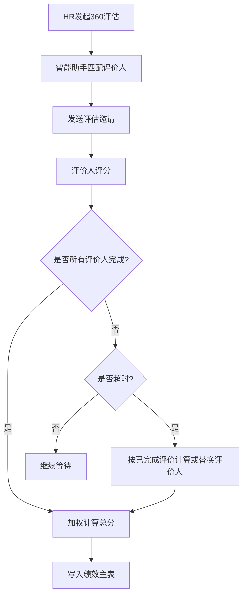
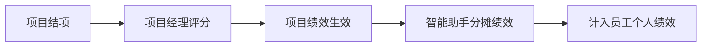
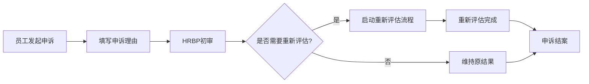

# 北森绩效云复刻 - 关键场景方案详解

**版本**: v1.0  
**最后更新**: 2026-05-17  
**关联主文档**: `files/beisen-performance-replication-plan.md`  
**适用对象**: HRBP、系统实施顾问、业务部门负责人

---

## 一、场景方案总览

本文档汇总北森绩效云中的 **8大关键场景方案**，提供简道云落地实现指南。

| 场景编号 | 场景名称 | 适用模块 | 复杂度 | 是否需二开 |
|---------|---------|---------|--------|-----------|
| SC-01 | 360环评 | 员工绩效 | 中 | 否 |
| SC-02 | HRBP动态授权 | 全模块 | 低 | 否 |
| SC-03 | 双轨制绩效考核 | 员工绩效 | 中 | 否 |
| SC-04 | 特殊人群标识整体方案 | 员工绩效 | 低 | 否 |
| SC-05 | 矩阵对比评估 | 员工绩效 | 高 | 是 |
| SC-06 | 组织绩效影响强制分布 | 员工绩效+组织绩效 | 中 | 否 |
| SC-07 | 项目制绩效-基于项目人力 | 员工绩效 | 高 | 部分 |
| SC-08 | 绩效申诉方案 | 员工绩效 | 低 | 否 |

---

## 二、场景方案详解

### SC-01: 360环评

#### 业务背景

传统绩效考核仅由上级评分，存在主观偏见风险。360度评估引入上级/同级/下级/自评/外部多方视角，确保评估客观公正。

#### 核心需求

1. 支持5类评价人角色（上级/同级/下级/自评/外部）
2. 匿名互评，保护评价人隐私
3. 加权计算各角色评分
4. 自动发送评估邀请
5. 评价进度跟踪

#### 简道云实现方案

##### 数据模型

```yaml
表单1: 评价人规则表
  - plan_id: 关联考核方案
  - evaluator_role: 单选 [上级, 同级, 下级, 自评, 外部]
  - weight: 数字（权重%）
  - min_count: 数字（最少人数）
  - max_count: 数字（最多人数）
  - auto_match_rule: 文本（自动匹配规则描述）

表单2: 360评估记录表
  - performance_id: 关联绩效主表
  - evaluatee_id: 成员字段（被评价人）
  - evaluator_id: 成员字段（评价人）
  - evaluator_role: 单选（评价人角色）
  - invitation_status: 单选 [未邀请, 已邀请, 已完成, 已超时]
  - invitation_time: 日期时间
  - completion_time: 日期时间
  - score: 数字（评分）
  - comments: 文本域（评语）
  - is_anonymous: 布尔（是否匿名）
```

##### 流程设计



##### 智能助手配置

```yaml
智能助手1: 360评估评价人自动匹配
触发类型: 表单触发
触发条件: 绩效主表.status 变更为 "评估中"

执行节点:
  1. 查询节点:
    - 查询对象: 评价人规则表
    - 查询条件: plan_id = {{触发记录.plan_id}}
    
  2. 循环容器:
    - 循环对象: 评价人规则列表
    
    循环内执行:
      a. 根据评价人角色查询对应人员:
        - 上级: 从员工信息表获取 direct_manager_id
        - 同级: 查询同部门同职级员工（排除本人）
        - 下级: 查询direct_report_ids
        - 自评: 被考核人本人
        - 外部: 从外部评价人表获取
        
      b. 写入360评估记录表:
        - 为每个评价人创建一条记录
        - 设置 invitation_status = "未邀请"
        
      c. HTTP请求节点:
        - 推送IM邀请给评价人

智能助手2: 360评估进度监控
触发类型: 定时触发
触发频率: 每天上午9:00

执行节点:
  1. 查询节点:
    - 查询对象: 360评估记录表
    - 查询条件: invitation_status = "已邀请" AND completion_time 为空
    
  2. 循环容器:
    - 循环对象: 未完成的评价记录
    
    循环内执行:
      a. 判断是否超时:
        - 若当前时间 - invitation_time > 7天，标记为超时
        
      b. 发送提醒:
        - 推送IM提醒给未完成的评价人
```

##### 匿名互评实现

1. **权限控制**:
   - 创建"匿名评价人"权限组
   - 该权限组只能查看自己的评价任务，无法查看其他评价人的身份
   
2. **表单脱敏**:
   - 在评价人填写的表单中，隐藏被评价人姓名（显示为"某同事"）
   - 通过前端事件实现：
     ```javascript
     // 表单加载时执行
     if (currentUserRole === 'evaluator') {
       hideField('evaluatee_name');
       showField('evaluatee_anonymous_name'); // 显示"某同事"
     }
     ```

3. **结果汇总脱敏**:
   - 在绩效主表中，仅展示各角色平均分，不展示单个评价人评分
   - HR可通过独立表单查看原始评价记录（需特殊权限）

##### 加权计算公式

```
最终得分 = Σ(各角色平均分 × 该角色权重)

示例:
- 上级评分: 90分，权重50% → 贡献45分
- 同级平均分: 85分，权重30% → 贡献25.5分
- 下级平均分: 88分，权重20% → 贡献17.6分
- 自评分: 92分，权重0% → 仅参考

最终得分 = 45 + 25.5 + 17.6 = 88.1分
```

---

### SC-02: HRBP动态授权

#### 业务背景

HRBP需要跨部门查看和管理绩效数据，但传统权限体系基于固定部门，无法灵活调整。

#### 核心需求

1. HRBP可动态配置负责的部门范围
2. 权限实时生效，无需重新登录
3. 支持临时授权（如HRBP休假时委托他人）

#### 简道云实现方案

##### 数据模型

```yaml
表单1: HRBP负责范围表
  - hrbp_id: 成员字段（HRBP）
  - department_ids: 部门字段（多选，负责的部门）
  - effective_date: 日期（生效日期）
  - expiry_date: 日期（失效日期，留空表示永久有效）
  - status: 单选 [有效, 已失效]
  - delegate_to: 成员字段（委托人，可选）
```

##### 权限配置

1. **动态权限组**:
   - 创建"HRBP角色"权限组
   - 数据权限设置为"自定义SQL过滤"
   - SQL条件: `department_id IN (SELECT department_ids FROM hrbp_scope WHERE hrbp_id = {{current_user}} AND status = '有效')`

2. **临时授权**:
   - 当HRBP设置delegate_to字段时，智能助手自动将委托人加入HRBP权限组
   - HRBP返回后，移除委托人权限

##### 智能助手配置

```yaml
智能助手: HRBP权限动态更新
触发类型: 表单触发
触发条件: HRBP负责范围表 新增/修改/删除

执行节点:
  1. 若新增或修改:
    - 更新权限组的SQL过滤条件
    - 推送IM通知给HRBP："您的负责范围已更新"
    
  2. 若设置delegate_to:
    - 将委托人添加到HRBP权限组
    - 推送IM通知给委托人："您已被授权为{{HRBP姓名}}的代理人"
```

---

### SC-03: 双轨制绩效考核

#### 业务背景

不同业务单元适合不同的考核工具（如研发用OKR，销售用KPI），需在同一企业内并行。

#### 核心需求

1. 支持KPI和OKR两种考核模式并存
2. 员工仅参与一种模式的考核
3. OKR完成度与绩效软连接（不直接计入分数）

#### 简道云实现方案

##### 数据模型

```yaml
表单1: 考核方案表
  - plan_id: 流水号
  - plan_name: 文本（方案名称）
  - plan_type: 单选 [KPI, OKR, BSC, PBC]
  - applicable_departments: 部门字段（多选，适用部门）
  - assessment_modules: 子表单（考核模块配置）
  
表单2: 被考核人方案表
  - employee_id: 成员字段
  - plan_id: 关联考核方案表
  - cycle_id: 关联绩效周期表
  - status: 单选 [有效, 已失效]
```

##### 差异化流程

**KPI方案流程**:
```
指标制定 → 审批 → 自评 → 经理评分 → 校准 → 确认
```

**OKR方案流程**:
```
OKR制定 → 审批 → 过程跟踪 → OKR完成度评估 → 经理定性评价 → 校准 → 确认
```

##### 软连接机制

1. **数据隔离**: OKR表和绩效表独立，不直接关联得分
2. **参考引用**: 在绩效评估环节，经理可查看下属OKR完成度作为评分参考
3. **定性评价**: 经理在绩效评语中需说明OKR执行情况对绩效的影响
4. **可选量化**: 若企业希望量化关联，可在绩效模板中设置"OKR完成度"考核项，权重建议≤20%

---

### SC-04: 特殊人群标识整体方案

#### 业务背景

试用期员工、实习生、外包人员等特殊人群需应用差异化考核流程。

#### 核心需求

1. 自动识别特殊人群
2. 应用简化版考核流程
3. 差异化评价指标

#### 简道云实现方案

##### 数据模型

```yaml
表单1: 特殊人群标识表
  - employee_id: 成员字段
  - special_type: 单选 [试用期, 实习生, 外包, 兼职, 其他]
  - start_date: 日期（标识生效日期）
  - end_date: 日期（标识失效日期，留空表示长期有效）
  - simplified_process: 布尔（是否启用简化流程）
  - custom_indicators: 文本域（差异化评价指标说明）
```

##### 智能助手配置

```yaml
智能助手: 特殊人群自动标识
触发类型: 表单触发
触发条件: 员工信息表.入职日期 / 员工类型 发生变更

执行节点:
  1. 判断逻辑:
    - 若入职日期 < 6个月前 AND 员工类型 = "正式员工" → 移除试用期标识
    - 若员工类型 = "实习生" → 添加实习生标识
    - 若员工类型 = "外包" → 添加外包标识
    
  2. 写入特殊人群标识表
```

##### 差异化流程

**试用期员工简化流程**:
```
指标制定（简化版，仅3-5个指标） → 经理评分 → 转正决策
```

**实习生考核**:
```
导师评价 + 项目成果展示 → 实习鉴定
```

---

### SC-05: 矩阵对比评估（需二开）

#### 业务背景

传统单一维度评分无法全面反映员工表现，需通过二维矩阵（如业绩vs能力）进行综合评估。

#### 核心需求

1. 二维散点图展示员工分布
2. 四象限划分（明星/潜力/待改进/骨干）
3. 支持拖拽调整员工位置

#### 简道云实现方案

##### 数据模型

```yaml
表单1: 绩效主表（扩展字段）
  - performance_score: 数字（业绩得分）
  - capability_score: 数字（能力得分）
  - quadrant: 单选 [明星, 潜力, 待改进, 骨干]（自动计算）
```

##### 二开前端页面

**技术栈**: Vue.js + ECharts

**功能**:
1. 调用简道云API获取员工绩效和能力得分
2. 使用ECharts绘制散点图
3. 支持点击员工头像查看详情
4. 支持拖拽调整坐标（需调用API更新数据）

**代码示例**:
```javascript
// 初始化散点图
const chart = echarts.init(document.getElementById('matrix-chart'));

const option = {
  xAxis: { name: '业绩得分', min: 0, max: 100 },
  yAxis: { name: '能力得分', min: 0, max: 100 },
  series: [{
    type: 'scatter',
    data: employees.map(emp => [emp.performance_score, emp.capability_score, emp.name]),
    label: { show: true, formatter: '{@[2]}' }
  }]
};

chart.setOption(option);
```

##### 四象限自动划分

```javascript
// 智能助手计算象限
if (performance_score >= 80 && capability_score >= 80) {
  quadrant = '明星';
} else if (performance_score < 80 && capability_score >= 80) {
  quadrant = '潜力';
} else if (performance_score < 80 && capability_score < 80) {
  quadrant = '待改进';
} else {
  quadrant = '骨干';
}
```

---

### SC-06: 组织绩效影响强制分布

#### 业务背景

组织绩效结果应影响个人绩效的强制分布比例，高绩效组织可获得更多A等级名额。

#### 核心需求

1. 组织绩效等级与个人分布比例联动
2. 自动调整各部门的A/B/C/D比例
3. 实时监控分布合规性

#### 简道云实现方案

##### 数据模型

```yaml
表单1: 分布规则表
  - plan_id: 关联考核方案
  - department_id: 部门字段
  - org_performance_grade: 单选 [A, B, C, D]（组织绩效等级）
  - grade_a_max_percentage: 数字（A等级最高比例%）
  - grade_b_target_percentage: 数字（B等级目标比例%）
  - grade_c_max_percentage: 数字（C等级最高比例%）
```

##### 联动规则

| 组织绩效等级 | A等级比例 | B等级比例 | C等级比例 | D等级比例 |
|------------|----------|----------|----------|----------|
| A | ≤30% | ≥60% | ≤10% | 0% |
| B | ≤20% | ≥70% | ≤10% | 0% |
| C | ≤10% | ≥70% | ≤20% | 0% |
| D | ≤5% | ≥65% | ≤25% | ≤5% |

##### 智能助手配置

```yaml
智能助手: 组织绩效联动分布调整
触发类型: 表单触发
触发条件: 组织绩效表.status 变更为 "已完成"

执行节点:
  1. 查询节点:
    - 查询对象: 组织绩效表
    - 获取字段: organization_id, performance_grade
    
  2. 根据组织绩效等级查询对应的分布规则:
    - 若grade = A → A比例=30%, B比例=60%, C比例=10%
    - 若grade = B → A比例=20%, B比例=70%, C比例=10%
    - ...
    
  3. 更新节点:
    - 更新对象: 分布规则表
    - 更新条件: department_id = {{organization_id}}
    - 更新内容: 调整A/B/C比例
    
  4. 通知节点:
    - 推送IM给部门经理："您部门的绩效分布比例已根据组织绩效调整为..."
```

---

### SC-07: 项目制绩效-基于项目人力

#### 业务背景

对于项目型组织，员工绩效应与项目成果挂钩，根据项目人力投入分摊项目绩效。

#### 核心需求

1. 记录员工在项目中的投入比例
2. 项目结项时自动分摊项目绩效
3. 计入员工个人绩效总分

#### 简道云实现方案

##### 数据模型

```yaml
表单1: 项目表
  - project_id: 流水号
  - project_name: 文本
  - project_manager: 成员字段
  - start_date: 日期
  - end_date: 日期
  - budget: 数字
  - status: 单选 [进行中, 已完成, 已取消]
  
表单2: 项目人力表
  - project_id: 关联项目表
  - employee_id: 成员字段
  - role: 文本（项目角色）
  - effort_percentage: 数字（投入比例%）
  - start_date: 日期
  - end_date: 日期
  
表单3: 项目绩效表
  - project_id: 关联项目表
  - project_score: 数字（项目评分）
  - project_grade: 单选 [A, B, C, D]
  - evaluation_comments: 文本域（评价评语）
  - status: 单选 [待评估, 已完成]
```

##### 流程设计



##### 智能助手配置

```yaml
智能助手: 项目绩效分摊
触发类型: 表单触发
触发条件: 项目绩效表.status 变更为 "已完成"

执行节点:
  1. 查询节点:
    - 查询对象: 项目人力表
    - 查询条件: project_id = {{触发记录.project_id}}
    
  2. 循环容器:
    - 循环对象: 项目成员列表
    
    循环内执行:
      a. 计算节点:
        - 个人项目绩效 = 项目评分 × 投入比例
        
      b. 查询节点:
        - 查询对象: 绩效主表
        - 查询条件: employee_id = {{当前成员ID}} AND cycle_id = {{当前周期}}
        
      c. 更新节点:
        - 更新对象: 绩效主表.指标评估子表
        - 更新内容: 新增"项目绩效"指标，填入个人项目绩效
        - 若已存在"项目绩效"指标，则累加
        
      d. 重新计算总分:
        - total_score = SUM(各指标得分 × 权重)
```

---

### SC-08: 绩效申诉方案

#### 业务背景

员工对绩效结果有异议时，需提供正式的申诉渠道，确保公平性。

#### 核心需求

1. 员工可在线发起申诉
2. HRBP初审，判断是否需要重新评估
3. 申诉处理全流程记录
4. 申诉期间暂停绩效生效

#### 简道云实现方案

##### 数据模型

```yaml
表单1: 绩效申诉表
  - appeal_id: 流水号
  - performance_id: 关联绩效主表
  - employee_id: 成员字段（申诉人）
  - appeal_reason: 文本域（申诉理由）
  - evidence_attachments: 附件（支撑材料）
  - appeal_status: 单选 [待初审, 初审通过, 初审驳回, 重新评估中, 申诉结案]
  - hrbp_reviewer: 成员字段（HRBP初审人）
  - hrbp_comments: 文本域（HRBP初审意见）
  - re_assessment_required: 布尔（是否需要重新评估）
  - final_decision: 文本域（最终决策）
  - created_time: 日期时间
  - resolved_time: 日期时间
```

##### 流程设计



##### 流程节点配置

| 节点名称 | 节点类型 | 负责人规则 | 操作权限 | 限时处理 |
|---------|---------|-----------|---------|---------|
| 员工发起申诉 | 填写节点 | 申诉人 | 新增/编辑/提交 | - |
| HRBP初审 | 审批节点 | HRBP（按部门分配） | 通过/驳回/要求补充材料 | 3个工作日 |
| 重新评估 | 流程节点 | 原评价人 + 上级经理 | 重新评分 | 5个工作日 |
| 申诉结案 | 系统节点 | - | 自动流转 | - |

##### 智能助手配置

```yaml
智能助手: 申诉期间暂停绩效生效
触发类型: 表单触发
触发条件: 绩效申诉表.appeal_status 变更为 "待初审"

执行节点:
  1. 更新节点:
    - 更新对象: 绩效主表
    - 更新条件: performance_id = {{触发记录.performance_id}}
    - 更新字段: status = "申诉中", appeal_status = "申诉中"
    
  2. 通知节点:
    - 推送IM给HRBP："收到{{员工姓名}}的绩效申诉，请及时初审"

智能助手: 申诉结案恢复绩效
触发类型: 表单触发
触发条件: 绩效申诉表.appeal_status 变更为 "申诉结案"

执行节点:
  1. 更新节点:
    - 更新对象: 绩效主表
    - 更新条件: performance_id = {{触发记录.performance_id}}
    - 更新字段: status = "已完成", appeal_status = "申诉已完成"
    
  2. 若重新评估结果为"维持原结果":
    - 触发电子签署流程
    
  3. 若重新评估结果为"调整结果":
    - 更新绩效主表的总分和等级
    - 触发新的电子签署流程
```

---

## 三、场景方案对比总结

| 场景 | 核心价值 | 实施难度 | 是否需二开 | 推荐优先级 |
|------|---------|---------|-----------|-----------|
| 360环评 | 提升评估客观性 | 中 | 否 | P0（高） |
| HRBP动态授权 | 提升HRBP工作效率 | 低 | 否 | P1（中） |
| 双轨制绩效考核 | 适配不同业务单元 | 中 | 否 | P0（高） |
| 特殊人群标识 | 差异化管理 | 低 | 否 | P1（中） |
| 矩阵对比评估 | 全面评估员工表现 | 高 | 是 | P2（低） |
| 组织绩效联动 | 强化团队意识 | 中 | 否 | P0（高） |
| 项目制绩效 | 项目成果挂钩 | 高 | 部分 | P1（中） |
| 绩效申诉 | 保障公平性 | 低 | 否 | P0（高） |

---

## 四、实施建议

### 4.1 分阶段实施策略

**Phase 1（第1-2个月）**: 实施P0优先级场景
- 360环评
- 双轨制绩效考核
- 组织绩效联动
- 绩效申诉

**Phase 2（第3-4个月）**: 实施P1优先级场景
- HRBP动态授权
- 特殊人群标识
- 项目制绩效

**Phase 3（第5-6个月）**: 实施P2优先级场景
- 矩阵对比评估（需二开）

### 4.2 常见陷阱与规避

| 陷阱 | 后果 | 规避方案 |
|------|------|---------|
| 360评估评价人不配合 | 评估进度延误 | 设置超时自动通过机制 + 定时提醒 |
| 强制分布导致优秀员工降级 | 员工不满流失 | 启用组织绩效联动 + 校准会议人工调整 |
| 项目绩效分摊不公 | 团队成员矛盾 | 明确投入比例计算规则 + 项目经理审核 |
| 申诉流程过长 | 绩效结果迟迟不能生效 | 设置申诉处理时限（如7个工作日） |

---

**文档维护说明**:
- 本工作表为主文档 `files/beisen-performance-replication-plan.md` 的详细补充
- 每次场景方案调整需同步更新版本号
- 所有飞书云文档需自动添加 Frank (ou_1e87f1890876b57a6f2ab437a3fce415) 为编辑协作者
