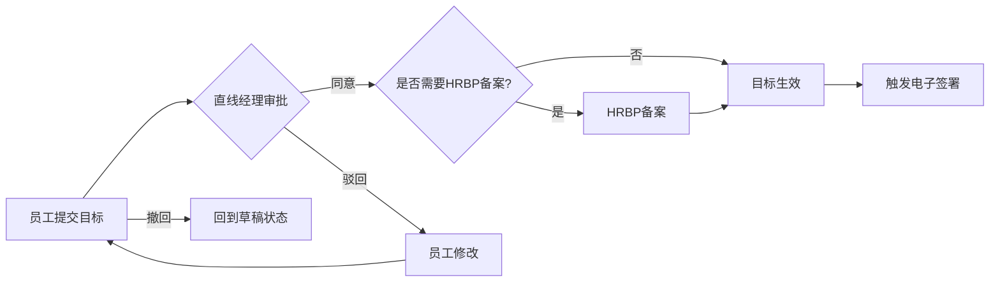

# 北森绩效云复刻 - 员工目标模块详细设计

**版本**: v1.0  
**最后更新**: 2026-05-17  
**关联主文档**: `files/beisen-performance-replication-plan.md`  
**适用对象**: 简道云管理员、HRBP、系统实施顾问

---

## 一、模块概述

员工目标模块是北森绩效云中实现"传统强管控模式"的核心载体，适用于销售、生产等结果导向型部门。与OKR模块相比，目标模块更强调**量化指标、强制对齐、电子签署**。

### 1.1 功能全景

```
┌─────────────────────────────────────────────┐
│           员工目标模块功能树                  │
├──────────────────┬──────────────────────────┤
│   员工自助        │     管理配置              │
├──────────────────┼──────────────────────────┤
│ • 我的目标       │ • 员工目标计划            │
│   - 目标制定     │   - 制定计划              │
│   - 目标审批     │   - 添加制定人员          │
│   - 目标协同     │   - 设置自动规则          │
│   - 目标地图     │   - 开启制定与监控        │
│   - 目标复盘     │   - 下发目标生效          │
│ • 四象限复盘     │   - 电子签署              │
│ • 目标看板       │ • 目标进度看板            │
│   - 制定分析(HR) │   - 制定分析(HR)          │
│   - 执行分析(HR) │   - 执行分析(HR)          │
│ • 团队目标       │ • 员工目标设置(20+配置项) │
│                  │ • 关键场景方案            │
└──────────────────┴──────────────────────────┘
```

---

## 二、数据模型设计

### 2.1 核心表单清单

| 表单名称 | 类型 | 说明 | 关键字段数 |
|---------|------|------|-----------|
| 目标周期表 | 普通表单 | 管理目标周期（年度/半年度/季度） | 8 |
| 员工目标主表 | 流程表单 | 存储员工目标主体信息 | 18 |
| 目标明细子表 | 子表单 | 嵌入主表，存储具体目标项 | 10 |
| 目标对齐关系表 | 普通表单 | 记录目标之间的对齐关系 | 6 |
| 目标审批记录表 | 普通表单 | 记录审批历史 | 7 |
| 目标评论表 | 普通表单 | 存储评论和@提及 | 8 |
| 目标复盘表 | 流程表单 | 四象限复盘记录 | 12 |
| 目标配置表 | 普通表单 | 存储20+配置项 | 25 |

### 2.2 员工目标主表字段设计

```yaml
表单名称: 员工目标主表
表单类型: 流程表单

字段列表:
  - 字段名: target_id
    类型: 流水号
    说明: 目标唯一标识
    规则: 自动生成，格式 TGT-YYYYMMDD-XXXX

  - 字段名: cycle_id
    类型: 关联字段
    关联表单: 目标周期表
    说明: 关联当前目标所属周期

  - 字段名: employee_id
    类型: 成员字段
    说明: 目标所有者
    规则: 默认当前登录用户

  - 字段名: department_id
    类型: 部门字段
    说明: 所属部门
    规则: 自动从员工信息获取

  - 字段名: target_title
    类型: 文本
    说明: 目标标题
    规则: 必填，最多100字

  - 字段名: target_items
    类型: 子表单
    关联子表: 目标明细子表
    说明: 目标明细项列表
    规则: 至少3个目标项，最多15个目标项

  - 字段名: alignment_targets
    类型: 关联字段（多选）
    关联表单: 员工目标主表 / 组织目标主表
    说明: 对齐的上级目标（可对齐员工目标或组织目标）
    规则: 必填，至少对齐1个

  - 字段名: visibility_scope
    类型: 多选
    选项: [全员可见, 仅上级可见, 指定人员可见]
    说明: 可见范围
    默认值: 全员可见

  - 字段名: specified_viewers
    类型: 成员字段（多选）
    说明: 指定可见人员
    显隐规则: 当visibility_scope="指定人员可见"时显示

  - 字段名: total_weight
    类型: 数字
    说明: 总权重（%）
    规则: 自动计算 = SUM(目标明细子表.权重)
    校验: 必须=100%

  - 字段名: overall_progress
    类型: 数字
    说明: 整体进度百分比
    规则: 自动计算 = SUM(权重 * 完成度) / 100

  - 字段名: status
    类型: 单选
    选项: [草稿, 审批中, 已生效, 已驳回, 已完成, 已撤回]
    说明: 目标状态
    默认值: 草稿

  - 字段名: electronic_signature_employee
    类型: 签名
    说明: 员工电子签名
    显隐规则: 仅在"已生效"状态后显示

  - 字段名: electronic_signature_manager
    类型: 签名
    说明: 经理电子签名
    显隐规则: 仅在"已生效"状态后显示

  - 字段名: signed_pdf
    类型: 附件
    说明: 签署后的PDF文件
    显隐规则: 智能助手生成后自动填充

  - 字段名: target_book_export
    类型: 附件
    说明: 导出的目标书（Excel/PDF）
    显隐规则: 智能助手生成后自动填充

  - 字段名: approval_history
    类型: 文本域
    说明: 审批历史记录
    规则: 只读，智能助手自动追加
```

### 2.3 目标明细子表字段设计

```yaml
子表名称: 目标明细子表
父表单: 员工目标主表

字段列表:
  - 字段名: item_name
    类型: 文本
    说明: 目标项名称
    规则: 必填，SMART原则校验

  - 字段名: item_type
    类型: 单选
    选项: [定量目标, 定性目标]
    说明: 目标类型
    默认值: 定量目标

  - 字段名: item_weight
    类型: 数字
    说明: 目标权重（%）
    规则: 必填，所有目标项权重之和必须=100

  - 字段名: target_value
    类型: 数字
    说明: 目标值
    规则: 定量目标必填

  - 字段名: current_value
    类型: 数字
    说明: 当前完成值
    规则: 可手动更新或通过智能助手自动同步

  - 字段名: completion_rate
    类型: 数字
    说明: 完成度（%）
    规则: 自动计算 = (当前值 / 目标值) * 100
    上限: 100%

  - 字段名: unit
    类型: 下拉
    选项: [元, 个, %, 天, 次, 其他]
    说明: 计量单位

  - 字段名: deadline
    类型: 日期
    说明: 截止日期

  - 字段名: risk_level
    类型: 单选
    选项: [无风险, 低风险, 中风险, 高风险]
    说明: 风险等级
    默认值: 无风险

  - 字段名: remarks
    类型: 文本域
    说明: 备注说明
```

---

## 三、员工目标设置（20+配置项详解）

### 3.1 配置项分类

北森员工目标模块包含 **20+配置项**，分为以下6类：

| 配置类别 | 配置项数量 | 说明 |
|---------|-----------|------|
| 规则类 | 4 | 自动规则、更新率频次、审批权限、定量分配 |
| 权限类 | 5 | 可见范围、经理权限、任务权限、评价人设置、菜单授权 |
| 功能类 | 6 | 电子签、沟通评论、字段映射、多语言配置、IM集成、目标任务集成 |
| 流程类 | 3 | 目标审批权限、目标经理权限、目标更新率频次 |
| 集成类 | 2 | IM集成、字段映射 |
| 高级类 | 2 | 电子签设置、目标任务集成IM |

### 3.2 配置项详细设计

#### 规则类配置

| 配置项名称 | 配置位置 | 配置方式 | 说明 |
|-----------|---------|---------|------|
| **目标自动规则** | 员工目标设置 > 自动规则 | 智能助手Pro配置 | 定义目标自动生效、自动提醒、自动归档等规则 |
| **目标更新率频次** | 员工目标设置 > 更新率频次 | 下拉选择 [每周, 每两周, 每月] | 规定员工更新目标进度的最低频次 |
| **目标审批权限** | 员工目标设置 > 审批权限 | 权限组配置 | 定义谁可以审批目标（直线经理/虚线经理/HRBP） |
| **目标定量分配** | 员工目标设置 > 定量分配 | 数字输入 | 设定定量目标与定性目标的最低比例（如定量≥70%） |

#### 权限类配置

| 配置项名称 | 配置位置 | 配置方式 | 说明 |
|-----------|---------|---------|------|
| **目标可见范围** | 员工目标设置 > 可见范围 | 单选 [全员可见, 仅上级可见, 自定义] | 全局默认可见范围 |
| **目标经理权限** | 员工目标设置 > 经理权限 | 权限组配置 | 定义经理可查看/编辑/审批哪些字段 |
| **目标任务权限** | 员工目标设置 > 任务权限 | 权限组配置 | 定义谁可以为目标添加任务 |
| **目标评价人设置** | 员工目标设置 > 评价人设置 | 成员选择器 | 定义目标复盘时的评价人（经理/同级/自评） |
| **目标管理菜单授权** | 员工目标设置 > 菜单授权 | 角色勾选 | 控制哪些角色可以看到目标管理菜单 |

#### 功能类配置

| 配置项名称 | 配置位置 | 配置方式 | 说明 |
|-----------|---------|---------|------|
| **目标电子签设置** | 员工目标设置 > 电子签 | 开关 [启用/禁用] | 是否启用电子签署功能 |
| **目标沟通评论设置** | 员工目标设置 > 沟通评论 | 开关 [启用/禁用] | 是否启用目标评论区 |
| **目标字段映射** | 员工目标设置 > 字段映射 | 字段对应表 | 映射外部系统字段到目标表单 |
| **目标多语言配置** | 员工目标设置 > 多语言 | 开关 [启用/禁用] + 语言选择 | 是否启用多语言支持 |
| **目标任务集成IM** | 员工目标设置 > IM集成 | Webhook配置 | 目标任务变更时推送IM消息 |
| **目标导航菜单设置** | 员工目标设置 > 导航菜单 | 菜单编辑器 | 自定义左侧导航菜单项 |

### 3.3 配置表设计

```yaml
表单名称: 目标配置表
表单类型: 普通表单

字段列表:
  - config_id: 流水号
  - config_category: 单选 [规则类, 权限类, 功能类, 流程类, 集成类, 高级类]
  - config_key: 文本（配置项键名）
  - config_value: 文本（配置项值）
  - config_description: 文本域（配置说明）
  - applicable_department: 部门字段（适用部门，留空表示全局）
  - effective_date: 日期（生效日期）
  - created_by: 成员字段
  - updated_by: 成员字段
  - updated_time: 日期时间
```

---

## 四、流程设计

### 4.1 目标审批流程



#### 流程节点配置

| 节点名称 | 节点类型 | 负责人规则 | 操作权限 | 限时处理 |
|---------|---------|-----------|---------|---------|
| 员工提交 | 填写节点 | 当前登录用户 | 新增/编辑/提交/撤回 | - |
| 直线经理审批 | 审批节点 | 直线经理（自动匹配） | 同意/驳回/加签/转交 | 5个工作日 |
| HRBP备案 | 填写节点 | HRBP（按部门分配） | 查看/备注 | - |
| 目标生效 | 系统节点 | - | 自动流转 | - |
| 电子签署 | 系统节点 | - | 触发智能助手 | - |

#### 流转规则

| 规则名称 | 触发条件 | 执行动作 |
|---------|---------|---------|
| 权重校验 | 提交时 | 检查所有目标项权重之和是否=100%，否则阻止提交 |
| SMART校验 | 提交时 | 检查目标是否符合SMART原则（通过前端事件提示） |
| 对齐强制校验 | 提交时 | 若未对齐任何上级目标，阻止提交（与OKR不同，目标模块强制对齐） |
| 定量比例校验 | 提交时 | 检查定量目标占比是否≥配置值（如70%），否则警告 |
| 防打扰合并 | 同一周期重复提交 | 若经理已有待办且未处理，不推送新待办 |

### 4.2 电子签署流程


---

## 五、关键场景方案

### 5.1 BP工作台

**需求**: HRBP需要快速查看负责部门的目标制定进度

**实现方案**:

1. **自定义仪表盘**:
   - 图表1: 各部门目标按时提交率（柱状图）
   - 图表2: 待审批目标列表（表格）
   - 图表3: 高风险目标预警（卡片列表）
   - 快捷按钮: "批量导出目标书"、"发送提醒"

2. **数据权限**:
   - HRBP只能查看负责部门的数据
   - 通过权限组过滤

### 5.2 人事调动联动

**需求**: 员工部门变更后，自动更新目标负责人和可见范围

**实现方案**:

```yaml
智能助手名称: 人事调动联动
触发类型: 表单触发
触发条件: 员工信息表.部门 发生变更

执行节点:
  1. 查询节点:
    - 查询对象: 员工目标主表
    - 查询条件: employee_id = {{触发记录.员工ID}} AND status = "已生效"
    
  2. 循环容器:
    - 循环对象: 查询结果集
    
    循环内执行:
      a. 更新节点:
        - 更新对象: 员工目标主表
        - 更新字段: 
          - department_id = {{新部门ID}}
          - visibility_scope = 重新计算（根据新部门权限规则）
          
      b. 通知节点:
        - 推送IM给新直线经理
        - 消息内容: "{{员工姓名}}已调入您部门，其目标已自动更新可见范围"
```

### 5.3 共背目标

**需求**: 多个员工共同承担同一个目标，权重分摊

**实现方案**:

1. **数据模型**:
   - 在目标对齐关系表中增加"共背标记"字段
   - 允许多个员工目标对齐到同一个上级目标

2. **权重分摊逻辑**:
   ```
   假设上级目标权重为100%，有3个下级共背：
   - 员工A承担40%
   - 员工B承担35%
   - 员工C承担25%
   
   上级目标完成度 = A完成度*40% + B完成度*35% + C完成度*25%
   ```

3. **简道云实现**:
   - 使用聚合表计算加权完成度
   - 在仪表盘展示共背目标贡献度

### 5.4 年度目标拆解

**需求**: 将年度目标拆解为月度/季度目标，累计值跟踪

**实现方案**:

1. **数据模型**:
   - 年度目标主表
   - 月度拆解子表（嵌入年度目标）
   - 累计值计算字段

2. **累计值计算公式**:
   ```
   累计完成值 = SUM(月度拆解子表.当月完成值)
   累计完成度 = 累计完成值 / 年度目标值 * 100%
   ```

3. **智能助手**:
   - 每月初自动创建新的月度拆解记录
   - 月末提醒员工填写当月完成值

### 5.5 经理下发目标

**需求**: 经理可直接为下属下发目标，无需员工自行制定

**实现方案**:

1. **权限配置**:
   - 在"目标经理权限"中启用"经理可创建下属目标"

2. **流程设计**:
   ```
   经理创建目标 → 选择下属 → 填写目标内容 → 提交
   → 下属收到待办 → 下属确认/提出异议 → 经理调整 → 生效
   ```

3. **异议处理**:
   - 下属可在目标详情页点击"提出异议"
   - 填写异议理由，触发经理重新审批流程

---

## 六、数据分析

### 6.1 目标制定分析（HR视角）

**数据集**: 聚合表 员工目标制定分析数据集

**图表组件**:

| 图表名称 | 图表类型 | 维度 | 指标 | 说明 |
|---------|---------|------|------|------|
| 按时提交率 | 饼图 | 部门 | 按时提交人数/总人数 | 监控各部门目标制定进度 |
| 审批通过率 | 柱状图 | 部门 | 通过数/提交总数 | 评估目标质量 |
| 平均目标项数量 | 数字卡片 | - | AVG(目标项数量) | 监控目标粒度 |
| 对齐率 | 进度条 | - | 已对齐目标数/总目标数 | 战略贯通程度 |
| 定量目标占比 | 雷达图 | 部门 | 定量目标权重总和 | 评估目标量化程度 |

### 6.2 目标执行分析（HR视角）

**数据集**: 聚合表 员工目标执行分析数据集

**图表组件**:

| 图表名称 | 图表类型 | 维度 | 指标 | 说明 |
|---------|---------|------|------|------|
| 进度分布 | 直方图 | 进度区间 | 目标数量 | 监控整体执行情况 |
| 高风险目标列表 | 表格 | 目标标题/所有者/进度/风险等级 | - | 重点关注对象 |
| 部门进度对比 | 雷达图 | 部门 | 平均进度% | 跨部门对比 |
| 更新频率分析 | 折线图 | 日期 | 更新次数 | 评估过程管理活跃度 |
| 按时完成率 | 数字卡片 | - | 按时完成目标数/总目标数 | 执行力评估 |

---

## 七、电子签署功能详解

### 7.1 签署流程


### 7.2 技术实现

**前置条件**: 简道云企业版及以上

**步骤**:

1. **配置打印模板**:
   - 进入"打印模板" > "新建模板"
   - 选择Word模板，设计目标书格式（含员工签名区和经理签名区）
   - 插入签名字段占位符

2. **智能助手配置**:
   ```yaml
   触发类型: 表单触发
   触发条件: 员工目标主表.status 变更为 "已生效"
   
   执行节点:
     1. 等待节点:
       - 等待条件: electronic_signature_employee 和 electronic_signature_manager 均不为空
       
     2. HTTP请求节点:
       - 请求方式: POST
       - 请求URL: 二开服务API地址 /api/generate-target-pdf
       - 请求体:
         {
           "target_id": "{{target_id}}",
           "template_id": "TARGET_TEMPLATE_001",
           "employee_signature": "{{electronic_signature_employee}}",
           "manager_signature": "{{electronic_signature_manager}}"
         }
         
     3. 更新节点:
       - 更新对象: 员工目标主表
       - 更新字段: signed_pdf = {{API返回的PDF URL}}
       
     4. 通知节点:
       - 推送IM消息给员工和经理
   ```

---

## 八、IM集成配置

### 8.1 飞书/钉钉集成

**配置步骤**:

1. **启用第三方集成**:
   - 进入"系统管理" > "第三方集成" > "飞书/钉钉"
   - 授权简道云访问IM API

2. **配置智能助手HTTP节点**:
   - 获取IM机器人Webhook地址
   - 在智能助手中配置HTTP POST请求

3. **消息推送场景**:
   - 目标审批待办
   - 目标进度更新提醒
   - 目标到期提醒
   - 人事调动通知
   - 电子签署完成通知

---

## 九、常见问题与解决方案

### 9.1 目标权重之和不等于100%

**解决方案**: 同OKR模块，通过前端校验 + 流程校验 + 智能提醒三重保障

### 9.2 对齐强制校验导致提交失败

**问题**: 员工找不到合适的上级目标对齐

**解决方案**:
- 提供"临时对齐"功能，允许先提交后补对齐
- HRBP协助员工找到合适的对齐目标
- 在目标地图中高亮显示未对齐目标

### 9.3 电子签署失败

**问题**: 签名图片无法正确嵌入PDF

**解决方案**:
- 检查打印模板中的签名占位符是否正确配置
- 确保二开服务有足够的权限访问签名图片
- 测试PDF生成API是否正常响应

---

## 十、附录：字段映射表

### 10.1 北森字段 → 简道云字段映射

| 北森字段名 | 北森字段类型 | 简道云字段名 | 简道云字段类型 | 备注 |
|-----------|------------|-------------|--------------|------|
| Target Title | 文本 | target_title | 文本 | 目标标题 |
| Target Items | 子表 | target_items | 子表单 | 目标明细 |
| Weight | 数字 | item_weight | 数字 | 百分比 |
| Target Value | 数字 | target_value | 数字 | 目标值 |
| Current Value | 数字 | current_value | 数字 | 当前值 |
| Completion Rate | 数字 | completion_rate | 数字 | 自动计算 |
| Alignment | 关联 | alignment_targets | 关联字段 | 强制对齐 |
| Employee Signature | 签名 | electronic_signature_employee | 签名 | 员工签名 |
| Manager Signature | 签名 | electronic_signature_manager | 签名 | 经理签名 |
| Status | 枚举 | status | 单选 | 状态机 |

---

**文档维护说明**:
- 本工作表为主文档 `files/beisen-performance-replication-plan.md` 的详细补充
- 每次字段/流程调整需同步更新版本号
- 所有飞书云文档需自动添加 Frank (ou_1e87f1890876b57a6f2ab437a3fce415) 为编辑协作者
