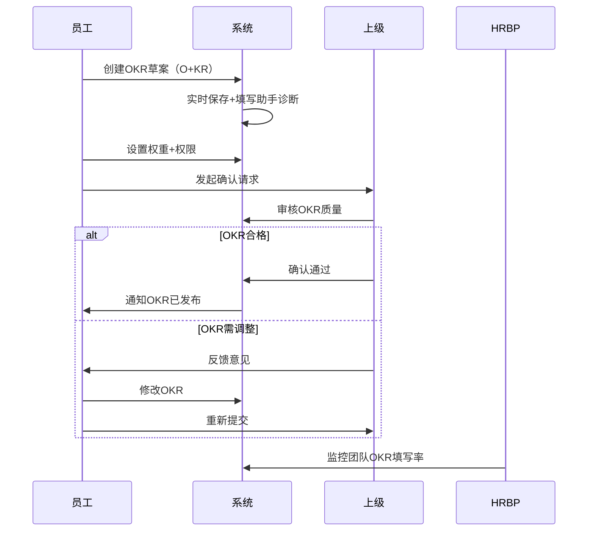
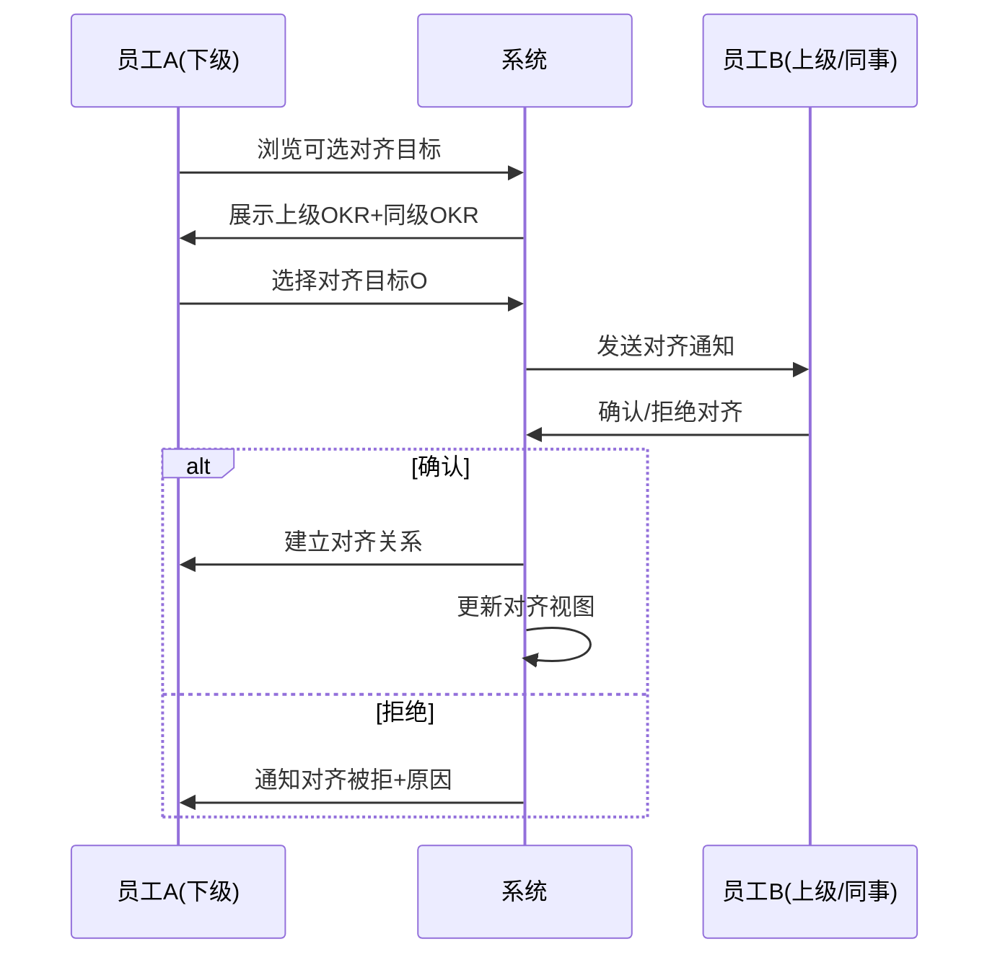
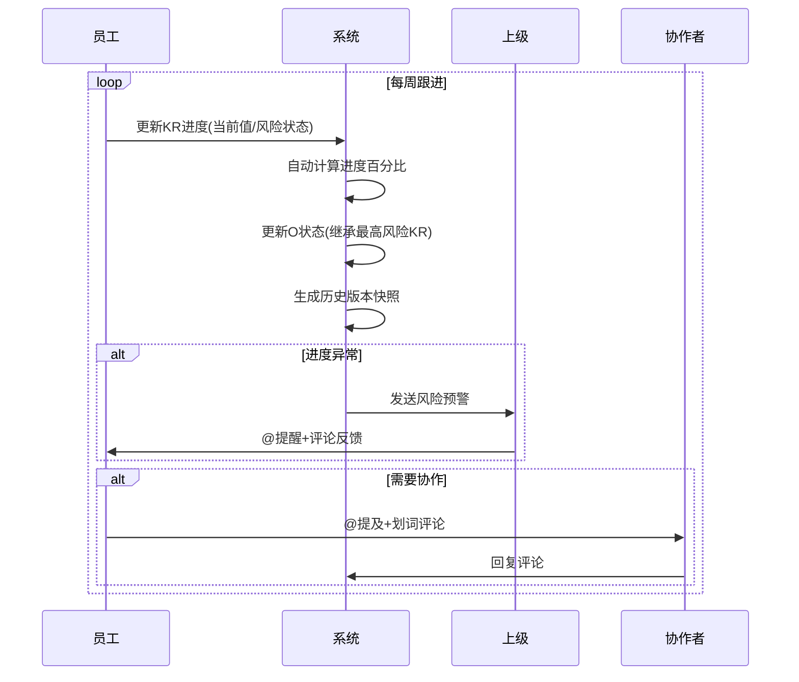
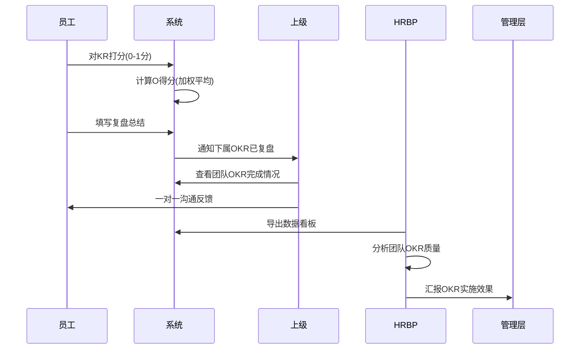
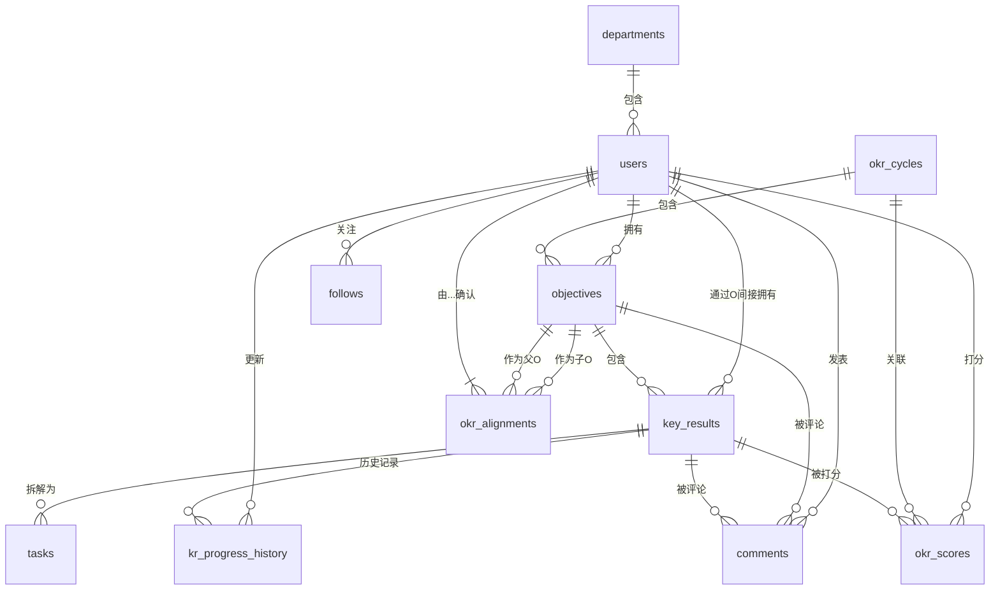
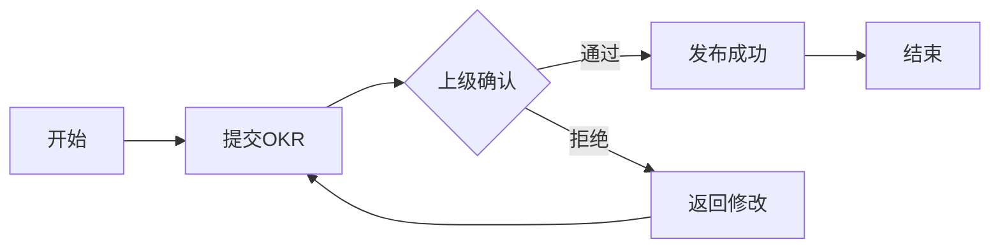
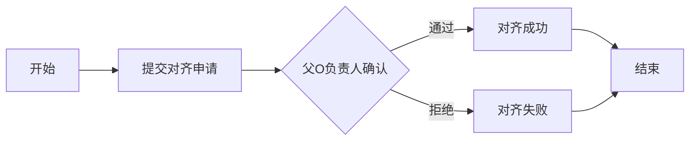
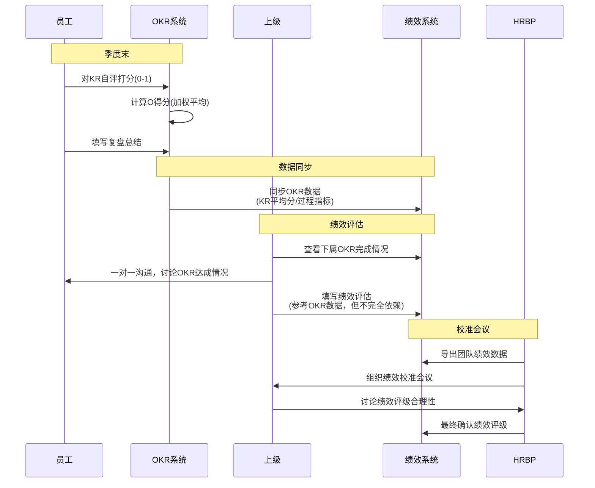

# 飞书OKR系统全功能复刻设计方案

**版本**: v1.0  
**创建日期**: 2026年5月16日  
**设计者**: Drucker (企业咨询顾问)  
**适用平台**: 简道云零代码平台 + 二开服务层  

---

## 目录

1. [执行摘要](#一执行摘要)
2. [飞书OKR功能架构分析](#二飞书okr功能架构分析)
3. [数据库设计建议](#三数据库设计建议)
4. [简道云实现方案](#四简道云实现方案)
5. [与绩效管理的衔接方案](#五与绩效管理的衔接方案)
6. [落地实施路线图](#六落地实施路线图)
7. [附录：关键配置清单](#七附录关键配置清单)

---

## 一、执行摘要

### 1.1 项目背景

本方案旨在基于飞书OKR系统的完整功能清单，设计一套可在简道云零代码平台上实现的OKR管理系统。方案遵循**战略人力资源管理(SHRM)**理论框架，将OKR作为**目标对齐与绩效管理**的核心工具，实现从"人岗匹配"到"业人匹配+横纵向对齐"的管理升级。

### 1.2 核心价值主张

| 维度 | 价值点 |
|------|--------|
| **战略穿透力** | 通过OKR对齐机制，确保公司战略→部门目标→个人目标的纵向贯通 |
| **透明与协作** | 全员可见的OKR体系，促进跨部门协作和目标一致性 |
| **敏捷迭代** | 支持周期性复盘和调整，适应快速变化的业务环境 |
| **数据驱动** | 通过进度跟踪和打分复盘，为绩效评估提供客观依据 |

### 1.3 技术选型原则

- **零代码优先**: 80%功能通过简道云原生能力实现（表单+流程+仪表盘+智能助手）
- **二开补充**: 20%复杂逻辑通过Node.js/Python中间件实现（如权重计算、历史版本对比、自动翻译）
- **混合架构**: 简道云负责数据存储和基础交互，二开层负责复杂业务逻辑和自定义UI

### 1.4 关键成功因素

1. **高层支持**: OKR需要CEO/高管率先垂范，公开自己的OKR
2. **培训先行**: 全员OKR理念培训，避免将OKR等同于KPI考核
3. **试点验证**: 选择1-2个创新部门试点，积累经验后推广
4. **持续迭代**: 每季度复盘OKR实施效果，优化流程和工具

---

## 二、飞书OKR功能架构分析

### 2.1 功能模块全景图

```mermaid
graph TB
    A[飞书OKR系统] --> B[OKR制定模块]
    A --> C[OKR对齐模块]
    A --> D[OKR跟进模块]
    A --> E[OKR复盘模块]
    A --> F[管理员功能]
    A --> G[辅助功能]
    
    B --> B1[添加O和KR]
    B --> B2[编辑模式-实时保存]
    B --> B3[填写助手-诊断建议]
    B --> B4[权重设置]
    B --> B5[权限设置-保密OKR]
    B --> B6[发布与确认]
    
    C --> C1[目标对齐]
    C --> C2[@协作提醒]
    C --> C3[对齐视图-可视化]
    C --> C4[查看他人OKR]
    C --> C5[关注功能]
    C --> C6[评论功能-划词/全局]
    
    D --> D1[进度更新-KR状态]
    D --> D2[O状态-风险继承]
    D --> D3[高级设置-起始/当前/目标值]
    D --> D4[任务拆解-子任务]
    D --> D5[进度报告-一键生成]
    D --> D6[历史版本-每日快照]
    
    E --> E1[KR打分-0-1分]
    E --> E2[O得分-加权平均]
    E --> E3[管理者数据看板]
    E --> E4[数据导出]
    
    F --> F1[初始化设置]
    F --> F2[多周期管理]
    F --> F3[权限管理-可见范围]
    F --> F4[权重控制开关]
    F --> F5[管理员数据看板]
    F --> F6[产品名称自定义]
    
    G --> G1[自动翻译]
    G --> G2[公告板-红点提示]
    G --> G3[搜索功能-姓名/离职成员]
```

### 2.2 核心业务流程

#### 流程1: OKR制定流程（季度初）



#### 流程2: OKR对齐流程



#### 流程3: OKR跟进流程（每周/双周）



#### 流程4: OKR复盘流程（季度末）



### 2.3 功能模块关联关系分析

| 模块 | 上游依赖 | 下游影响 | 关键数据流 |
|------|---------|---------|-----------|
| **OKR制定** | 无（起点） | OKR对齐、OKR跟进 | O/KR定义→对齐关系→进度跟踪 |
| **OKR对齐** | OKR制定 | OKR跟进、数据看板 | 对齐关系→目标一致性指标 |
| **OKR跟进** | OKR制定+对齐 | OKR复盘、数据看板 | 进度数据→风险预警→复盘打分 |
| **OKR复盘** | OKR跟进 | 绩效考核、下一周期OKR | 打分结果→绩效评估→新OKR参考 |
| **管理员功能** | 所有模块 | 系统配置、数据治理 | 权限设置→可见范围→数据安全 |

### 2.4 核心业务实体识别

基于APQC流程框架，识别以下核心业务实体：

1. **用户(User)**: 员工、管理者、HRBP、管理员
2. **OKR周期(Cycle)**: 年度/季度/月度周期定义
3. **Objective(O)**: 目标，定性描述，有优先级和权重
4. **Key Result(KR)**: 关键成果，定量指标，有起始值/当前值/目标值
5. **对齐关系(Alignment)**: O之间的上下级/同级对齐
6. **进度记录(Progress)**: KR的历史进度快照
7. **打分记录(Scoring)**: 季度末KR的0-1分打分
8. **评论(Comment)**: 划词评论和全局评论
9. **任务(Task)**: KR拆解的子任务
10. **关注关系(Follow)**: 用户关注的其他成员OKR

---

## 三、数据库设计建议

### 3.1 核心数据表结构

#### 表1: 用户表 (users)

| 字段名 | 类型 | 说明 | 约束 |
|--------|------|------|------|
| user_id | VARCHAR(32) | 用户ID（主键） | PK, NOT NULL |
| name | VARCHAR(50) | 姓名 | NOT NULL |
| email | VARCHAR(100) | 邮箱 | UNIQUE |
| department_id | VARCHAR(32) | 所属部门ID | FK → departments |
| manager_id | VARCHAR(32) | 直属上级ID | FK → users |
| position | VARCHAR(100) | 职位 | |
| status | TINYINT | 状态(1在职/0离职) | DEFAULT 1 |
| created_at | DATETIME | 创建时间 | |
| updated_at | DATETIME | 更新时间 | |

#### 表2: 部门表 (departments)

| 字段名 | 类型 | 说明 | 约束 |
|--------|------|------|------|
| dept_id | VARCHAR(32) | 部门ID（主键） | PK, NOT NULL |
| dept_name | VARCHAR(100) | 部门名称 | NOT NULL |
| parent_dept_id | VARCHAR(32) | 父部门ID | FK → departments |
| dept_level | INT | 部门层级 | |
| created_at | DATETIME | 创建时间 | |

#### 表3: OKR周期表 (okr_cycles)

| 字段名 | 类型 | 说明 | 约束 |
|--------|------|------|------|
| cycle_id | VARCHAR(32) | 周期ID（主键） | PK, NOT NULL |
| cycle_name | VARCHAR(50) | 周期名称（如"2026 Q1"） | NOT NULL |
| cycle_type | TINYINT | 周期类型(1年度/2季度/3月度) | NOT NULL |
| start_date | DATE | 开始日期 | NOT NULL |
| end_date | DATE | 结束日期 | NOT NULL |
| status | TINYINT | 状态(1进行中/2已结束/3未开始) | DEFAULT 3 |
| is_active | BOOLEAN | 是否当前活跃周期 | DEFAULT FALSE |
| created_by | VARCHAR(32) | 创建人ID | FK → users |
| created_at | DATETIME | 创建时间 | |

#### 表4: Objective表 (objectives)

| 字段名 | 类型 | 说明 | 约束 |
|--------|------|------|------|
| o_id | VARCHAR(32) | O ID（主键） | PK, NOT NULL |
| cycle_id | VARCHAR(32) | 所属周期ID | FK → okr_cycles, NOT NULL |
| owner_id | VARCHAR(32) | 负责人ID | FK → users, NOT NULL |
| o_title | VARCHAR(500) | O标题（定性描述） | NOT NULL |
| o_description | TEXT | O详细描述 | |
| weight | DECIMAL(5,2) | 权重(0-100) | DEFAULT 100 |
| priority | INT | 优先级(1最高) | DEFAULT 999 |
| status | TINYINT | 状态(1草稿/2已发布/3已完成/4已归档) | DEFAULT 1 |
| visibility | TINYINT | 可见性(1全员可见/2仅自己/3指定人员) | DEFAULT 1 |
| visible_to_users | TEXT | 可见人员ID列表(JSON数组) | |
| confirmed_by | VARCHAR(32) | 确认人ID（上级） | FK → users |
| confirmed_at | DATETIME | 确认时间 | |
| created_at | DATETIME | 创建时间 | |
| updated_at | DATETIME | 更新时间 | |
| version | INT | 版本号 | DEFAULT 1 |

#### 表5: Key Result表 (key_results)

| 字段名 | 类型 | 说明 | 约束 |
|--------|------|------|------|
| kr_id | VARCHAR(32) | KR ID（主键） | PK, NOT NULL |
| o_id | VARCHAR(32) | 所属O ID | FK → objectives, NOT NULL |
| kr_title | VARCHAR(500) | KR标题（定量描述） | NOT NULL |
| kr_description | TEXT | KR详细描述 | |
| weight | DECIMAL(5,2) | 权重(0-100) | DEFAULT 100 |
| start_value | DECIMAL(15,2) | 起始值 | DEFAULT 0 |
| current_value | DECIMAL(15,2) | 当前值 | DEFAULT 0 |
| target_value | DECIMAL(15,2) | 目标值 | NOT NULL |
| unit | VARCHAR(20) | 单位（如"%","万元","个"） | |
| progress_percent | DECIMAL(5,2) | 进度百分比(自动计算) | |
| risk_status | TINYINT | 风险状态(1正常/2有风险/3严重滞后) | DEFAULT 1 |
| status | TINYINT | 状态(1进行中/2已完成/3已放弃) | DEFAULT 1 |
| score | DECIMAL(3,2) | 季度末打分(0-1) | |
| sort_order | INT | 排序号 | DEFAULT 0 |
| created_at | DATETIME | 创建时间 | |
| updated_at | DATETIME | 更新时间 | |

**进度计算公式**:
```
progress_percent = (current_value - start_value) / (target_value - start_value) * 100
```

**注意**: 当 `target_value == start_value` 时，progress_percent = 0 或 100（根据current_value判断）

#### 表6: OKR对齐关系表 (okr_alignments)

| 字段名 | 类型 | 说明 | 约束 |
|--------|------|------|------|
| alignment_id | VARCHAR(32) | 对齐ID（主键） | PK, NOT NULL |
| child_o_id | VARCHAR(32) | 子O ID（下级OKR） | FK → objectives, NOT NULL |
| parent_o_id | VARCHAR(32) | 父O ID（上级OKR） | FK → objectives, NOT NULL |
| alignment_type | TINYINT | 对齐类型(1向上对齐/2横向对齐) | NOT NULL |
| status | TINYINT | 状态(1待确认/2已确认/3已拒绝) | DEFAULT 1 |
| confirmed_by | VARCHAR(32) | 确认人ID（父O负责人） | FK → users |
| confirmed_at | DATETIME | 确认时间 | |
| reject_reason | TEXT | 拒绝原因 | |
| created_at | DATETIME | 创建时间 | |

**唯一约束**: `(child_o_id, parent_o_id)` 防止重复对齐

#### 表7: KR进度历史记录表 (kr_progress_history)

| 字段名 | 类型 | 说明 | 约束 |
|--------|------|------|------|
| history_id | VARCHAR(32) | 历史记录ID（主键） | PK, NOT NULL |
| kr_id | VARCHAR(32) | KR ID | FK → key_results, NOT NULL |
| snapshot_date | DATE | 快照日期 | NOT NULL |
| current_value | DECIMAL(15,2) | 当时当前值 | NOT NULL |
| progress_percent | DECIMAL(5,2) | 当时进度百分比 | |
| risk_status | TINYINT | 当时风险状态 | |
| update_note | TEXT | 更新说明 | |
| updated_by | VARCHAR(32) | 更新人ID | FK → users |
| created_at | DATETIME | 创建时间 | |

**唯一约束**: `(kr_id, snapshot_date)` 每天最多一个版本

#### 表8: OKR打分记录表 (okr_scores)

| 字段名 | 类型 | 说明 | 约束 |
|--------|------|------|------|
| score_id | VARCHAR(32) | 打分ID（主键） | PK, NOT NULL |
| kr_id | VARCHAR(32) | KR ID | FK → key_results, NOT NULL |
| cycle_id | VARCHAR(32) | 周期ID | FK → okr_cycles, NOT NULL |
| score_value | DECIMAL(3,2) | 打分(0-1) | NOT NULL |
| self_assessment | TEXT | 自评说明 | |
| scored_by | VARCHAR(32) | 打分人ID | FK → users, NOT NULL |
| scored_at | DATETIME | 打分时间 | |

**唯一约束**: `(kr_id, cycle_id)` 每个KR在每个周期只能打一次分

#### 表9: 评论表 (comments)

| 字段名 | 类型 | 说明 | 约束 |
|--------|------|------|------|
| comment_id | VARCHAR(32) | 评论ID（主键） | PK, NOT NULL |
| target_type | TINYINT | 目标类型(1 O/2 KR/3 评论回复) | NOT NULL |
| target_id | VARCHAR(32) | 目标ID（O ID或KR ID或评论ID） | NOT NULL |
| content | TEXT | 评论内容 | NOT NULL |
| mention_users | TEXT | @提及的用户ID列表(JSON数组) | |
| parent_comment_id | VARCHAR(32) | 父评论ID（回复时用） | FK → comments |
| created_by | VARCHAR(32) | 创建人ID | FK → users, NOT NULL |
| created_at | DATETIME | 创建时间 | |
| updated_at | DATETIME | 更新时间 | |

#### 表10: 任务表 (tasks)

| 字段名 | 类型 | 说明 | 约束 |
|--------|------|------|------|
| task_id | VARCHAR(32) | 任务ID（主键） | PK, NOT NULL |
| kr_id | VARCHAR(32) | 所属KR ID | FK → key_results, NOT NULL |
| task_title | VARCHAR(500) | 任务标题 | NOT NULL |
| task_description | TEXT | 任务描述 | |
| assignee_id | VARCHAR(32) | 负责人ID | FK → users |
| due_date | DATE | 截止日期 | |
| status | TINYINT | 状态(1待办/2进行中/3已完成) | DEFAULT 1 |
| completed_at | DATETIME | 完成时间 | |
| created_by | VARCHAR(32) | 创建人ID | FK → users, NOT NULL |
| created_at | DATETIME | 创建时间 | |

#### 表11: 关注关系表 (follows)

| 字段名 | 类型 | 说明 | 约束 |
|--------|------|------|------|
| follow_id | VARCHAR(32) | 关注ID（主键） | PK, NOT NULL |
| follower_id | VARCHAR(32) | 关注者ID | FK → users, NOT NULL |
| followed_user_id | VARCHAR(32) | 被关注者ID | FK → users, NOT NULL |
| created_at | DATETIME | 创建时间 | |

**唯一约束**: `(follower_id, followed_user_id)` 防止重复关注

#### 表12: 系统配置表 (system_configs)

| 字段名 | 类型 | 说明 | 约束 |
|--------|------|------|------|
| config_key | VARCHAR(100) | 配置键（主键） | PK, NOT NULL |
| config_value | TEXT | 配置值 | NOT NULL |
| config_type | TINYINT | 配置类型(1字符串/2数字/3布尔/4JSON) | |
| description | VARCHAR(500) | 配置说明 | |
| updated_by | VARCHAR(32) | 最后更新人ID | FK → users |
| updated_at | DATETIME | 更新时间 | |

**典型配置项**:
- `okr_product_name`: OKR产品名称（默认"OKR"）
- `enable_weight_setting`: 是否允许用户设置权重（true/false）
- `default_cycle_type`: 默认周期类型（1/2/3）
- `visibility_scope`: 默认可见范围（all/dept/team）
- `max_o_per_user`: 每人最大O数量（默认5）
- `max_kr_per_o`: 每个O最大KR数量（默认5）

### 3.2 关键关联关系图



### 3.3 索引设计建议

| 表名 | 索引字段 | 索引类型 | 说明 |
|------|---------|---------|------|
| objectives | (cycle_id, owner_id) | 联合索引 | 快速查询某周期某人的O |
| objectives | (owner_id, status) | 联合索引 | 快速查询某人的进行中O |
| key_results | (o_id, sort_order) | 联合索引 | 按顺序获取O下的KR |
| okr_alignments | (child_o_id) | 单列索引 | 快速查询某O的对齐关系 |
| okr_alignments | (parent_o_id) | 单列索引 | 快速查询某O被哪些O对齐 |
| kr_progress_history | (kr_id, snapshot_date DESC) | 联合索引 | 快速获取KR最新进度 |
| comments | (target_type, target_id) | 联合索引 | 快速查询某O/KR的评论 |
| follows | (follower_id) | 单列索引 | 快速查询某人关注的用户 |

---

## 四、简道云实现方案

### 4.1 简道云能力映射分析

#### 4.1.1 可用简道云原生实现的功能（80%）

| 飞书OKR功能 | 简道云对应能力 | 实现方式 | 复杂度 |
|------------|--------------|---------|--------|
| 添加O和KR | 普通表单+子表单 | O为主表，KR为子表字段 | ⭐⭐ |
| 编辑模式-实时保存 | 表单自动保存 | 开启"自动保存草稿"功能 | ⭐ |
| 权重设置 | 数字字段 | O和KR表单中添加权重字段 | ⭐ |
| 权限设置-可见性 | 数据权限组 | 设置"可查看/可编辑"权限组 | ⭐⭐⭐ |
| 发布与确认 | 流程表单 | O发布触发审批流程给上级 | ⭐⭐⭐ |
| 目标对齐 | 关联字段+双向关联 | O表单中关联父O，建立双向关联 | ⭐⭐⭐ |
| @协作提醒 | 智能助手Pro | HTTP触发+飞书消息推送 | ⭐⭐⭐⭐ |
| 查看他人OKR | 仪表盘+筛选器 | 创建"我的OKR""团队OKR"视图 | ⭐⭐ |
| 关注功能 | 关联数据字段 | 创建"关注关系"表单，仪表盘过滤 | ⭐⭐ |
| 评论功能 | 子表单+富文本 | KR表单中添加评论子表 | ⭐⭐ |
| 进度更新 | 表单编辑+公式字段 | KR表单中更新current_value，自动计算progress | ⭐⭐ |
| O状态-风险继承 | 智能助手Pro | 定时触发，检查KR风险状态，更新O状态 | ⭐⭐⭐⭐ |
| 高级设置-起始/当前/目标值 | 数字字段 | KR表单中添加三个数值字段 | ⭐ |
| 任务拆解 | 子表单 | KR表单中添加任务子表 | ⭐⭐ |
| 历史版本 | 智能助手Pro+聚合表 | 定时快照，存储到历史表 | ⭐⭐⭐⭐ |
| KR打分 | 表单字段+权限控制 | 季度末开放打分字段，限制仅本人可编辑 | ⭐⭐ |
| O得分-加权平均 | 聚合表+公式 | 通过聚合表计算KR加权平均分 | ⭐⭐⭐ |
| 管理者数据看板 | 仪表盘 | 创建多维度统计图表 | ⭐⭐⭐ |
| 数据导出 | 内置导出功能 | 仪表盘/表单数据导出Excel | ⭐ |
| 多周期管理 | 表单+筛选器 | 创建"OKR周期"表单，O/KR关联周期 | ⭐⭐ |
| 搜索功能 | 仪表盘搜索框 | 仪表盘顶部添加搜索组件 | ⭐⭐ |
| 公告板 | 知识库+消息推送 | 使用简道云知识库发布OKR指南 | ⭐⭐ |

#### 4.1.2 需要二开实现的功能（20%）

| 飞书OKR功能 | 二开需求 | 技术方案 | 复杂度 |
|------------|---------|---------|--------|
| 实时拖动调整顺序 | 前端交互优化 | Vue.js自定义页面，调用简道云API更新sort_order | ⭐⭐⭐⭐ |
| 填写助手-诊断建议 | AI内容分析 | 接入大模型API，分析O/KR质量，给出建议 | ⭐⭐⭐⭐⭐ |
| 对齐视图-可视化 | 图形化展示 | D3.js/ECharts绘制对齐关系图 | ⭐⭐⭐⭐⭐ |
| 划词评论 | 前端交互 | 自定义富文本编辑器，支持选中文字评论 | ⭐⭐⭐⭐⭐ |
| 进度报告-一键生成 | 文档自动生成 | Node.js生成Markdown/Word报告，推送到飞书文档 | ⭐⭐⭐⭐ |
| 历史版本对比-高亮显示 | 差异对比算法 | Python difflib库对比文本差异，前端高亮显示 | ⭐⭐⭐⭐ |
| 自动翻译 | 多语言支持 | 接入翻译API（如百度翻译/DeepL），自动翻译O/KR | ⭐⭐⭐ |
| 权重自动校验 | 业务规则校验 | 后端校验O下KR权重总和是否为100%，不符合则拒绝提交 | ⭐⭐⭐ |
| 复杂权限控制 | 细粒度权限 | 后端中间件实现字段级权限（如某些KR仅特定人可见） | ⭐⭐⭐⭐ |

### 4.2 简道云表单设计详解

#### 表单1: OKR周期管理表单

**表单名称**: `okr_cycle_mgmt`

**字段设计**:

| 字段名 | 字段类型 | 必填 | 说明 | 高级设置 |
|--------|---------|------|------|---------|
| cycle_name | 单行文本 | 是 | 周期名称（如"2026 Q1"） | 唯一性校验 |
| cycle_type | 单选按钮 | 是 | 周期类型 | 选项: 年度/季度/月度 |
| start_date | 日期 | 是 | 开始日期 | |
| end_date | 日期 | 是 | 结束日期 | 校验: end_date > start_date |
| status | 单选按钮 | 是 | 状态 | 选项: 未开始/进行中/已结束 |
| is_active | 复选框 | 否 | 是否当前活跃周期 | 默认不勾选 |
| description | 多行文本 | 否 | 周期说明 | |
| created_by | 成员字段 | 是 | 创建人 | 默认值: 当前用户 |
| created_at | 日期时间 | 是 | 创建时间 | 默认值: 当前时间 |

**视图设计**:
- 表格视图: 展示所有周期，按start_date降序
- 筛选器: 按cycle_type、status筛选

**权限设置**:
- 仅管理员可创建/编辑周期
- 全员可查看周期列表

---

#### 表单2: Objective主表单

**表单名称**: `objective_main`

**字段设计**:

| 字段名 | 字段类型 | 必填 | 说明 | 高级设置 |
|--------|---------|------|------|---------|
| o_title | 单行文本 | 是 | O标题（定性描述） | 最大长度500字符 |
| o_description | 多行文本 | 否 | O详细描述 | 富文本编辑器 |
| cycle_id | 关联数据 | 是 | 所属周期 | 关联`okr_cycle_mgmt`表单 |
| owner_id | 成员字段 | 是 | 负责人 | 默认值: 当前用户 |
| weight | 数字 | 否 | 权重(0-100) | 默认值: 100，范围0-100 |
| priority | 数字 | 否 | 优先级 | 默认值: 999，越小优先级越高 |
| status | 单选按钮 | 是 | 状态 | 选项: 草稿/已发布/已完成/已归档，默认: 草稿 |
| visibility | 单选按钮 | 是 | 可见性 | 选项: 全员可见/仅自己/指定人员，默认: 全员可见 |
| visible_to_users | 成员多选 | 否 | 可见人员 | 当visibility="指定人员"时显示 |
| confirmed_by | 成员字段 | 否 | 确认人（上级） | 只读，流程确认后自动填充 |
| confirmed_at | 日期时间 | 否 | 确认时间 | 只读，流程确认后自动填充 |
| o_score | 数字 | 否 | O得分(加权平均) | 只读，由聚合表自动计算 |
| created_at | 日期时间 | 是 | 创建时间 | 默认值: 当前时间，只读 |
| updated_at | 日期时间 | 是 | 更新时间 | 默认值: 当前时间，每次编辑自动更新 |

**子表单: Key Results**

子表单名称: `kr_subform`

| 字段名 | 字段类型 | 必填 | 说明 | 高级设置 |
|--------|---------|------|------|---------|
| kr_title | 单行文本 | 是 | KR标题（定量描述） | 最大长度500字符 |
| kr_description | 多行文本 | 否 | KR详细描述 | |
| weight | 数字 | 否 | 权重(0-100) | 默认值: 100，范围0-100 |
| start_value | 数字 | 否 | 起始值 | 默认值: 0 |
| current_value | 数字 | 是 | 当前值 | 默认值: 0 |
| target_value | 数字 | 是 | 目标值 | 必须 > start_value |
| unit | 下拉框 | 否 | 单位 | 选项: %/万元/个/天/其他 |
| progress_percent | 公式 | 否 | 进度百分比 | 公式: `(current_value - start_value) / (target_value - start_value) * 100` |
| risk_status | 单选按钮 | 是 | 风险状态 | 选项: 正常/有风险/严重滞后，默认: 正常 |
| kr_status | 单选按钮 | 是 | KR状态 | 选项: 进行中/已完成/已放弃，默认: 进行中 |
| score | 数字 | 否 | KR打分(0-1) | 季度末开放编辑，范围0-1，步长0.1 |
| sort_order | 数字 | 否 | 排序号 | 默认值: 0 |

**公式字段说明**:
- `progress_percent` 公式需要考虑除零情况：
  ```
  IF(target_value == start_value, 
     IF(current_value >= target_value, 100, 0), 
     (current_value - start_value) / (target_value - start_value) * 100)
  ```

**视图设计**:
- 表格视图: 展示所有O，按cycle_id、owner_id分组
- 看板视图: 按status分组（草稿/已发布/已完成）
- 画廊视图: 卡片式展示O标题和进度

**权限设置**:
- 创建人: 可编辑自己的O
- 上级(manager_id): 可查看下属的O
- 管理员: 可查看所有O
- 当visibility="仅自己"时: 仅创建人可见
- 当visibility="指定人员"时: 仅visible_to_users中的人员可见

**数据联动规则**:
- 当cycle_id改变时，自动加载该周期的默认配置
- 当owner_id改变时，自动填充confirmed_by为owner的上级

---

#### 表单3: OKR对齐关系表单

**表单名称**: `okr_alignment`

**字段设计**:

| 字段名 | 字段类型 | 必填 | 说明 | 高级设置 |
|--------|---------|------|------|---------|
| child_o_id | 关联数据 | 是 | 子O ID | 关联`objective_main`表单 |
| parent_o_id | 关联数据 | 是 | 父O ID | 关联`objective_main`表单 |
| alignment_type | 单选按钮 | 是 | 对齐类型 | 选项: 向上对齐/横向对齐 |
| status | 单选按钮 | 是 | 状态 | 选项: 待确认/已确认/已拒绝，默认: 待确认 |
| confirmed_by | 成员字段 | 否 | 确认人 | 只读，父O负责人 |
| confirmed_at | 日期时间 | 否 | 确认时间 | 只读 |
| reject_reason | 多行文本 | 否 | 拒绝原因 | 当status="已拒绝"时显示 |
| created_by | 成员字段 | 是 | 创建人 | 默认值: 当前用户，只读 |
| created_at | 日期时间 | 是 | 创建时间 | 默认值: 当前时间，只读 |

**校验规则**:
- 唯一性校验: `(child_o_id, parent_o_id)` 组合不能重复
- 逻辑校验: child_o_id != parent_o_id（不能对自己对齐）
- 权限校验: 只有child_o的owner才能创建对齐关系

**流程设计**:
- 提交后触发审批流程，发送给parent_o的owner
- parent_o的owner可选择"确认"或"拒绝"
- 确认后status变为"已确认"，拒绝后status变为"已拒绝"，需填写reject_reason

**视图设计**:
- 表格视图: 展示所有对齐关系，按status筛选
- 我的对齐: 筛选created_by=当前用户的记录
- 待我确认: 筛选parent_o.owner=当前用户且status="待确认"的记录

---

#### 表单4: KR进度历史表单

**表单名称**: `kr_progress_history`

**字段设计**:

| 字段名 | 字段类型 | 必填 | 说明 | 高级设置 |
|--------|---------|------|------|---------|
| kr_id | 关联数据 | 是 | KR ID | 关联`objective_main`中的KR子表（需通过二开实现） |
| snapshot_date | 日期 | 是 | 快照日期 | 默认值: 当前日期 |
| current_value | 数字 | 是 | 当时当前值 | |
| progress_percent | 数字 | 否 | 当时进度百分比 | 只读，由智能助手计算 |
| risk_status | 单选按钮 | 否 | 当时风险状态 | 选项: 正常/有风险/严重滞后 |
| update_note | 多行文本 | 否 | 更新说明 | |
| updated_by | 成员字段 | 是 | 更新人 | 默认值: 当前用户，只读 |
| created_at | 日期时间 | 是 | 创建时间 | 默认值: 当前时间，只读 |

**智能助手Pro设计**:
- **触发条件**: 定时触发（每天凌晨2点）
- **执行动作**:
  1. 查询所有进行中的KR（kr_status="进行中"）
  2. 读取每个KR的current_value、progress_percent、risk_status
  3. 在`kr_progress_history`中创建新记录
  4. 如果当天已有记录，则跳过（每天最多一个版本）

**视图设计**:
- 按kr_id分组，按snapshot_date降序排列
- 用于展示KR的进度趋势图

---

#### 表单5: 评论表单

**表单名称**: `okr_comments`

**字段设计**:

| 字段名 | 字段类型 | 必填 | 说明 | 高级设置 |
|--------|---------|------|------|---------|
| target_type | 单选按钮 | 是 | 目标类型 | 选项: O/KR/评论回复 |
| target_id | 单行文本 | 是 | 目标ID | 存储O ID或KR ID或评论ID |
| content | 富文本 | 是 | 评论内容 | 支持@提及 |
| mention_users | 成员多选 | 否 | @提及的用户 | 从content中解析提取 |
| parent_comment_id | 单行文本 | 否 | 父评论ID | 回复时填写 |
| created_by | 成员字段 | 是 | 创建人 | 默认值: 当前用户，只读 |
| created_at | 日期时间 | 是 | 创建时间 | 默认值: 当前时间，只读 |

**智能助手Pro设计**:
- **触发条件**: 表单提交后触发
- **执行动作**:
  1. 解析content中的@提及（格式: @用户名）
  2. 提取mention_users字段
  3. 通过飞书API发送消息提醒给被@用户

**视图设计**:
- 按target_id分组，按created_at升序排列
- 用于在O/KR详情页展示评论列表

---

#### 表单6: 任务表单

**表单名称**: `okr_tasks`

**字段设计**:

| 字段名 | 字段类型 | 必填 | 说明 | 高级设置 |
|--------|---------|------|------|---------|
| kr_id | 关联数据 | 是 | 所属KR ID | 关联`objective_main`中的KR子表 |
| task_title | 单行文本 | 是 | 任务标题 | |
| task_description | 多行文本 | 否 | 任务描述 | |
| assignee_id | 成员字段 | 否 | 负责人 | 默认值: 当前用户 |
| due_date | 日期 | 否 | 截止日期 | |
| status | 单选按钮 | 是 | 状态 | 选项: 待办/进行中/已完成，默认: 待办 |
| completed_at | 日期时间 | 否 | 完成时间 | 当status="已完成"时自动填充 |
| created_by | 成员字段 | 是 | 创建人 | 默认值: 当前用户，只读 |
| created_at | 日期时间 | 是 | 创建时间 | 默认值: 当前时间，只读 |

**视图设计**:
- 表格视图: 按kr_id、status分组
- 看板视图: 按status分组（待办/进行中/已完成）
- 甘特图视图: 按due_date展示任务时间线

---

#### 表单7: 关注关系表单

**表单名称**: `okr_follows`

**字段设计**:

| 字段名 | 字段类型 | 必填 | 说明 | 高级设置 |
|--------|---------|------|------|---------|
| follower_id | 成员字段 | 是 | 关注者 | 默认值: 当前用户，只读 |
| followed_user_id | 成员字段 | 是 | 被关注者 | |
| created_at | 日期时间 | 是 | 创建时间 | 默认值: 当前时间，只读 |

**唯一性校验**: `(follower_id, followed_user_id)` 不能重复

**视图设计**:
- 我关注的: 筛选follower_id=当前用户
- 关注我的: 筛选followed_user_id=当前用户

---

#### 表单8: 系统配置表单

**表单名称**: `system_configs`

**字段设计**:

| 字段名 | 字段类型 | 必填 | 说明 | 高级设置 |
|--------|---------|------|------|---------|
| config_key | 单行文本 | 是 | 配置键 | 唯一性校验 |
| config_value | 多行文本 | 是 | 配置值 | |
| config_type | 单选按钮 | 是 | 配置类型 | 选项: 字符串/数字/布尔/JSON |
| description | 单行文本 | 否 | 配置说明 | |
| updated_by | 成员字段 | 是 | 最后更新人 | 默认值: 当前用户，只读 |
| updated_at | 日期时间 | 是 | 更新时间 | 默认值: 当前时间，只读 |

**典型配置项**:
- `okr_product_name`: "OKR"
- `enable_weight_setting`: "true"
- `default_cycle_type`: "2"（季度）
- `visibility_scope`: "all"
- `max_o_per_user`: "5"
- `max_kr_per_o`: "5"

**权限设置**:
- 仅管理员可编辑
- 全员可查看

---

### 4.3 简道云流程设计

#### 流程1: OKR发布确认流程

**流程名称**: `okr_publish_approval`

**触发条件**: 当`objective_main`表单中status从"草稿"变为"已发布"时

**流程节点**:



**节点配置**:

| 节点名称 | 节点类型 | 负责人 | 操作权限 | 流转条件 |
|---------|---------|--------|---------|---------|
| 提交OKR | 开始节点 | 发起人 | 提交 | - |
| 上级确认 | 审批节点 | owner.manager_id | 通过/拒绝 | - |
| 发布成功 | 结束节点 | - | - | 上级确认=通过 |
| 返回修改 | 结束节点 | - | - | 上级确认=拒绝 |

**智能助手Pro集成**:
- 当流程到达"上级确认"节点时，通过HTTP触发发送飞书消息给上级
- 当流程结束时，发送通知给发起人

---

#### 流程2: OKR对齐确认流程

**流程名称**: `okr_alignment_approval`

**触发条件**: 当`okr_alignment`表单提交时

**流程节点**:



**节点配置**:

| 节点名称 | 节点类型 | 负责人 | 操作权限 | 流转条件 |
|---------|---------|--------|---------|---------|
| 提交对齐申请 | 开始节点 | 发起人 | 提交 | - |
| 父O负责人确认 | 审批节点 | parent_o.owner_id | 通过/拒绝 | - |
| 对齐成功 | 结束节点 | - | - | 确认=通过 |
| 对齐失败 | 结束节点 | - | - | 确认=拒绝 |

**智能助手Pro集成**:
- 当流程到达"父O负责人确认"节点时，发送飞书消息给父O负责人
- 当流程结束时，发送通知给发起人（包含拒绝原因）

---

### 4.4 简道云仪表盘设计

#### 仪表盘1: 我的OKR

**仪表盘名称**: `my_okr_dashboard`

**组件设计**:

1. **筛选器组件**:
   - 周期筛选: 下拉框，选择okr_cycle
   - 状态筛选: 多选框，选择status（草稿/已发布/已完成）

2. **统计卡片**:
   - 我的O总数: COUNT(objective_main WHERE owner_id=当前用户)
   - 已发布O数: COUNT(objective_main WHERE owner_id=当前用户 AND status="已发布")
   - 平均进度: AVG(progress_percent FROM key_results WHERE o_id IN 我的O)
   - 高风险KR数: COUNT(key_results WHERE risk_status="严重滞后" AND o_id IN 我的O)

3. **表格组件**:
   - 展示我的O列表
   - 字段: o_title, cycle_name, status, o_score, progress_percent
   - 点击O标题可跳转到O详情页

4. **进度趋势图**:
   - 折线图，展示近30天我的KR平均进度变化
   - X轴: 日期，Y轴: 平均进度百分比

5. **对齐关系图**:
   - 树状图，展示我的O的对齐关系
   - 根节点: 我的O，子节点: 对齐的父O和子O

**权限设置**:
- 仅当前用户可查看自己的OKR

---

#### 仪表盘2: 团队OKR

**仪表盘名称**: `team_okr_dashboard`

**组件设计**:

1. **筛选器组件**:
   - 周期筛选
   - 部门筛选
   - 成员筛选

2. **统计卡片**:
   - 团队O总数
   - OKR填写率: (已发布O数 / 应填写O数) * 100%
   - OKR对齐率: (已对齐O数 / 总O数) * 100%
   - 近7天更新率: (近7天有更新的O数 / 总O数) * 100%

3. **表格组件**:
   - 展示团队成员的O列表
   - 字段: owner_name, o_title, cycle_name, status, progress_percent, risk_status
   - 支持按progress_percent排序，快速识别滞后OKR

4. **进度分布图**:
   - 柱状图，展示团队KR进度分布（0-20%, 20-40%, 40-60%, 60-80%, 80-100%）

5. **风险预警列表**:
   - 表格，展示risk_status="严重滞后"的KR
   - 字段: kr_title, owner_name, progress_percent, days_to_deadline

**权限设置**:
- 部门负责人可查看本部门所有成员的OKR
- 普通成员仅可查看自己的OKR和自己关注的OKR

---

#### 仪表盘3: 管理者数据看板

**仪表盘名称**: `manager_okr_analytics`

**组件设计**:

1. **筛选器组件**:
   - 周期筛选
   - 部门筛选（多级联动）

2. **核心指标卡片**:
   - OKR填写率
   - OKR对齐率
   - KR打分率: (已打分KR数 / 应打分KR数) * 100%
   - 近7天更新率
   - 平均O得分

3. **趋势分析图**:
   - 折线图，展示近6个周期的OKR填写率、对齐率、打分率趋势

4. **部门对比图**:
   - 柱状图，对比各部门的OKR填写率、对齐率

5. **OKR质量分析**:
   - 散点图，X轴: O数量，Y轴: 平均进度，气泡大小: 团队人数
   - 识别OKR过多或过少的团队

6. **数据导出按钮**:
   - 导出当前筛选条件下的OKR数据为Excel

**权限设置**:
- 仅管理员和部门负责人可查看

---

### 4.5 智能助手Pro设计

#### 智能助手1: OKR风险预警

**助手名称**: `okr_risk_alert`

**触发条件**: 定时触发（每周一上午9点）

**执行逻辑**:

```
1. 查询所有进行中的KR（kr_status="进行中"）
2. 筛选risk_status="严重滞后"或progress_percent < 50%且距离end_date < 7天的KR
3. 获取KR所属O的owner_id
4. 获取owner的manager_id
5. 通过飞书API发送消息给owner和manager
   - 消息内容: "您的KR【kr_title】进度仅为progress_percent%，存在延期风险，请及时更新进度或调整目标。"
6. 记录日志到`okr_alert_logs`表单
```

**所需接口**:
- 简道云API: 查询表单数据
- 飞书API: 发送消息

---

#### 智能助手2: OKR历史版本快照

**助手名称**: `okr_history_snapshot`

**触发条件**: 定时触发（每天凌晨2点）

**执行逻辑**:

```
1. 查询所有进行中的O（status="已发布"或"进行中"）
2. 遍历每个O下的KR
3. 读取KR的current_value、progress_percent、risk_status
4. 检查`kr_progress_history`中是否已有当天的记录
   - 如果已有，跳过
   - 如果没有，创建新记录
5. 记录执行日志
```

**注意事项**:
- 需要处理时区问题，确保每天只创建一个快照
- 对于没有变化的KR，仍需创建快照（便于追踪"无变化"的状态）

---

#### 智能助手3: @提及消息推送

**助手名称**: `okr_mention_notify`

**触发条件**: 表单提交后触发（`okr_comments`表单）

**执行逻辑**:

```
1. 读取新提交的评论记录
2. 解析content字段，提取@提及的用户名
   - 正则表达式: /@(\w+)/g
3. 根据用户名查询user_id
4. 通过飞书API发送消息给被@用户
   - 消息内容: "您在OKR评论中被@提及：comment_content（点击查看）"
   - 链接: 跳转到对应的O/KR详情页
5. 更新comment记录的mention_users字段
```

**技术难点**:
- 需要从飞书通讯录同步用户信息，建立username到user_id的映射
- 需要处理@多个用户的情况

---

#### 智能助手4: O得分自动计算

**助手名称**: `okr_o_score_calc`

**触发条件**: 定时触发（每季度结束后第1天）或表单提交后触发（KR打分后）

**执行逻辑**:

```
1. 查询所有已打分的KR（score IS NOT NULL）
2. 按o_id分组
3. 对每个O，计算加权平均分：
   o_score = SUM(kr.score * kr.weight) / SUM(kr.weight)
4. 更新`objective_main`表单中的o_score字段
5. 记录计算日志
```

**注意事项**:
- 需要处理weight为0的情况（避免除零错误）
- 如果O下没有打分的KR，o_score保持为空

---

### 4.6 权限体系设计

#### 4.6.1 角色定义

| 角色 | 权限范围 | 典型用户 |
|------|---------|---------|
| **超级管理员** | 所有权限，包括系统配置、数据导出、查看所有OKR | IT管理员、HR总监 |
| **部门管理员** | 查看本部门所有OKR、管理团队OKR、数据导出 | 部门负责人、HRBP |
| **普通员工** | 查看自己的OKR、查看全员公开的OKR、创建/编辑自己的OKR | 全体员工 |
| **访客** | 仅查看全员公开的OKR | 实习生、外包人员 |

#### 4.6.2 数据权限配置

**简道云权限组设置**:

1. **全员可见权限组**:
   - 适用范围: 所有用户
   - 权限: 可查看`visibility="全员可见"`的O

2. **部门可见权限组**:
   - 适用范围: 部门负责人+部门成员
   - 权限: 可查看本部门所有O（无论visibility设置）

3. **个人私有权限组**:
   - 适用范围: O的owner
   - 权限: 可编辑自己的O（无论visibility设置）

4. **指定人员权限组**:
   - 适用范围: O的visible_to_users字段中的人员
   - 权限: 可查看该O

**权限优先级**: 个人私有 > 指定人员 > 部门可见 > 全员可见

#### 4.6.3 字段级权限控制

| 字段 | 创建人 | 上级 | 管理员 | 其他人 |
|------|--------|------|--------|--------|
| o_title | 可编辑 | 可查看 | 可查看 | 依visibility而定 |
| o_description | 可编辑 | 可查看 | 可查看 | 依visibility而定 |
| weight | 可编辑（若enable_weight_setting=true） | 可查看 | 可查看 | 不可见 |
| kr子表 | 可编辑 | 可查看 | 可查看 | 依visibility而定 |
| o_score | 只读 | 只读 | 只读 | 只读 |
| confirmed_by | 只读 | 可编辑（审批时） | 只读 | 不可见 |

**注意**: 简道云原生不支持字段级权限，需要通过以下方式实现：
- 方法1: 创建多个表单副本，不同角色看到不同表单
- 方法2: 通过二开中间件实现字段级权限控制（推荐）

---

### 4.7 二开服务层设计

#### 4.7.1 技术架构

```
┌─────────────────────────────────────────┐
│         前端层 (Vue.js + Element UI)      │
│  - 自定义OKR编辑页面（支持拖动排序）       │
│  - 对齐关系可视化图（D3.js）              │
│  - 历史版本对比页面（diff高亮显示）       │
└──────────────┬──────────────────────────┘
               │ HTTP/WebSocket
┌──────────────▼──────────────────────────┐
│      二开服务层 (Node.js + Express)      │
│  - API网关（统一鉴权、限流）              │
│  - 业务逻辑层（权重校验、权限控制）       │
│  - 数据同步层（简道云API封装）           │
│  - 消息推送层（飞书Webhook集成）         │
└──────────────┬──────────────────────────┘
               │ 简道云Open API
┌──────────────▼──────────────────────────┐
│         简道云平台层                      │
│  - 表单数据存储                           │
│  - 流程引擎                               │
│  - 仪表盘渲染                             │
│  - 智能助手Pro执行                        │
└─────────────────────────────────────────┘
```

#### 4.7.2 核心API接口设计

**接口1: 创建/更新OKR**

```
POST /api/v1/objectives
PUT  /api/v1/objectives/:o_id

Request Body:
{
  "o_title": "提升产品市场占有率",
  "o_description": "...",
  "cycle_id": "cycle_2026_q1",
  "weight": 100,
  "priority": 1,
  "visibility": "all",
  "key_results": [
    {
      "kr_title": "Q1末市场份额达到15%",
      "weight": 50,
      "start_value": 10,
      "current_value": 12,
      "target_value": 15,
      "unit": "%"
    },
    {
      "kr_title": "新增100家企业客户",
      "weight": 50,
      "start_value": 0,
      "current_value": 30,
      "target_value": 100,
      "unit": "家"
    }
  ]
}

Validation:
- 校验KR权重总和是否为100%（可选，取决于enable_weight_setting配置）
- 校验target_value > start_value
- 校验max_o_per_user和max_kr_per_o限制

Response:
{
  "code": 200,
  "data": {
    "o_id": "obj_xxx",
    "message": "OKR创建成功"
  }
}
```

**接口2: 更新KR进度**

```
PUT /api/v1/key_results/:kr_id/progress

Request Body:
{
  "current_value": 45,
  "risk_status": "normal",
  "update_note": "本周新增15家客户"
}

Business Logic:
1. 更新KR的current_value
2. 自动计算progress_percent
3. 创建历史版本快照（写入kr_progress_history）
4. 如果risk_status变化，触发风险预警

Response:
{
  "code": 200,
  "data": {
    "progress_percent": 45.0,
    "snapshot_created": true
  }
}
```

**接口3: 创建对齐关系**

```
POST /api/v1/alignments

Request Body:
{
  "child_o_id": "obj_child_xxx",
  "parent_o_id": "obj_parent_xxx",
  "alignment_type": "upward"
}

Business Logic:
1. 校验child_o的owner是否有权限创建对齐
2. 校验parent_o是否存在且未结束
3. 创建对齐记录，status="pending"
4. 发送审批流程给parent_o的owner

Response:
{
  "code": 200,
  "data": {
    "alignment_id": "align_xxx",
    "status": "pending"
  }
}
```

**接口4: 获取对齐关系图**

```
GET /api/v1/objectives/:o_id/alignment-graph

Response:
{
  "code": 200,
  "data": {
    "center_o": {
      "o_id": "obj_xxx",
      "o_title": "中心O",
      "owner_name": "张三"
    },
    "parent_os": [
      {
        "o_id": "obj_parent_xxx",
        "o_title": "父O",
        "owner_name": "李四",
        "alignment_type": "upward"
      }
    ],
    "child_os": [
      {
        "o_id": "obj_child_xxx",
        "o_title": "子O",
        "owner_name": "王五",
        "alignment_type": "downward"
      }
    ]
  }
}
```

**接口5: 获取历史版本对比**

```
GET /api/v1/key_results/:kr_id/history-compare?date1=2026-05-01&date2=2026-05-15

Response:
{
  "code": 200,
  "data": {
    "version1": {
      "snapshot_date": "2026-05-01",
      "current_value": 30,
      "progress_percent": 30.0,
      "risk_status": "normal"
    },
    "version2": {
      "snapshot_date": "2026-05-15",
      "current_value": 45,
      "progress_percent": 45.0,
      "risk_status": "at_risk"
    },
    "diff": {
      "current_value": "+15",
      "progress_percent": "+15.0%",
      "risk_status": "normal → at_risk"
    }
  }
}
```

#### 4.7.3 简道云API封装

**文件**: `/src/api/jiandaoyun.js`

```javascript
const axios = require('axios');

class JiandaoyunAPI {
  constructor(appId, apiKey) {
    this.baseURL = 'https://api.jiandaoyun.com/api/v1';
    this.appId = appId;
    this.apiKey = apiKey;
    this.headers = {
      'Authorization': `Bearer ${apiKey}`,
      'Content-Type': 'application/json'
    };
  }

  // 查询表单数据
  async queryForm(formId, filters = {}, fields = []) {
    const response = await axios.post(
      `${this.baseURL}/app/${this.appId}/entry/${formId}/data`,
      {
        filters,
        fields,
        limit: 1000
      },
      { headers: this.headers }
    );
    return response.data.data;
  }

  // 创建表单数据
  async createFormEntry(formId, data) {
    const response = await axios.post(
      `${this.baseURL}/app/${this.appId}/entry/${formId}/data`,
      data,
      { headers: this.headers }
    );
    return response.data.data;
  }

  // 更新表单数据
  async updateFormEntry(formId, entryId, data) {
    const response = await axios.put(
      `${this.baseURL}/app/${this.appId}/entry/${formId}/data/${entryId}`,
      data,
      { headers: this.headers }
    );
    return response.data.data;
  }

  // 删除表单数据
  async deleteFormEntry(formId, entryId) {
    await axios.delete(
      `${this.baseURL}/app/${this.appId}/entry/${formId}/data/${entryId}`,
      { headers: this.headers }
    );
  }
}

module.exports = JiandaoyunAPI;
```

#### 4.7.4 飞书消息推送集成

**文件**: `/src/services/feishu-notifier.js`

```javascript
const axios = require('axios');

class FeishuNotifier {
  constructor(appId, appSecret) {
    this.appId = appId;
    this.appSecret = appSecret;
    this.accessToken = null;
    this.tokenExpireTime = 0;
  }

  // 获取access_token
  async getAccessToken() {
    if (this.accessToken && Date.now() < this.tokenExpireTime) {
      return this.accessToken;
    }

    const response = await axios.post(
      'https://open.feishu.cn/open-apis/auth/v3/tenant_access_token/internal',
      {
        app_id: this.appId,
        app_secret: this.appSecret
      }
    );

    this.accessToken = response.data.tenant_access_token;
    this.tokenExpireTime = Date.now() + (response.data.expire - 300) * 1000;
    return this.accessToken;
  }

  // 发送消息给用户
  async sendMessageToUser(userId, message) {
    const token = await this.getAccessToken();
    
    await axios.post(
      'https://open.feishu.cn/open-apis/im/v1/messages',
      {
        receive_id: userId,
        receive_id_type: 'user_id',
        msg_type: 'text',
        content: JSON.stringify({ text: message })
      },
      {
        headers: {
          'Authorization': `Bearer ${token}`,
          'Content-Type': 'application/json'
        }
      }
    );
  }

  // 发送OKR风险预警
  async sendRiskAlert(userId, krTitle, progressPercent) {
    const message = `⚠️ OKR风险预警\n\n您的KR【${krTitle}】进度仅为${progressPercent}%，存在延期风险，请及时更新进度或调整目标。\n\n点击查看: https://okr.feishu.cn/demo/user`;
    await this.sendMessageToUser(userId, message);
  }

  // 发送@提及通知
  async sendMentionNotification(userId, commenterName, commentContent, targetUrl) {
    const message = `💬 您在OKR评论中被@提及\n\n${commenterName}: ${commentContent}\n\n点击查看: ${targetUrl}`;
    await this.sendMessageToUser(userId, message);
  }
}

module.exports = FeishuNotifier;
```

---

## 五、与绩效管理的衔接方案

### 5.1 OKR与绩效考核的关系辨析

#### 5.1.1 核心理念差异

| 维度 | OKR | KPI/绩效考核 |
|------|-----|-------------|
| **目的** | 目标对齐、促进协作、鼓励挑战 | 绩效评估、薪酬分配、晋升决策 |
| **性质** | 过程管理工具 | 结果评估工具 |
| **透明度** | 全员可见 | 通常保密 |
| **与奖惩挂钩** | **不直接挂钩** | 直接挂钩 |
| **更新频率** | 高频（每周/双周） | 低频（季度/年度） |
| **挑战性** | 鼓励设定挑战性目标（Moonshot） | 通常设定可达成的目标 |

#### 5.1.2 常见误区

❌ **误区1**: 将OKR完成率直接作为绩效考核依据
- **问题**: 导致员工设定保守目标，违背OKR鼓励挑战的初衷
- **正确做法**: OKR完成率仅作为参考，不作为硬性考核指标

❌ **误区2**: OKR和KPI并行，同一事项被重复考核
- **问题**: 增加员工负担，造成目标冲突
- **正确做法**: OKR用于创新性、挑战性目标；KPI用于基础性、保障性目标

❌ **误区3**: 上级对下属OKR打分
- **问题**: 违背OKR自评原则，容易导致主观偏见
- **正确做法**: KR由本人自评，上级仅提供反馈和指导

### 5.2 OKR数据支撑绩效评估的设计

#### 5.2.1 OKR在绩效评估中的权重建议

**混合模式设计**（参考北森2025年趋势）:

| 绩效组成部分 | 权重 | 数据来源 | 说明 |
|------------|------|---------|------|
| **OKR完成度** | 30% | OKR系统打分 | KR自评平均分 × 难度系数 |
| **KPI达成率** | 40% | KPI系统 | 基础业务指标完成情况 |
| **能力评估** | 20% | 360度反馈 | 领导力、专业能力、协作能力 |
| **价值观践行** | 10% | 行为事件访谈 | 企业文化契合度 |

**注意**: OKR完成度仅占30%，避免过度强调结果而忽视过程和努力

#### 5.2.2 OKR难度系数设计

**问题**: 如何平衡挑战性目标和保守目标？

**解决方案**: 引入难度系数（Difficulty Factor）

```
绩效得分 = KR自评平均分 × 难度系数

难度系数定义:
- 保守目标（达成率>90%）: 系数0.8
- 适中目标（达成率70-90%）: 系数1.0
- 挑战性目标（达成率50-70%）: 系数1.2
-  Moonshot目标（达成率<50%但有重大突破）: 系数1.5
```

**示例**:
- 员工A设定保守目标，KR平均分0.9，难度系数0.8 → 绩效得分0.72
- 员工B设定挑战性目标，KR平均分0.6，难度系数1.2 → 绩效得分0.72
- **结论**: 两人绩效得分相同，但员工B的贡献可能更大（因为目标更具挑战性）

**实施要点**:
- 难度系数由上级在季度初与员工共同确定
- 季度末复盘时，上级可根据实际情况调整难度系数
- 需要在系统中记录难度系数的设定理由，保证公平性

#### 5.2.3 OKR过程指标纳入绩效评估

除了OKR完成度，还应考察OKR执行过程中的表现：

| 过程指标 | 权重 | 数据来源 | 说明 |
|---------|------|---------|------|
| **OKR更新频率** | 5% | 进度历史记录 | 每周/双周是否及时更新进度 |
| **对齐率** | 5% | 对齐关系表 | 是否与上级/同事目标对齐 |
| **协作贡献** | 10% | 评论/@提及记录 | 是否积极帮助他人达成目标 |
| **复盘质量** | 10% | 复盘总结文本 | 复盘是否深入、是否有改进行动 |

**合计**: 过程指标占30%，结果指标（OKR完成度）占30%，总计60%与OKR相关

### 5.3 "OKR+绩效"一体化实施建议

#### 5.3.1 系统整合方案

**方案1: 数据打通（推荐）**

- **OKR系统**: 简道云OKR应用
- **绩效系统**: 简道云绩效管理应用（或现有绩效系统）
- **整合方式**:
  1. 在绩效系统中创建"OKR评估"表单
  2. 通过简道云API从OKR系统同步数据：
     - KR自评平均分
     - OKR完成度
     - 过程指标（更新频率、对齐率等）
  3. 在绩效评估表中自动填充OKR相关数据
  4. 上级在绩效评估时参考OKR数据，但最终评分由上级决定

**方案2: 统一平台**

- 使用北森、Moka等一体化HR SaaS平台
- OKR和绩效管理在同一平台内，数据天然打通
- **优点**: 无需二开，开箱即用
- **缺点**: 成本高，灵活性低

#### 5.3.2 流程设计

**季度绩效评估流程**:



#### 5.3.3 关键成功因素

1. **高层示范**: CEO/高管公开自己的OKR和绩效评估结果，树立榜样
2. **培训先行**: 全员培训OKR理念和绩效评估方法，避免误解
3. **试点验证**: 选择1-2个部门试点"OKR+绩效"一体化，积累经验后推广
4. **持续迭代**: 每季度复盘绩效评估效果，优化OKR与绩效的衔接方式
5. **透明公正**: 绩效评估标准和流程公开透明，减少主观偏见

#### 5.3.4 风险提示

| 风险 | 可能性 | 影响程度 | 应对措施 |
|------|--------|---------|---------|
| **OKR沦为KPI** | 高 | 高 | 明确OKR不与奖惩直接挂钩，加强理念宣导 |
| **目标过于保守** | 中 | 中 | 引入难度系数，鼓励设定挑战性目标 |
| **上级主观偏见** | 中 | 高 | 引入360度反馈，多方验证绩效表现 |
| **数据造假** | 低 | 高 | 定期抽查OKR真实性，建立举报机制 |
| **员工抵触** | 中 | 中 | 充分沟通，解释OKR对个人成长的价值 |

---

## 六、落地实施路线图

### 6.1 分阶段实施建议

#### 阶段1: 准备期（第1-2周）

**目标**: 完成系统搭建和理念宣导

**关键任务**:

| 任务 | 负责人 | 交付物 | 验收标准 |
|------|--------|--------|---------|
| **系统搭建** | IT管理员 | 简道云OKR应用上线 | 所有表单、流程、仪表盘配置完成 |
| **管理员培训** | HR总监 | 管理员操作手册 | 管理员能独立完成周期创建、权限配置 |
| **理念宣导** | HRBP | OKR理念PPT+FAQ文档 | 全员理解OKR与KPI的区别 |
| **试点部门选择** | CEO+HR总监 | 试点部门名单 | 选择1-2个创新导向部门（如产品、研发） |

**里程碑**: 简道云OKR应用正式上线，试点部门全员完成OKR理念培训

---

#### 阶段2: 试点期（第3-8周，覆盖1个OKR周期）

**目标**: 验证系统功能和流程，收集反馈

**关键任务**:

| 任务 | 负责人 | 交付物 | 验收标准 |
|------|--------|--------|---------|
| **试点部门OKR制定** | 试点部门负责人 | 试点部门OKR草案 | 每人至少1个O，每个O至少2个KR |
| **OKR对齐** | 试点部门员工 | 对齐关系图 | 80%以上的O完成向上对齐 |
| **每周跟进** | 试点部门员工 | 进度更新记录 | 每周更新KR进度，风险KR及时预警 |
| **中期复盘** | HRBP | 试点中期复盘报告 | 识别问题和改进点 |
| **季度末复盘** | 试点部门全员 | KR打分+复盘总结 | 100%完成KR自评和复盘 |
| **反馈收集** | HRBP | 用户反馈问卷+访谈记录 | 收集至少20条有效反馈 |

**里程碑**: 试点部门完成第一个OKR周期，输出试点总结报告

---

#### 阶段3: 优化期（第9-10周）

**目标**: 根据试点反馈优化系统和流程

**关键任务**:

| 任务 | 负责人 | 交付物 | 验收标准 |
|------|--------|--------|---------|
| **系统优化** | IT管理员 | 优化后的简道云应用 | 修复试点中发现的Bug，优化用户体验 |
| **流程优化** | HRBP | 优化后的OKR操作SOP | 简化操作步骤，减少用户负担 |
| **培训材料完善** | HRBP | OKR最佳实践案例集 | 整理试点部门的成功案例和常见问题 |
| **管理员能力提升** | IT管理员 | 管理员进阶培训 | 掌握数据看板分析、权限精细配置 |

**里程碑**: 输出OKR系统V2.0版本和操作SOP V2.0

---

#### 阶段4: 推广期（第11-16周，覆盖2个OKR周期）

**目标**: 逐步推广到全公司

**关键任务**:

| 任务 | 负责人 | 交付物 | 验收标准 |
|------|--------|--------|---------|
| **分批推广** | HRBP | 推广计划表 | 按部门分批推广，每批2-3个部门 |
| **部门培训** | HRBP | 部门专属培训 | 每个部门至少1场培训+答疑 |
| **OKR制定辅导** | HRBP | 一对一辅导记录 | 帮助新员工制定高质量OKR |
| **数据监控** | HR总监 | 每周OKR数据看板 | 监控填写率、对齐率、更新率 |
| **问题响应** | IT管理员+HRBP | 问题工单+解决方案 | 48小时内响应用户问题 |

**里程碑**: 全公司80%以上员工使用OKR系统

---

#### 阶段5: 全面应用期（第17周以后）

**目标**: OKR成为日常管理工具，与绩效评估衔接

**关键任务**:

| 任务 | 负责人 | 交付物 | 验收标准 |
|------|--------|--------|---------|
| **绩效衔接** | HR总监 | OKR+绩效一体化方案 | 正式将OKR数据纳入绩效评估 |
| **持续优化** | IT管理员+HRBP | 季度系统迭代计划 | 每季度根据用户反馈优化系统 |
| **最佳实践分享** | HRBP | 月度OKR优秀案例 | 每月评选3-5个优秀OKR案例 |
| **文化建设** | CEO+HR总监 | OKR文化宣传活动 | 通过内部媒体宣传OKR价值 |

**里程碑**: OKR成为公司标准管理工具，OKR数据正式纳入绩效评估

---

### 6.2 关键成功因素（CSF）

#### CSF1: 高层支持与示范

**具体措施**:
- CEO公开自己的OKR，并定期更新进度
- 高管团队在月度会议上分享OKR实践经验
- 将OKR使用情况纳入管理者考核

**衡量指标**:
- 高管OKR填写率: 100%
- 高管OKR更新频率: ≥每周1次

---

#### CSF2: 全员理念认同

**具体措施**:
- 入职培训中加入OKR理念课程
- 每季度举办OKR最佳实践分享会
- 设立"OKR之星"奖项，激励优秀实践

**衡量指标**:
- 员工OKR理念测试通过率: ≥90%
- 员工满意度调查中OKR相关评分: ≥4分（5分制）

---

#### CSF3: 系统易用性

**具体措施**:
- 简化操作流程，减少点击次数
- 提供移动端支持，方便随时更新进度
- 建立快速响应机制，及时解决技术问题

**衡量指标**:
- 用户平均OKR制定时间: ≤30分钟
- 系统故障响应时间: ≤4小时

---

#### CSF4: 数据质量

**具体措施**:
- 定期抽查OKR质量，提供改进建议
- 建立OKR评审机制，上级审核下属OKR
- 通过数据分析识别低质量OKR（如目标过于保守）

**衡量指标**:
- OKR填写规范率: ≥95%
- OKR对齐率: ≥80%

---

#### CSF5: 持续迭代

**具体措施**:
- 每季度收集用户反馈，优化系统和流程
- 跟踪行业最佳实践，持续改进OKR实施方法
- 建立OKR社区，促进经验交流

**衡量指标**:
- 用户反馈采纳率: ≥50%
- 每季度系统迭代次数: ≥1次

---

### 6.3 风险提示与应对措施

#### 风险1: OKR沦为KPI

**风险描述**: 员工将OKR视为考核工具，设定保守目标，违背OKR鼓励挑战的初衷

**应对措施**:
- 明确OKR不与奖惩直接挂钩，仅作为绩效评估的参考
- 引入难度系数，鼓励设定挑战性目标
- 高层示范，公开自己的挑战性OKR

**预警指标**:
- OKR平均完成率 > 90%（过高，说明目标过于保守）
- 员工反馈中提到"考核"关键词的频率

---

#### 风险2: 目标对齐不足

**风险描述**: 员工OKR与部门/公司目标脱节，导致资源浪费和目标冲突

**应对措施**:
- 强制要求向上对齐，否则无法发布OKR
- 提供对齐视图，直观展示目标关系
- HRBP定期检查对齐率，督促改进

**预警指标**:
- OKR对齐率 < 70%
- 未对齐O的数量占比 > 30%

---

#### 风险3: 更新频率低

**风险描述**: 员工不定期更新OKR进度，导致OKR失去过程管理价值

**应对措施**:
- 智能助手Pro自动发送更新提醒
- 将更新频率纳入过程指标，影响绩效评估
- 提供便捷的移动端更新入口

**预警指标**:
- 近7天更新率 < 50%
- 超过2周未更新的OKR数量

---

#### 风险4: 系统复杂性高

**风险描述**: 简道云配置复杂，用户学习成本高，导致抵触情绪

**应对措施**:
- 提供详细的操作手册和视频教程
- 设立OKR小助手（智能客服），解答常见问题
- 简化初始版本功能，逐步迭代增加高级功能

**预警指标**:
- 用户求助工单数量 > 50个/周
- 用户满意度调查中系统易用性评分 < 3分

---

#### 风险5: 数据隐私泄露

**风险描述**: 保密OKR被未经授权的人员查看，导致敏感信息泄露

**应对措施**:
- 严格配置权限，确保保密OKR仅指定人员可见
- 定期审计权限配置，发现异常及时调整
- 建立数据泄露应急预案

**预警指标**:
- 权限配置错误次数 > 0
- 用户举报隐私泄露事件

---

### 6.4 管理员操作指南要点

#### 6.4.1 日常运维任务

**任务1: 创建新周期**

1. 进入`okr_cycle_mgmt`表单
2. 点击"新建"，填写周期信息
   - cycle_name: "2026 Q2"
   - cycle_type: "季度"
   - start_date: "2026-04-01"
   - end_date: "2026-06-30"
   - status: "未开始"
3. 保存后，将该周期设为"当前活跃周期"（勾选is_active）
4. 通知全员新周期已开始

**任务2: 配置权限**

1. 进入简道云后台 → 应用管理 → 权限设置
2. 创建权限组:
   - "全员可见组": 适用范围=所有用户，权限=查看全员可见的O
   - "部门管理组": 适用范围=部门负责人，权限=查看本部门所有O
   - "超级管理员组": 适用范围=IT管理员+HR总监，权限=所有权限
3. 为每个O设置visibility和visible_to_users字段

**任务3: 监控数据质量**

1. 进入"管理者数据看板"仪表盘
2. 查看核心指标:
   - OKR填写率: 应 ≥ 95%
   - OKR对齐率: 应 ≥ 80%
   - 近7天更新率: 应 ≥ 70%
3. 识别异常数据:
   - 填写率低的部门: 联系部门负责人督促
   - 对齐率低的部门: 提供对齐指导
   - 更新率低的部门: 发送提醒通知

**任务4: 数据导出**

1. 进入"管理者数据看板"仪表盘
2. 选择要导出的周期和部门
3. 点击"导出Excel"按钮
4. 导出内容包括:
   - O列表（含标题、负责人、状态、得分）
   - KR列表（含标题、进度、风险状态、打分）
   - 对齐关系列表

---

#### 6.4.2 问题排查指南

**问题1: 用户无法查看某O**

**排查步骤**:
1. 检查O的visibility字段设置
   - 如果visibility="仅自己"，仅owner可见
   - 如果visibility="指定人员"，检查visible_to_users是否包含该用户
2. 检查用户是否在"部门管理组"中
   - 如果是部门负责人，应可查看本部门所有O
3. 检查用户是否是超级管理员
   - 超级管理员可查看所有O

**解决方案**:
- 调整O的visibility设置
- 将用户添加到visible_to_users列表
- 将用户添加到相应权限组

---

**问题2: KR进度未自动计算**

**排查步骤**:
1. 检查KR的start_value、current_value、target_value是否正确填写
2. 检查progress_percent公式是否正确配置
   - 公式: `IF(target_value == start_value, IF(current_value >= target_value, 100, 0), (current_value - start_value) / (target_value - start_value) * 100)`
3. 检查是否有除零错误（target_value == start_value）

**解决方案**:
- 修正KR数值字段
- 修复公式配置
- 联系IT管理员检查智能助手Pro是否正常执行

---

**问题3: 对齐关系未生效**

**排查步骤**:
1. 检查`okr_alignment`表单中该对齐记录的状态
   - 如果status="待确认"，等待父O负责人确认
   - 如果status="已拒绝"，查看reject_reason
2. 检查父O负责人是否收到审批通知
3. 检查飞书消息推送是否正常

**解决方案**:
- 催促父O负责人确认
- 重新提交对齐申请
- 检查飞书API配置是否正确

---

### 6.5 普通用户操作指南要点

#### 6.5.1 OKR制定流程

**步骤1: 创建O**

1. 进入"我的OKR"仪表盘
2. 点击"新建O"按钮
3. 填写O信息:
   - o_title: 定性描述，简洁明了（如"提升产品市场占有率"）
   - o_description: 详细描述（可选）
   - cycle_id: 选择当前周期
   - weight: 设置权重（默认100）
   - priority: 设置优先级（数字越小优先级越高）
   - visibility: 选择可见性（默认全员可见）
4. 点击"保存草稿"

**步骤2: 添加KR**

1. 在O详情页，点击"添加KR"按钮
2. 填写KR信息:
   - kr_title: 定量描述，可衡量（如"Q1末市场份额达到15%"）
   - weight: 设置权重（所有KR权重总和应为100）
   - start_value: 起始值（如10）
   - current_value: 当前值（如12）
   - target_value: 目标值（如15）
   - unit: 选择单位（如"%"）
3. 点击"保存"
4. 重复步骤2-3，添加2-5个KR

**步骤3: 对齐O**

1. 在O详情页，点击"对齐"按钮
2. 浏览可选的父O列表（上级OKR、同级OKR）
3. 选择要对齐的父O
4. 点击"提交对齐申请"
5. 等待父O负责人确认

**步骤4: 发布O**

1. 确认O和KR填写完整
2. 点击"发布"按钮
3. 系统自动触发审批流程，发送给上级确认
4. 上级确认后，O状态变为"已发布"

---

#### 6.5.2 OKR跟进流程

**步骤1: 更新KR进度**

1. 进入"我的OKR"仪表盘
2. 找到要更新的O，点击进入详情页
3. 在KR列表中，找到要更新的KR
4. 修改current_value字段（如从12改为15）
5. 系统自动计算progress_percent
6. 选择risk_status（正常/有风险/严重滞后）
7. 填写update_note（可选，说明进度变化原因）
8. 点击"保存"

**建议频率**: 每周或双周更新一次

---

**步骤2: 查看风险预警**

1. 进入"我的OKR"仪表盘
2. 查看"风险预警列表"组件
3. 如果有高风险KR，及时更新进度或与上级沟通

---

**步骤3: 评论与协作**

1. 在O或KR详情页，找到评论区
2. 输入评论内容，可使用@提及其他用户（如"@张三 请协助提供数据"）
3. 点击"发送"
4. 被@用户会收到飞书消息提醒

---

#### 6.5.3 OKR复盘流程

**步骤1: KR自评打分**

1. 季度结束后，进入"我的OKR"仪表盘
2. 找到已结束的周期，点击进入
3. 在KR列表中，找到"score"字段
4. 对每个KR进行自评打分（0-1分，步长0.1）
   - 1分: 完全达成
   - 0.7分: 基本达成
   - 0.5分: 部分达成
   - 0.3分: 进展有限
   - 0分: 未达成
5. 填写self_assessment（自评说明，解释打分理由）
6. 点击"保存"

**注意**: 仅本人可对自己的KR打分，上级不可代打

---

**步骤2: 填写复盘总结**

1. 在O详情页，找到"复盘总结"区域
2. 填写以下内容:
   - 本季度主要成就
   - 遇到的挑战和解决方案
   - 下季度改进计划
   - 需要的支持和资源
3. 点击"保存"

---

**步骤3: 与上级沟通**

1. 预约一对一会议，与上级讨论OKR完成情况
2. 准备材料:
   - OKR完成度数据
   - 复盘总结
   - 下季度OKR草案
3. 听取上级反馈，记录改进行动

---

## 七、附录：关键配置清单

### 7.1 简道云表单清单

| 表单名称 | 表单ID | 用途 | 关键字段数 |
|---------|--------|------|-----------|
| okr_cycle_mgmt | form_cycle | OKR周期管理 | 8 |
| objective_main | form_objective | O主表单（含KR子表） | 15+子表8字段 |
| okr_alignment | form_alignment | OKR对齐关系 | 9 |
| kr_progress_history | form_history | KR进度历史 | 8 |
| okr_comments | form_comments | 评论 | 8 |
| okr_tasks | form_tasks | 任务拆解 | 10 |
| okr_follows | form_follows | 关注关系 | 3 |
| system_configs | form_configs | 系统配置 | 6 |

### 7.2 简道云流程清单

| 流程名称 | 流程ID | 触发条件 | 节点数 |
|---------|--------|---------|--------|
| okr_publish_approval | flow_publish | O状态变为"已发布" | 4 |
| okr_alignment_approval | flow_alignment | 提交对齐申请 | 4 |

### 7.3 简道云仪表盘清单

| 仪表盘名称 | 仪表盘ID | 用途 | 组件数 |
|-----------|---------|------|--------|
| my_okr_dashboard | dash_my_okr | 我的OKR | 5 |
| team_okr_dashboard | dash_team_okr | 团队OKR | 5 |
| manager_okr_analytics | dash_manager | 管理者数据看板 | 6 |

### 7.4 智能助手Pro清单

| 助手名称 | 助手ID | 触发条件 | 执行动作 |
|---------|--------|---------|---------|
| okr_risk_alert | assistant_risk | 每周一9点 | 发送风险预警消息 |
| okr_history_snapshot | assistant_history | 每天凌晨2点 | 创建进度快照 |
| okr_mention_notify | assistant_mention | 评论提交后 | 发送@提及通知 |
| okr_o_score_calc | assistant_score | KR打分后/季度末 | 计算O得分 |

### 7.5 二开API接口清单

| 接口路径 | 方法 | 功能 | 复杂度 |
|---------|------|------|--------|
| /api/v1/objectives | POST/PUT | 创建/更新OKR | ⭐⭐⭐ |
| /api/v1/key_results/:kr_id/progress | PUT | 更新KR进度 | ⭐⭐ |
| /api/v1/alignments | POST | 创建对齐关系 | ⭐⭐⭐ |
| /api/v1/objectives/:o_id/alignment-graph | GET | 获取对齐关系图 | ⭐⭐⭐⭐ |
| /api/v1/key_results/:kr_id/history-compare | GET | 获取历史版本对比 | ⭐⭐⭐⭐ |

### 7.6 权限组清单

| 权限组名称 | 适用范围 | 权限 |
|-----------|---------|------|
| 全员可见组 | 所有用户 | 查看全员可见的O |
| 部门管理组 | 部门负责人 | 查看本部门所有O |
| 个人私有组 | O的owner | 编辑自己的O |
| 指定人员组 | visible_to_users中的人员 | 查看指定O |
| 超级管理员组 | IT管理员+HR总监 | 所有权限 |

### 7.7 系统配置项清单

| 配置键 | 配置值 | 说明 |
|--------|--------|------|
| okr_product_name | "OKR" | OKR产品名称 |
| enable_weight_setting | "true" | 是否允许用户设置权重 |
| default_cycle_type | "2" | 默认周期类型（2=季度） |
| visibility_scope | "all" | 默认可见范围 |
| max_o_per_user | "5" | 每人最大O数量 |
| max_kr_per_o | "5" | 每个O最大KR数量 |

---

## 结语

本方案基于飞书OKR系统的完整功能清单，结合简道云零代码平台的能力，设计了一套可落地的OKR管理系统复刻方案。方案遵循**战略人力资源管理(SHRM)**理论框架，将OKR作为目标对齐与过程管理的核心工具，并与绩效评估有机衔接。

**下一步行动建议**:

1. **立即启动**: IT管理员按照"阶段1: 准备期"任务清单，完成系统搭建
2. **试点验证**: 选择1-2个创新部门试点，收集反馈并优化
3. **持续迭代**: 每季度复盘OKR实施效果，优化系统和流程
4. **绩效衔接**: 在OKR运行稳定后，逐步将OKR数据纳入绩效评估

**联系方式**: 如有问题，请通过飞书私信联系Drucker，或查阅飞书云文档周报（每周日20:00更新）。

---

**文档版本**: v1.0  
**最后更新**: 2026年5月16日  
**设计者**: Drucker (企业咨询顾问 & IT专家)  
**协作者**: Frank (ou_1e87f1890876b57a6f2ab437a3fce415) - 已自动添加为编辑协作者
