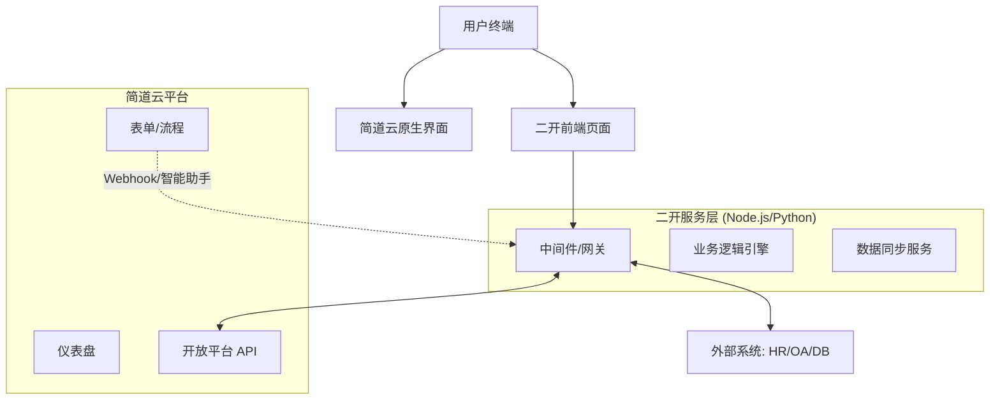

# 简道云 + 二开混合架构标准框架 (v1.0)

> **维护说明**：本文档是简道云二开项目的技术核心。开启新会话时，请务必先读取此文件以同步技术上下文。

## 1. 架构总览

采用 **“零代码底座 + 低代码/二开增强”** 的混合模式：
- **简道云端 (Zero-Code)**：负责基础数据采集（表单）、流程流转（BPM）、基础报表（仪表盘）及权限管理。
- **二开服务端 (Backend)**：负责复杂业务逻辑计算、跨系统数据同步（如 HR/OA/ERP）、自定义 API 聚合。
- **二开前端 (Frontend)**：负责自定义详情页、复杂交互看板、移动端定制页面。



## 2. 二开项目目录规范

```text
jdy-custom-project/
├── config/
│   ├── dev.env.js          # 开发环境配置 (AppID, AppSecret)
│   └── prod.env.js         # 生产环境配置
├── src/
│   ├── api/
│   │   ├── jdy-client.js   # 简道云 API 封装 (认证/增删改查)
│   │   └── external.js     # 外部系统 API 封装
│   ├── services/
│   │   ├── data-sync.js    # 数据同步逻辑 (如: 摩卡HR -> 简道云)
│   │   └── complex-calc.js # 复杂计算逻辑 (如: 绩效自动算分)
│   ├── views/              # 前端页面 (Vue/React)
│   │   ├── custom-detail/  # 自定义详情页
│   │   └── dashboard-pro/  # 高级可视化看板
│   └── utils/
│       ├── auth.js         # 身份校验工具
│       └── logger.js       # 日志记录
├── tests/                  # 单元测试
├── package.json
└── README.md
```

## 3. 核心技术实现要点

### 3.1 简道云 API 认证与封装
- **认证方式**：使用 `AppID` 和 `AppSecret` 获取 `access_token`。
- **缓存策略**：`access_token` 有效期 2 小时，必须在服务端进行内存或 Redis 缓存，严禁前端硬编码。
- **请求限流**：简道云 API 有调用频率限制，二开层需实现队列或重试机制。

### 3.2 数据同步机制 (Hybrid Sync)
- **触发方式**：
  1. **Webhook**：简道云表单提交/更新时触发二开接口。
  2. **定时任务**：每日凌晨同步全量基础数据（如组织架构）。
  3. **智能助手 Pro**：通过 HTTP 节点调用二开服务。
- **一致性保障**：采用“最终一致性”模型，关键业务需增加对账脚本。

### 3.3 一人多岗与复杂审批
- **痛点解决**：简道云原生支持一人多岗，但跨业态审批需二开介入。
- **实现方案**：在二开层维护一份“岗位-审批人”映射表，通过 API 动态写入流程节点的“负责人”字段。

## 4. 常见避坑指南

1. **不要在前端直接调用简道云 API**：会暴露 `AppSecret`，必须经过二开后端转发。
2. **子表单数据处理**：简道云子表单在 API 中是 JSON 数组，二开层需做好结构化解析。
3. **附件处理**：简道云附件有下载链接时效性，二开层需实现“代理下载”或“转存 OSS”。
4. **权限隔离**：二开前端页面需自行实现基于简道云用户身份的 RBAC 校验。
5. **字段值提取**：简道云 API 返回的字段值是 `{"value": xxx}` 格式，必须用 `safe_get()` 统一处理。
6. **前后端字段名一致性**：前端映射字段名时，必须与后端 API 返回的 JSON key 完全一致，否则值为 undefined。

## 4.5 Flask Bridge 模式（轻量架构）

当需求以**数据可视化、看板、目标树**等展示型交互为主时，使用 Flask Bridge 模式：

### 架构特点

- **后端**：单文件 Flask 应用，纯代理层，不存储数据
- **前端**：Standalone HTML + 内联 CSS/JS，零构建步骤
- **部署**：systemd + gunicorn + Nginx，单机部署

### 后端模板

```python
"""Bridge Service - Flask 单文件模式"""
import os
from flask import Flask, request, jsonify
from flask_cors import CORS
import requests

JDY_API_KEY = os.environ.get("JDY_API_KEY", "")
JDY_BASE_URL = "https://api.jiandaoyun.com/api/v5"

app = Flask(__name__, static_folder='static', static_url_path='/static')
CORS(app)

class JDYClient:
    def __init__(self, api_key):
        self.headers = {
            "Authorization": "Bearer {}".format(api_key),
            "Content-Type": "application/json"
        }

    def list_data(self, entry_id, limit=100, filter_cond=None, fields=None):
        payload = {"entry_id": entry_id, "limit": limit}
        if filter_cond: payload["filter"] = filter_cond
        if fields: payload["fields"] = fields
        resp = requests.post(
            "{}/app/entry/data/list".format(JDY_BASE_URL),
            json=payload, headers=self.headers, timeout=30
        )
        return resp.json().get("data", [])

def safe_get(record, field_name, default=None):
    """安全提取简道云字段值"""
    field = record.get(field_name, {})
    if isinstance(field, dict):
        return field.get("value", default)
    return field if field is not None else default
```

### 前端模板（Standalone HTML + Fine Design CDN）

```html
<!DOCTYPE html>
<html lang="zh-CN">
<head>
<meta charset="UTF-8">
<!-- Fine Design CDN（与简道云 UI 统一） -->
<link rel="stylesheet" href="https://docs.fanruan.design/assets/react/fine-design-runtime/fine-design/fine-design.min.css" />
<style>
:root {
  --primary: var(--fd-color-brand-6, #00b899);
  --text-1: var(--fd-color-text, #141e31);
  --bg-1: var(--fd-color-bg-container, #ffffff);
  --border-1: var(--fd-color-border, #e6e8ed);
  --r: var(--fd-border-radius-lg, 6px);
}
</style>
</head>
<body>
<script>
const API = {
  BASE_URL: '/okr',
  async _get(path) { return (await fetch(this.BASE_URL + path)).json(); }
};
</script>
</body>
</html>
```

### 部署配置

```ini
# systemd: /etc/systemd/system/xxx-bridge.service
[Service]
EnvironmentFile=/home/deploy/apps/xxx-bridge/.env
ExecStart=.../gunicorn -w 2 -b 0.0.0.0:8200 --timeout 120 app:app
```

```nginx
# Nginx
location /xxx/ {
    proxy_pass http://127.0.0.1:8200/;
    proxy_read_timeout 120s;  # 必须 >= gunicorn timeout
}
```

- 静态 HTML 更新：SFTP 上传到 `static/`，立即生效，无需重启
- 后端代码更新：SFTP 上传 `app.py` 后 `sudo systemctl restart xxx-bridge`

## 5. 常用 API 索引

### v5 API（推荐，当前版本）

| 功能 | 接口路径 | 方法 | 备注 |
|------|----------|------|------|
| 查询数据列表 | `/api/v5/app/entry/data/list` | POST | 支持 filter_cond 筛选、data_id 游标分页 |
| 获取单条数据 | `/api/v5/app/entry/data/get` | POST | 需提供 data_id |
| 新增数据 | `/api/v5/app/entry/data/create` | POST | 字段格式 `{"field_name": {"value": xxx}}` |
| 更新数据 | `/api/v5/app/entry/data/update` | POST | 需提供 data_id |
| 删除数据 | `/api/v5/app/entry/data/delete` | POST | 需提供 data_id |
| 获取表单字段列表 | `/api/v5/app/entry/widget/list` | POST | 返回字段 id/name/type/options |
| 获取应用列表 | `/api/v5/app/list` | GET | 返回当前用户可见的应用 |

### v6 API（流程专用）

| 功能 | 接口路径 | 方法 | 备注 |
|------|----------|------|------|
| 获取流程实例详情 | `/api/v6/workflow/instance/get` | POST | 含审批节点、待办状态 |

### 认证方式

```python
headers = {
    "Authorization": "Bearer YOUR_API_KEY",  # 直接使用 API Key，无需 access_token
    "Content-Type": "application/json"
}
```

**注意**：v5 API 使用 Bearer Token 直接认证，不再需要 AppID/AppSecret 换取 access_token。

### 字段值格式

```python
# 文本/数字/单选
{"field_name": {"value": "实际值"}}

# 成员字段
{"owner": {"value": {"username": "jdy-xxx"}}}

# 部门字段
{"dept": {"value": {"dept_no": 42}}}

# 日期字段
{"start_date": {"value": "2026-01-01T00:00:00.000Z"}}

# 多选字段
{"tags": {"value": ["选项1", "选项2"]}}
```

## 10. 远程前端 CSS 调试规范

> 通过 SSH 编辑服务器上的 HTML 文件时，以下规范可避免反复踩坑。

### 10.1 scroll 事件调试铁律

监听 scroll 前**必须确认目标元素有 `overflow: auto/scroll`**：

```javascript
// 部署前在浏览器控制台验证
const el = document.querySelector('.target');
console.log('overflow:', getComputedStyle(el).overflow);
console.log('overflowY:', getComputedStyle(el).overflowY);
// 如果输出 "visible"，说明该元素不是滚动容器，scroll 事件不会触发
```

**常见错误**：监听内层 div（如 `#task-list`）而非外层滚动容器（如 `.task-panel`）。

### 10.2 CSS 选择器审计

修改大型 HTML 文件的 CSS 时，**必须先搜索目标选择器的所有规则**：

```python
# 部署前用正则审计
import re
# 找出所有 body 规则
body_rules = re.findall(r'body\s*\{[^}]+\}', css)
print(f"Found {len(body_rules)} body rules")  # 可能有多条！
```

**典型陷阱**：`body` 有 4 条独立规则，改了第一条的 flex 布局，但第三条的 `padding: 20px` 破坏了 100vh 约束。

### 10.3 增量补丁 2 轮法则

| 修复轮次 | 策略 |
|---------|------|
| 1-2 轮 | 增量 `replace(old, new)` 可行 |
| 3+ 轮未解决 | **立即切换为整块重写**：找到完整的 CSS 规则块，一次性替换 |

**原因**：多轮补丁会形成不可预测的层叠（原始规则 + !important 覆盖 + JS 内联样式）。

### 10.4 100vh 布局标准写法

```css
/* 正确：flex column 冻结布局 */
body {
  display: flex;
  flex-direction: column;
  height: 100vh;
  overflow: hidden;
  padding: 0;  /* 关键：不能有 padding */
}
.header, .toolbar { flex-shrink: 0; }  /* 顶部冻结 */
.main { flex: 1; min-height: 0; overflow: hidden; }  /* 中间可滚动 */
.footer { flex-shrink: 0; }  /* 底部冻结 */
```

**陷阱**：`body { padding: 20px }` + `height: 100vh` = 内容总高度 100vh + 40px，页面变得可滚动。

### 10.5 弹窗（Modal）标准结构

```css
.modal-overlay {
  position: fixed;
  top: 0; left: 0;
  width: 100%; height: 100%;  /* 用 % 不用 vw/vh，避免滚动条问题 */
  display: flex;
  align-items: center;
  justify-content: center;
  z-index: 10000;
}
.modal {
  max-width: calc(100vw - 60px);  /* 左右各留 30px */
  max-height: calc(100vh - 60px);
  display: flex;
  flex-direction: column;
  overflow: hidden;  /* 关键：overflow 在容器上设为 hidden */
}
.modal-body {
  flex: 1;
  overflow-y: auto;  /* 滚动在内容区，不在容器上 */
  min-height: 0;
}
```

**反模式**：`overflow-y: auto` 放在 `.modal` 上 → 滚动条挤占宽度 → 边框截断。

### 10.6 部署前验证清单

```python
# 1. 替换前：提取目标 CSS 块确认当前状态
matches = re.findall(r'\.modal\s*\{[^}]+\}', css)
print("Current modal rules:", len(matches))

# 2. 替换后：再次提取确认结果
matches_after = re.findall(r'\.modal\s*\{[^}]+\}', css_after)
print("After fix modal rules:", len(matches_after))

# 3. 检查是否有冲突的 !important 规则
conflicts = re.findall(r'\.modal[^{]*\{[^}]*!important[^}]*\}', css_after)
if conflicts:
    print("WARNING: !important conflicts detected")
```

---
*最后更新时间: 2026-06-12*
*维护者: Drucker (AI Assistant)*