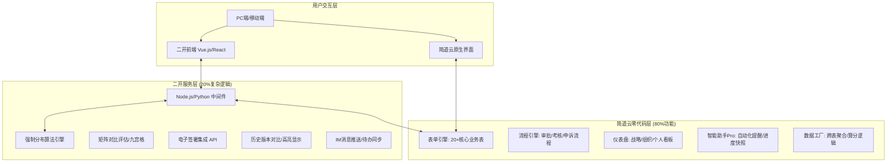
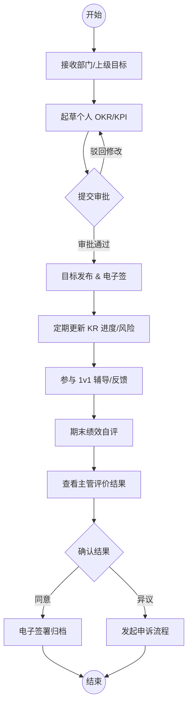
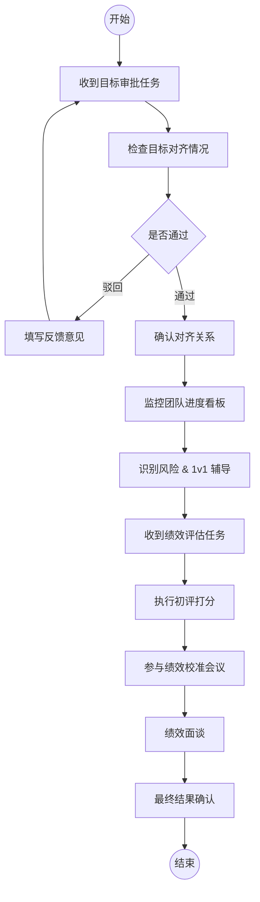

# 绩效+OKR一体化管理系统设计说明书

**版本**: v1.0  
**创建日期**: 2026年5月17日  
**设计者**: Drucker (企业咨询顾问)  
**适用平台**: 简道云零代码平台 + 二开服务层  

---

## 第一章：系统概述

### 1.1 设计理念

本系统旨在深度融合**北森绩效云**的严谨性与**飞书OKR**的敏捷性，构建一套“战略穿透、过程透明、结果公正”的一体化管理平台。

*   **融合核心优势**：
    *   **来自飞书OKR**：保留极简的用户体验（实时保存、拖动排序）、强大的目标对齐机制（可视化地图）、高频的协作功能（@提及、划词评论）以及红黄绿灯风险预警体系。
    *   **来自北森绩效云**：引入多绩效模式支持（KPI/OKR/PBC/360等）、OGSMA战略解码框架、强制分布与排名等级、完整的考核闭环（校准/申诉/电子签）以及PIP改进计划。
*   **管理哲学**：从“人岗匹配”转向“业人匹配+横纵向对齐”，通过OKR实现过程管理与目标协同，通过绩效考核实现价值评估与利益分配。

### 1.2 系统架构

采用“简道云零代码层 + 二开服务层”的混合架构：



### 1.3 核心业务流程

系统遵循 APQC 流程框架，实现从战略到执行的闭环：

1.  **战略解码**：高管团队利用 OGSMA 框架制定公司级战略主题与目标。
2.  **目标制定**：组织与员工基于战略解码，制定 OKR/KPI，并完成向上/横向对齐。
3.  **过程跟进**：每周/双周更新 KR 进度，系统自动计算风险状态并触发预警。
4.  **绩效评估**：季度末发起考核活动，执行多人评估、结果校准、强制分布。
5.  **改进发展**：针对低绩效员工触发 PIP 计划，针对高潜员工纳入人才盘点。

### 1.4 用户角色定义

| 角色 | 职责描述 | 核心权限 |
| :--- | :--- | :--- |
| **员工** | 制定个人目标，更新进度，参与自评与互评 | OKR制定、进度更新、绩效自评 |
| **直线经理** | 审核下属目标，提供反馈，执行绩效初评 | 目标审批、下属进度查看、绩效打分 |
| **HRBP** | 监控组织目标对齐率，组织绩效校准会议，处理申诉 | 全局数据看板、校准工作台、申诉处理 |
| **绩效管理员** | 配置考核模板，发起考核活动，管理指标库 | 系统设置、模板配置、活动发起 |
| **系统管理员** | 维护组织架构，配置权限，管理二开接口 | 通讯录同步、权限组配置、API管理 |

### 1.5 多角色业务流程图

本节展示核心业务在不同用户视角下的流转过程，帮助理解系统交互逻辑。

#### 1.5.1 员工视角 (Employee Journey)
员工关注目标的制定、进度的更新以及最终绩效结果的确认。



#### 1.5.2 直线经理视角 (Manager Journey)
经理关注团队目标的对齐、过程辅导以及绩效评估的公正性。



#### 1.5.3 HR/管理员视角 (HR/Admin Journey)
HR 关注系统的配置、流程的推进以及组织绩效的整体分布。

```mermaid
graph TD
    Start((开始)) --> Config[维护指标库 & 考核模板]
    Config --> Launch[发起考核活动]
    Launch --> Rules[配置规则 (周期/分布/权重)]
    Rules --> Notify[全员通知 & 流程启动]
    Notify --> Monitor[监控完成率 & 催办]
    Monitor --> CalibMeeting[组织绩效校准会议]
    CalibMeeting --> Adjust[应用强制分布/调整等级]
    Adjust --> AppealHandle[处理员工申诉]
    AppealHandle --> PublishResult[发布最终结果]
    PublishResult --> Archive[数据归档 & 同步薪酬]
    Archive --> End((结束))
```

---

## 第二章：功能模块设计

### 2.1 战略解码模块（OGSMA框架）

*   **功能来源**：北森绩效云
*   **核心功能**：
    *   **战略主题管理**：定义公司级长期战略方向。
    *   **OGSMA 分解**：支持 Objective（目的）、Goals（目标）、Strategies（策略）、Measures（衡量标准）、Accountability（责任人）的五层拆解。
    *   **战略地图**：可视化展示战略层级关系，确保上下贯通。

### 2.2 OKR管理模块

*   **功能来源**：飞书OKR
*   **核心功能**：
    *   **目标制定**：支持 O（定性）+ KR（定量）结构，提供填写助手诊断 SMART 原则。
    *   **目标对齐**：支持向上对齐（关联上级 O）和横向对齐（关联同事 O），生成对齐视图。
    *   **进度跟进**：KR 支持起始值/当前值/目标值，自动计算进度百分比，继承最高风险为 O 的状态。
    *   **OKR 复盘**：季度末进行 0-1 分打分，支持四象限复盘（保持/停止/开始/继续）。

### 2.3 目标管理模块（多模式）

*   **功能来源**：北森绩效云
*   **核心功能**：
    *   **多模式支持**：除了 OKR，还支持 KPI（关键绩效指标）、PBC（个人业务承诺）、MBO（目标管理）。
    *   **指标库管理**：预置常用考核指标，支持定量与定性指标的分类管理。
    *   **权重与优先级**：支持目标权重的动态调整，确保资源聚焦。

### 2.4 绩效管理模块

*   **功能来源**：北森绩效云
*   **核心功能**：
    *   **考核活动管理**：支持按周期（季度/年度）发起考核，配置考核组与分布规则。
    *   **多维评估**：支持上级评价、同事互评、下属评价、自评等多种角色。
    *   **绩效校准**：提供矩阵对比视图，支持 HRBP 组织线上/线下校准会议，调整最终等级。
    *   **申诉与确认**：员工对结果有异议可发起申诉，确认后支持电子签署。

### 2.5 组织目标与组织绩效模块

*   **功能来源**：北森绩效云
*   **核心功能**：
    *   **组织目标拆解**：将公司战略目标拆解为部门/团队目标，支撑集团化管理。
    *   **组织绩效评估**：基于组织目标的达成情况，评估部门负责人的绩效，并与组织奖金池挂钩。

### 2.6 数据分析模块

*   **功能来源**：融合两者
*   **核心功能**：
    *   **预置数据集**：提供员工目标、OKR 进度、绩效结果、组织绩效等 10+ 个标准数据集。
    *   **管理驾驶舱**：展示全公司 OKR 填写率、对齐率、绩效等级分布、高风险目标清单。

### 2.7 系统设置模块

*   **功能来源**：北森绩效云
*   **核心功能**：
    *   **权限管理**：字段级权限控制，支持按组织架构隔离数据可见范围。
    *   **规则配置**：配置强制分布比例（如 S:10%, A:20%）、算分公式、电子签模板。

---

## 第三章：简道云表单结构设计

本章详细列出支撑系统的 20 个核心表单。所有表单均启用“操作日志”以追踪变更。

### 3.1 战略解码表 (`战略解码`)

*   **表单用途**：存储 O/G/S 三层战略要素，通过「父级战略」自引用形成 O→G→S 树形结构。M（衡量）移至「指标库」，A（责任）由 S 层的「责任人」字段 + 「考核组」表共同承担。
*   **字段清单**（10 个字段，按六层排列）：

    **第一层 · 基础标识**
    | 字段名 | 类型 | 必填 | 说明 |
    | :--- | :--- | :--- | :--- |
    | 战略编号 | 流水号 | 自动 | 格式 SD-{YYYY}-{NNN}，如 SD-2026-001 |
    | 战略标题 | 单行文本 | 是 | 如"平台交易规模突破1万亿"，最大 200 字 |

    **第二层 · 关联引用**
    | 字段名 | 类型 | 必填 | 说明 |
    | :--- | :--- | :--- | :--- |
    | 所属周期 | 关联数据 → 绩效周期 | 是 | 关联年度/季度周期 |
    | 父级战略 | 关联数据 → 本表 | 否 | 自引用，O→G→S 树形。空值=O层根节点 |

    **第三层 · 业务核心**
    | 字段名 | 类型 | 必填 | 说明 |
    | :--- | :--- | :--- | :--- |
    | 战略层级 | 单选按钮组 | 是 | O-目的 / G-目标 / S-策略 |
    | 战略描述 | 多行文本 | 是 | O层写方向愿景，G层写量化数字（如"从7200亿→10000亿"融入描述），S层写执行路径 |
    | 权重 | 数字 | 否 | G层/S层填写，在父级中的权重 0-100，默认 100 |
    | 责任人 | 成员单选 | 是 | O/G/S 均可指定。S层的责任人是圈定「考核组」的锚点 |

    **第四层 · 状态流转**
    | 字段名 | 类型 | 必填 | 说明 |
    | :--- | :--- | :--- | :--- |
    | 战略状态 | 单选按钮组 | 是 | 草稿 / 已发布 / 执行中 / 已完成 / 已关闭 |

    **第六层 · 统计辅助**
    | 字段名 | 类型 | 必填 | 说明 |
    | :--- | :--- | :--- | :--- |
    | △ 下游对齐数 | 聚合公式 | 自动 | 仅S层有值。COUNT(「OKR目标」表中 战略来源=本条S 的记录数)。0=孤儿策略 |

*   **设计要点**：
    - G 层的目标值和当前值不从本表维护。目标数字已经在「战略描述」中表达（如"突破1万亿"），实际达成进度通过仪表盘聚合下游 OKR 数据实时计算——数据工厂沿 战略解码(S) → OKR目标(战略来源) → 关键结果(KR完成率) 链路聚合。
    - 这张表是纯战略树，不承载运营数据。
    - **「权重」语义**：G层权重 = G在O中的战略优先级；S层权重 = S在G中的贡献占比。此权重用于战略层面的优先级排序，不等同于考核模板中的打分权重。
    - **「责任人」语义**：S层责任人 = 战略问责归属（高管共识产物）。不等同于 OKR目标表的负责人（执行归属，可修改）。S.责任人的实际作用是：HR圈定考核组的锚点 + 战略会议的历史记录。
*   **视图设计**：层级视图（按 O→G→S 树形折叠）、表格视图。
*   **权限设置**：高管/HRBP 可编辑，全员可见。
*   **搭建注意**：①「父级战略」自引用字段必须在表中已有至少1条记录后才能配置——先手动创建 O 层种子数据；②「下游对齐数」依赖「OKR目标」表的「战略来源」字段，等 OKR目标 表建好后回补。
*   **管理逻辑参考**：详见 `files/ogsm-okr-management-logic.md`。

### 3.2 OKR目标表 (`OKR目标`)

*   **表单用途**：存储部门或个人的 O（Objective）。部门O通过「战略来源」字段承接战略解码表中的 S 层策略。
*   **字段清单**：
    | 字段名 | 类型 | 必填 | 说明 | 校验/显隐 |
    | :--- | :--- | :--- | :--- | :--- |
    | 目标编号 | 流水号 | 自动 | 唯一标识，格式 O-{YYYY}-{NNN} | |
    | 所属周期 | 关联数据 | 是 | 关联`绩效周期` | |
    | **◎ 战略来源** | **关联数据 → 战略解码** | **是(部门O)** | **关联到S层策略。过滤条件：战略层级=S、战略状态=已发布。这是战略→执行的桥接字段** | **个人O选填** |
    | 负责人 | 成员单选 | 是 | 默认当前用户 | |
    | 目标层级 | 单选按钮组 | 是 | 公司级/部门级/团队级/个人级 | 部门O选部门级 |
    | 目标描述 | 单行文本 | 是 | 定性描述，鼓舞人心 | |
    | 权重 | 数字 | 否 | 0-100 | |
    | 可见范围 | 单选 | 是 | 全员/仅自己/指定人员 | |
    | 风险状态 | 单选 | 是 | 正常(绿)/有风险(黄)/严重滞后(红) | 由KR进度自动计算 |
    | △ 目标进度 | 聚合公式 | 自动 | AVG(关联KR的完成率) | 需先建关联数据→关键结果 |
    | △ O得分 | 数字 | 否 | 只读，由 KR 加权平均得出 | |
*   **关联关系**：一对多关联 `关键结果`；通过「战略来源」多对一关联 `战略解码`；通过 `目标对齐` 实现自引用树形。
*   **数据联动规则**：当部门负责人选择「战略来源」(S1)后，系统通过数据联动自动带出该 S 的责任人（如孙明辉）作为「负责人」建议值，但**允许修改**——部门负责人可以将具体O的执行权指派给下属。S层责任人是战略问责归属，OKR负责人是执行归属，两者不强制相等。
*   **管理逻辑参考**：详见 `files/ogsm-okr-management-logic.md`。

### 3.3 OKR关键成果表 (`关键结果`)

*   **表单用途**：存储 O 下的 KR（Key Results）。
*   **字段清单**：
    | 字段名 | 类型 | 必填 | 说明 | 校验/显隐 |
    | :--- | :--- | :--- | :--- | :--- |
    | `kr_id` | 流水号 | 是 | 唯一标识 | |
    | `o_id` | 关联数据 | 是 | 所属目标 | 关联`OKR目标` |
    | `kr_title` | 单行文本 | 是 | 成果标题 | 定量描述 |
    | `start_value` | 数字 | 是 | 起始值 | |
    | `current_value` | 数字 | 是 | 当前值 | |
    | `target_value` | 数字 | 是 | 目标值 | |
    | `progress_percent` | 公式 | 否 | 进度百分比 | `(current-start)/(target-start)*100` |
    | `score` | 数字 | 否 | 复盘打分 | 0-1分，季度末开放编辑 |
*   **智能助手**：当 `current_value` 更新时，自动记录到 `进度记录`。

### 3.4 目标对齐表 (`目标对齐`)

*   **表单用途**：记录 O 之间的上下级或横向对齐关系。员工创建个人O后，通过此表声明"我的O支撑了谁的O"，父目标负责人确认后对齐生效。
*   **字段清单**（10 个字段）：

    **第一层 · 基础标识**
    | 字段名 | 类型 | 必填 | 说明 |
    | :--- | :--- | :--- | :--- |
    | 对齐编号 | 流水号 | 自动 | 格式 AL-{YYYY}-{NNN} |

    **第二层 · 关联引用**
    | 字段名 | 类型 | 必填 | 说明 |
    | :--- | :--- | :--- | :--- |
    | 子目标 | 关联数据 → OKR目标 | 是 | 发起对齐的一方 |
    | 父目标 | 关联数据 → OKR目标 | 是 | 被对齐的一方。数据联动带出父目标的负责人 |

    **第三层 · 业务核心**
    | 字段名 | 类型 | 必填 | 说明 |
    | :--- | :--- | :--- | :--- |
    | 对齐类型 | 单选按钮组 | 是 | 向上对齐 / 横向对齐 |
    | 对齐说明 | 多行文本 | 是 | 为什么这个子O支撑父O？如"MRO品类扩展直接贡献G1交易量增长" |
    | 发起人 | 成员单选 | 是 | 默认当前用户 |

    **第四层 · 状态流转**
    | 字段名 | 类型 | 必填 | 说明 |
    | :--- | :--- | :--- | :--- |
    | 确认状态 | 单选按钮组 | 是 | 待确认 / 已确认 / 已拒绝 |
    | 确认人 | 成员单选 | 自动 | 父目标的负责人。系统联动带出，不可改 |
    | 确认时间 | 日期时间 | 自动 | 确认/拒绝时自动记录 |
    | 拒绝原因 | 多行文本 | 否 | 仅确认状态=已拒绝时显示。如"KR未覆盖G1核心维度" |

*   **智能助手 Pro 配置**：
    - 目标对齐创建时（确认状态=待确认）→ 推送飞书消息给父目标的负责人："张三将其个人O『完成MRO品类上线』对齐到您的部门O，请确认"
    - 确认状态变更时：已确认 → 通知发起人；已拒绝 → 通知发起人 + 驳回原因

### 3.5 目标进度记录表 (`进度记录`)

*   **表单用途**：存储 KR 的历史进度快照，用于趋势分析。
*   **字段清单**：`history_id`, `kr_id`, `snapshot_date`, `current_value`, `progress_percent`, `update_note`。
*   **数据来源**：由智能助手 Pro 每日凌晨自动抓取生成。

### 3.6 OKR复盘打分表 (`OKR复盘`)

*   **表单用途**：季度末对 OKR 进行整体复盘。
*   **字段清单**：`review_id`, `o_id`, `self_score` (0-1), `manager_score`, `review_summary` (四象限总结), `difficulty_factor` (难度系数)。

### 3.7 绩效活动表 (`绩效考核活动`)

*   **表单用途**：管理每一次绩效考核活动的元数据。
*   **字段清单**：
    | 字段名 | 类型 | 必填 | 说明 |
    | :--- | :--- | :--- | :--- |
    | `activity_id` | 流水号 | 是 | 活动ID |
    | `activity_name` | 单行文本 | 是 | 活动名称 | 如"2026 Q1 绩效考核" |
    | `cycle_id` | 关联数据 | 是 | 关联周期 | |
    | `template_id` | 关联数据 | 是 | 使用模板 | 关联`考核模板` |
    | `status` | 单选 | 是 | 状态 | 未开始/进行中/已结束 |

### 3.8 绩效考核组表 (`考核组`)

*   **表单用途**：定义参与本次考核的人员范围。
*   **字段清单**：`group_id`, `activity_id`, `group_name`, `members` (成员多选), `auto_rule` (JSON, 自动加人规则)。

### 3.9 考核模板表 (`考核模板`)

*   **表单用途**：HR 配置不同岗位/层级的考核内容。模板本身只存元数据，具体挂载哪些指标通过「模板指标明细」表管理——因为简道云不支持嵌套子表单。
*   **字段清单**（6 个字段）：

    **第一层 · 基础标识**
    | 字段名 | 类型 | 必填 | 说明 |
    | :--- | :--- | :--- | :--- |
    | 模板编号 | 流水号 | 自动 | 格式 TPL-{YYYY}-{NNN} |
    | 模板名称 | 单行文本 | 是 | 如"运营部门-年度考核模板" |

    **第三层 · 业务核心**
    | 字段名 | 类型 | 必填 | 说明 |
    | :--- | :--- | :--- | :--- |
    | 模板类型 | 单选按钮组 | 是 | OKR型 / KPI型 / 混合型 |
    | 适用角色 | 单选按钮组 | 是 | 高管 / 部门负责人 / 员工 / 自定义。发起考核活动时指定参评范围 |
    | 总分规则 | 多行文本 | 是 | 如"部门O得分=指标加权求和；个人总分=部门O×70%+个人发展O×30%" |

    **第四层 · 状态流转**
    | 字段名 | 类型 | 必填 | 说明 |
    | :--- | :--- | :--- | :--- |
    | 模板状态 | 单选按钮组 | 是 | 草稿 / 已发布 / 已停用。停用后发起新活动时不可选 |

*   **设计说明**：采用"一套卷子"模式——HR 创建模板后，在「模板指标明细」表中逐条添加指标（从指标库里选），按考核维度分组并配权重。发起考核活动时，指定模板 → 系统为考核组内每个成员实例化考核项。

### 3.9b 模板指标明细表 (`模板指标明细`)

*   **表单用途**：考核模板和指标库之间的桥接表。每条记录 = "某个模板在某个维度下挂了某个指标，权重是多少"。
*   **字段清单**（5 个字段）：

    **第二层 · 关联引用**
    | 字段名 | 类型 | 必填 | 说明 |
    | :--- | :--- | :--- | :--- |
    | 所属模板 | 关联数据 → 考核模板 | 是 | 过滤：模板状态=草稿或已发布 |
    | 关联指标 | 关联数据 → 指标库 | 是 | 过滤：指标状态=启用。数据联动带出指标类型、考核方式、目标值 |

    **第三层 · 业务核心**
    | 字段名 | 类型 | 必填 | 说明 |
    | :--- | :--- | :--- | :--- |
    | 考核维度 | 下拉单选 | 是 | 经营成果/重点项目/SLA指标/行为表现/合规。同一模板的指标归类到同一维度 |
    | 指标在维度内权重 | 数字 | 是 | 0-100。同模板+同维度下所有指标的权重之和应为100 |
    | 备注 | 单行文本 | 否 | 如"此项仅考核部门负责人" |

*   **设计说明**：原设计用嵌套子表单，但简道云不支持子表单内嵌子表单。拆成主表+明细表后，HR 在考核模板的详情页通过「关联数据展示」标签页查看和添加明细，效果等同于子表单。仪表盘通过数据工厂检测"同模板同维度下权重之和≠100"的异常。

### 3.10 指标库表 (`指标库`)

*   **表单用途**：HR 从战略解码的 G/S 层拆解出 M（衡量标准），以指标形式录入此表。每条 S 通常对应 **2-4 条指标**（至少 1 条结果指标 + 1-2 条过程指标，预警指标按需）。指标库是考核模板的"零件库"——HR 在考核模板的子表单中从指标库里挑选条目，组装成一套卷子。
*   **字段清单**（11 个字段，按六层排列）：

    **第一层 · 基础标识**
    | 字段名 | 类型 | 必填 | 说明 |
    | :--- | :--- | :--- | :--- |
    | 指标编号 | 流水号 | 自动 | 格式 ZB-{YYYY}-{NNN}，如 ZB-2026-001 |
    | 指标名称 | 单行文本 | 是 | 如"核心品类SKU总量""外部客户交易额占比" |

    **第二层 · 关联引用**
    | 字段名 | 类型 | 必填 | 说明 |
    | :--- | :--- | :--- | :--- |
    | **◎ 关联战略** | **关联数据 → 战略解码** | **是** | **追溯到 G 或 S。过滤条件：战略层级 = G 或 S AND 战略状态 = 已发布。HR 从 S 详情页点「配置考核指标」按钮，此字段自动预填当前 S** |
    | 所属周期 | 关联数据 → 绩效周期 | 是 | 关联年度/季度。数据联动：选关联战略后自动带出 |

    **第三层 · 业务核心**
    | 字段名 | 类型 | 必填 | 说明 |
    | :--- | :--- | :--- | :--- |
    | 指标类型 | 单选按钮组 | 是 | 结果指标 / 过程指标 / 预警指标 |
    | **考核方式** | **单选按钮组** | **是** | **定量打分（按算分规则计分）/ 等级评定（S/A/B/C/D）/ 一票否决（触发即降档）。结果指标→定量，过程指标→等级，预警指标→一票否决** |
    | 目标值 | 单行文本 | 是 | 如"≥200万""≥90%""=0"。预警指标如"月流失>3%触发" |
    | 算分规则 | 多行文本 | 否 | 定量指标必填。如"线性插值：达标100分，超标120封顶，低于下限0分" |
    | 数据来源 | 单行文本 | 否 | 实际达成值从哪里取？如"OKR目标.平台运营部.关键结果.SKU总量""系统监控P99延迟""财务系统月度报表"。不填则默认评估人手动输入 |

    **第四层 · 状态流转**
    | 字段名 | 类型 | 必填 | 说明 |
    | :--- | :--- | :--- | :--- |
    | 指标状态 | 单选按钮组 | 是 | 启用 / 停用 / 草稿。考核模板子表单中仅显示"启用"的指标 |

    **第六层 · 统计辅助**
    | 字段名 | 类型 | 必填 | 说明 |
    | :--- | :--- | :--- | :--- |
    | △ 被引用次数 | 聚合公式 | 自动 | COUNT(考核模板子表单中 关联指标=本条 的记录)。知道哪些模板用了这个指标 |

*   **一对多关系**：一条战略解码记录 → 多条指标库记录。以云梦泽为例，S1「核心品类深度运营」至少拆 3 条：1 条结果指标（品类交易额）、2 条过程指标（SKU 总量、信息完整度）、可选 1 条预警（SKU 活跃率低于 60%）。
*   **设计说明**：到期评估时，定量指标自动从「数据来源」取实际值、套算分规则算出得分；等级评定由评价人手动打分；预警指标只看是否触发——触发则关联考核组的全员降档。三种考核方式对应三类指标类型，HR 建指标时一次选对，后续评估自动化。

    **云梦泽示例（S1 对应的 3 条指标）**：

    | 指标名称 | 类型 | 考核方式 | 目标值 | 算分规则 | 数据来源 |
    |---------|------|---------|--------|---------|---------|
    | 核心品类交易额达成率 | 结果指标 | 定量打分 | ≥100%（即≥该项在G1中的贡献额） | 线性：达标100分，120%封顶120分，低于80%得0分 | OKR目标.平台运营部.关键结果 |
    | 核心品类SKU总量 | 过程指标 | 等级评定 | ≥200万 | S≥220万, A≥200万, B≥180万, C≥150万, D<150万 | 平台运营部季度盘点 |
    | 商品信息完整度 | 过程指标 | 等级评定 | ≥90% | S≥95%, A≥90%, B≥85%, C≥80%, D<80% | 平台运营部抽样检查 |
    | SKU活跃率 | 预警指标 | 一票否决 | 月活跃率<50%触发预警 | 触发则平台运营部全员绩效降一档 | 系统月度统计 |

*   **搭建注意**：①「被引用次数」聚合公式依赖考核模板表的子表单数据，等考核模板建好后再回补；②数据联动：选了关联战略后自动带出所属周期。

### 3.11 绩效评估记录表 (`评估记录`)

*   **表单用途**：存储评价人对具体指标的打分和评语。
*   **字段清单**：`eval_id`, `item_id`, `evaluator_id` (评价人), `evaluator_role` (上级/同事/自评), `score`, `comment`, `attachments`。

### 3.12 多人评估记录表 (`多人评估`)

*   **表单用途**：当存在多个评价人时，存储加权逻辑。
*   **字段清单**：`eval_id`, `evaluator_id`, `weight` (该评价人权重)。

### 3.13 绩效结果表 (`绩效结果`)

*   **表单用途**：存储最终的绩效等级和总分。
*   **字段清单**：
    | 字段名 | 类型 | 必填 | 说明 |
    | :--- | :--- | :--- | :--- |
    | `result_id` | 流水号 | 是 | 结果ID |
    | `activity_id` | 关联数据 | 是 | 所属活动 | |
    | `appraisee_id` | 成员 | 是 | 被考核人 | |
    | `total_score` | 数字 | 否 | 总分 | |
    | `final_rating` | 单选 | 否 | 最终等级 | S/A/B/C/D |
    | `forced_dist_applied` | 复选框 | 否 | 是否强分 | |
    | `status` | 单选 | 是 | 状态 | 待确认/已确认/已申诉 |

### 3.14 绩效校准记录表 (`校准记录`)

*   **表单用途**：记录校准会议中的调整情况。
*   **字段清单**：`calibration_id`, `result_id`, `original_rating`, `adjusted_rating`, `adjustment_reason`, `calibrated_by` (校准人)。

### 3.15 绩效申诉表 (`绩效申诉`)

*   **表单用途**：员工对绩效结果提出异议。
*   **字段清单**：`appeal_id`, `result_id`, `appeal_reason`, `evidence` (附件), `status` (处理中/已解决), `handling_result`。

### 3.16 PIP改进计划表 (`改进计划`)

*   **表单用途**：针对低绩效员工的改进计划。
*   **字段清单**：`pip_id`, `result_id`, `improvement_goals` (富文本), `action_plans` (富文本), `timeline` (日期区间), `status` (进行中/成功/失败)。

### 3.17 电子签署记录表 (`签署记录`)

*   **表单用途**：存储目标责任书或绩效结果的电子签名信息。
*   **字段清单**：`sign_id`, `document_type` (目标/绩效), `document_id`, `signer_id`, `signature_image` (URL), `signed_at`, `ip_address`。

### 3.18 组织目标表 (`组织目标`)

*   **表单用途**：存储部门/团队级别的目标。
*   **字段清单**：结构与 `OKR目标` 类似，增加 `org_id` (所属组织) 和 `leader_id` (组织负责人)。

### 3.19 组织绩效结果表 (`org_绩效结果`)

*   **表单用途**：存储组织维度的绩效评估结果。
*   **字段清单**：`org_result_id`, `org_id`, `cycle_id`, `total_score`, `final_rating`。

### 3.20 用户权限配置表 (`权限配置`)

*   **表单用途**：配置字段级权限和数据可见范围。
*   **字段清单**：`perm_id`, `role_id`, `form_id`, `field_permissions` (JSON, 定义各字段的读写权限)。

---

## 第四章：简道云高级功能设计

### 4.1 流程设计

#### 流程1：OKR制定与审批流程
*   **流程图**：
```mermaid
graph LR
    A[员工起草OKR] --> B{上级审批}
    B -- 驳回 --> A
    B -- 通过 --> C[发布并通知]
    C --> D[电子签署(可选)]
```
*   **节点配置**：
    *   **起草节点**：仅创建人可编辑，开启“自动保存草稿”。
    *   **审批节点**：上级可查看并对齐情况进行审核，支持“驳回至起草”。
    *   **流转规则**：审批通过后，自动将 `status` 更新为“已发布”，并触发智能助手发送飞书通知。

#### 流程2：绩效评估与校准流程
*   **流程图**：

*   **异常处理**：若员工在“结果确认”节点选择“申诉”，流程自动跳转至“申诉处理”子流程，并暂停归档。

### 4.2 智能助手Pro配置

1.  **OKR进度每日快照**：
    *   **触发**：定时触发（每日 02:00）。
    *   **动作**：遍历所有进行中的 KR，将 `current_value` 和 `progress_percent` 写入 `进度记录`。
2.  **目标风险预警**：
    *   **触发**：定时触发（每周一 09:00）。
    *   **动作**：筛选 `risk_status` 为“有风险”或“严重滞后”的目标，向负责人及其上级推送飞书消息。
3.  **绩效评估待办提醒**：
    *   **触发**：定时触发（每日 10:00）。
    *   **动作**：检查 `评估记录` 中状态为“待评估”的记录，向评价人发送催办通知。
4.  **算分引擎触发器**：
    *   **触发**：表单事件（当 `评估记录` 提交后）。
    *   **动作**：调用二开 API 重新计算该考核项的加权平均分，并更新 `perf_item` 的 `score`。
5.  **强制分布应用**：
    *   **触发**：自定义按钮触发。
    *   **动作**：HRBP 点击后，调用二开 API 根据预设比例调整 `绩效结果` 中的 `final_rating`。
6.  **PIP 进展汇报提醒**：
    *   **触发**：定时触发（每两周）。
    *   **动作**：提醒低绩效员工填写改进进展。
7.  **对齐关系确认通知**：
    *   **触发**：表单事件（当 `目标对齐` 创建时）。
    *   **动作**：通知父目标负责人确认对齐关系。
8.  **电子签署完成归档**：
    *   **触发**：表单事件（当 `签署记录` 创建时）。
    *   **动作**：更新对应目标或绩效结果的状态为“已签署”，并归档。

### 4.3 数据工厂设计

1.  **OKR 进度趋势流**：
    *   **输入**：`关键结果`, `进度记录`。
    *   **处理**：按周聚合 KR 的平均进度。
    *   **输出**：用于仪表盘展示团队 OKR 推进趋势。
2.  **绩效算分流**：
    *   **输入**：`perf_item`, `评估记录`。
    *   **处理**：根据 `考核模板` 定义的权重，计算每个员工的总分。
    *   **输出**：更新 `绩效结果` 表的 `total_score`。
3.  **组织绩效汇总流**：
    *   **输入**：`组织目标`, `关键结果`。
    *   **处理**：聚合组织下所有 KR 的完成率。
    *   **输出**：用于组织绩效看板。
4.  **人才九宫格数据流**：
    *   **输入**：`绩效结果`, `talent_potential_score` (若有)。
    *   **处理**：将绩效分数与潜力分数映射到 9 个格子。
    *   **输出**：用于人才盘点仪表盘。

### 4.4 聚合表设计

1.  **员工 OKR 得分汇总表**：
    *   **聚合规则**：按 `owner_id` 和 `cycle_id` 分组，计算 O 的加权平均分。
    *   **场景**：在绩效评估时自动引用 OKR 得分作为参考。
2.  **部门绩效等级分布表**：
    *   **聚合规则**：按 `department_id` 和 `final_rating` 分组计数。
    *   **场景**：监控各部门是否符合强制分布要求。
3.  **战略解码完成率表**：
    *   **聚合规则**：按 `ogsma_type` 统计已完成的比例。
    *   **场景**：高管战略看板。

### 4.5 自定义按钮设计

1.  **一键生成进度报告**：
    *   **位置**：OKR 详情页。
    *   **动作**：调用二开 API 生成 Markdown 格式周报，并推送到飞书文档。
2.  **应用强制分布**：
    *   **位置**：绩效校准工作台。
    *   **动作**：执行强制分布算法，批量更新员工等级。
3.  **发起绩效申诉**：
    *   **位置**：绩效结果详情页。
    *   **动作**：创建一条 `绩效申诉` 记录并启动申诉流程。
4.  **导出 OKR 地图**：
    *   **位置**：OKR 列表页。
    *   **动作**：调用二开前端生成可视化的对齐关系图并下载 PNG。
5.  **批量导入指标**：
    *   **位置**：考核项管理页。
    *   **动作**：解析 Excel 并批量创建 `perf_item` 记录。
6.  **电子签署**：
    *   **位置**：目标/绩效确认页。
    *   **动作**：唤起电子签组件，完成后回传签名图片 URL。

### 4.6 仪表盘设计

1.  **战略解码进度看板**：展示 OGSMA 各层级完成率及高风险战略项。
2.  **OKR 过程管理看板**：展示全员 OKR 填写率、对齐率、更新率及红黄绿灯分布。
3.  **绩效活动总览**：展示考核活动进展、评估完成率、等级分布概览。
4.  **个人绩效与成长中心**：员工视角，展示历史绩效趋势、OKR 得分及 PIP 进展。
5.  **HRBP 校准工作台**：展示待校准人员名单、强制分布偏离度及申诉处理进度。

---

## 第五章：二开功能设计清单

### 5.1 前端二开功能（Vue.js/React）

1.  **OKR 对齐视图可视化**：
    *   **技术实现**：使用 D3.js 或 ECharts 绘制力导向图或树状图。
    *   **交互**：支持拖拽节点、点击查看详情、高亮显示对齐路径。
    *   **集成**：通过简道云“自定义页面”嵌入，调用简道云 API 获取对齐关系数据。
2.  **四象限复盘组件**：
    *   **技术实现**：Canvas 绘制四象限背景，支持用户在象限内拖拽标签。
    *   **交互**：用户可将 KR 拖入“保持”、“停止”、“开始”、“继续”四个区域。
3.  **矩阵对比评估（九宫格）**：
    *   **技术实现**：Grid 布局展示 9 个格子，支持拖拽员工头像在不同格子间移动以调整评级。
    *   **集成**：拖拽结束后调用后端 API 批量更新绩效等级。
4.  **强制分布拖拽校准**：
    *   **技术实现**：左侧为未分布人员池，右侧为 S/A/B/C/D 五个桶，显示当前人数与目标比例。
    *   **交互**：拖拽人员入桶，实时校验比例是否超标。

### 5.2 后端二开功能（Node.js/Python）

1.  **强制分布算法引擎**：
    *   **API**：`POST /api/v1/perf/forced-distribution`
    *   **逻辑**：接收活动 ID 和分布规则，按总分排序，根据比例切分等级，返回调整建议。
2.  **算分引擎**：
    *   **API**：`POST /api/v1/perf/calculate-score`
    *   **逻辑**：根据模板配置的公式（加权平均、去最高最低分等）计算最终得分。
3.  **历史版本对比**：
    *   **API**：`GET /api/v1/okr/history-compare?kr_id=xxx`
    *   **逻辑**：使用 `diff-match-patch` 库对比两个版本的 KR 描述，返回高亮差异 HTML。
4.  **电子签署集成**：
    *   **API**：`POST /api/v1/esign/sign`
    *   **逻辑**：对接第三方电子签平台（如 e 签宝），生成签署链接，监听签署回调并保存图片。
5.  **IM 消息推送**：
    *   **API**：`POST /api/v1/notification/send`
    *   **逻辑**：封装飞书/钉钉 API，支持发送卡片消息、待办事项。

### 5.3 数据库设计（二开层）

*   **缓存策略**：使用 Redis 缓存高频访问的 OKR 对齐关系图和绩效等级分布数据，有效期 10 分钟。
*   **索引设计**：在二开数据库中为 `kr_id`, `activity_id`, `appraisee_id` 建立联合索引，加速查询。

---

## 第六章：系统集成设计

### 6.1 与人事系统集成
*   **同步内容**：组织架构、员工入职/离职/调岗信息。
*   **方式**：通过简道云“企业互联”或二开 API 定时同步 HR 主数据（如 Moka/北森人事云）。

### 6.2 与 IM 系统集成
*   **飞书/钉钉**：
    *   **待办同步**：考核节点到达时，自动在 IM 中创建待办任务。
    *   **消息推送**：OKR 评论 @提及、绩效结果发布时发送即时消息。

### 6.3 与业务系统集成
*   **ERP/CRM**：
    *   **数据抓取**：在制定 KPI 时，通过二开 API 从 CRM 抓取销售额、从 ERP 抓取生产合格率，自动填入 `actual_value`。

### 6.4 与薪酬系统集成
*   **结果同步**：绩效确认后，将 `final_rating` 和 `total_score` 同步至薪酬系统，作为奖金计算系数。

### 6.5 SSO 单点登录集成
*   **方式**：支持 OAuth2.0 或 CAS 协议，实现从企业门户或 IM 一键登录本系统。

---

## 第七章：实施路线图

### 7.1 分阶段实施计划

| 阶段 | 时间 | 关键任务 | 交付物 |
| :--- | :--- | :--- | :--- |
| **准备期** | 第 1-2 周 | 系统搭建、管理员培训、理念宣导 | 简道云应用上线、操作手册 |
| **试点期** | 第 3-8 周 | 选取创新部门试点 OKR+绩效一体化 | 试点总结报告、优化后的 SOP |
| **优化期** | 第 9-10 周 | 修复 Bug、优化二开功能、完善培训材料 | 系统 V2.0、最佳实践案例集 |
| **推广期** | 第 11-16 周 | 分批推广至全公司，监控数据质量 | 全员使用率达到 80% |
| **全面应用** | 第 17 周+ | 绩效结果正式挂钩薪酬，持续迭代 | 常态化运行机制 |

### 7.2 关键成功因素
1.  **高层示范**：CEO 公开自己的 OKR 和绩效目标。
2.  **培训先行**：确保全员理解 OKR 与 KPI 的区别，避免“换汤不换药”。
3.  **数据质量**：建立 OKR 评审机制，确保目标具有挑战性且可衡量。

### 7.3 风险及应对措施
*   **风险**：OKR 沦为变相 KPI。
    *   **应对**：明确 OKR 得分不直接决定薪酬，引入难度系数平衡。
*   **风险**：系统操作复杂导致抵触。
    *   **应对**：简化前端交互，提供移动端支持，设立快速响应客服。

### 7.4 培训与变革管理
*   **培训内容**：OGSMA 战略解码工作坊、OKR 制定技巧、绩效面谈技巧。
*   **变革管理**：设立“OKR 大使”，在各部门内部提供辅导和支持。

---

## 第八章：附录

### 8.1 完整配置清单
*   **表单**：20 个核心业务表单。
*   **流程**：5 个核心业务流程（OKR 审批、绩效评估、申诉、PIP、电子签）。
*   **仪表盘**：5 个管理看板。
*   **智能助手**：8 个自动化任务。
*   **二开接口**：10+ 个 API 接口。

### 8.2 API 接口清单
*   `/api/v1/okr/alignments` (获取对齐关系)
*   `/api/v1/perf/score` (计算绩效得分)
*   `/api/v1/esign/create` (创建签署任务)
*   ...

### 8.3 权限矩阵表
*   详细定义各角色对 20 个表单的增删改查权限及字段级可见性。

### 8.4 术语表
*   **OGSMA**：Objective, Goals, Strategies, Measures, Accountability。
*   **PIP**：Performance Improvement Plan，绩效改进计划。
*   **KR**：Key Result，关键成果。
