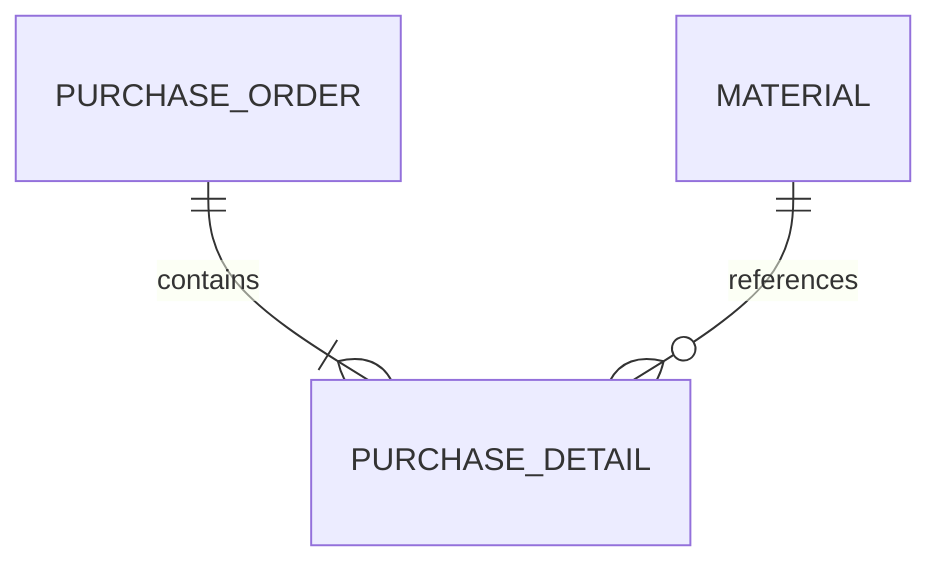

# 需求规格书模板（Phase 1）

> 本模板用于 JDY Hybrid 项目需求分析阶段，确保需求完整、可追溯、可验收。

---

## 1. 项目概述

| 字段 | 内容 |
|------|------|
| 项目名称 | |
| 项目编号 | |
| 客户名称 | |
| 简道云 App ID | |
| 项目目标 | （一句话描述核心业务价值） |
| 项目范围 | （明确包含 / 不包含的边界） |
| 预计上线日期 | |
| 项目经理 | |

### 1.1 背景与痛点
- 当前业务流程描述：
- 核心痛点列表：
- 期望改善指标：

---

## 2. 用户角色表

| 角色名称 | 角色标识 | 职责描述 | 对应简道云角色/部门 | 权限级别 |
|----------|---------|---------|-------------------|---------|
| 示例：仓库管理员 | warehouse_admin | 负责入库审核、库存盘点 | 仓储部-主管 | 读写 |
| | | | | |

---

## 3. 功能清单表

> **实现方式标注说明**：
> - `JDY` = 纯简道云表单/流程/仪表盘实现
> - `HYBRID` = 简道云 + 二开混合实现
> - `CUSTOM` = 纯自定义开发（不依赖简道云）

| 编号 | 功能模块 | 功能名称 | 功能描述 | 实现方式 | 优先级 | 关联流程 | 备注 |
|------|---------|---------|---------|---------|--------|---------|------|
| F001 | | | | JDY/HYBRID/CUSTOM | P0/P1/P2 | | |
| F002 | | | | | | | |

### 3.1 功能详细说明（按编号展开）

#### F001: [功能名称]
- **触发条件**：
- **输入数据**：
- **处理逻辑**：
- **输出结果**：
- **异常场景**：
- **验收标准**：

---

## 4. 核心流程 BPMN 描述

> 对每个核心业务流程提供以下信息：

### 4.1 [流程名称]

- **流程标识**：`PROC_XXX`
- **发起角色**：
- **参与角色**：
- **触发事件**：
- **结束事件**：

**节点清单**：

| 节点ID | 节点类型 | 节点名称 | 执行角色 | 关联表单 | 超时规则 | 分支条件 |
|--------|---------|---------|---------|---------|---------|---------|
| N01 | StartEvent | 开始 | - | - | - | - |
| N02 | UserTask | 提交申请 | 申请人 | form_xxx | - | - |
| N03 | Gateway | 金额判断 | - | - | - | amount > 5000 → N04; else → N05 |
| N04 | UserTask | 总监审批 | 总监 | - | 48h | - |
| N05 | EndEvent | 结束 | - | - | - | - |

**BPMN XML 片段**（可选，供引擎直接导入）：
```xml
<!-- 粘贴导出的 BPMN XML -->
```

---

## 5. 数据实体关系表

| 实体名称 | 对应简道云表单ID | 主键字段 | 核心字段列表 | 关联实体 | 关联方式 | 数据量预估 |
|----------|----------------|---------|-------------|---------|---------|-----------|
| 采购订单 | form_xxx | _id | 单号,供应商,金额,状态 | 采购明细 | 子表单 | 月增500 |
| 采购明细 | (子表单) | - | 物料,数量,单价 | 物料主数据 | 关联查询 | - |
| 物料主数据 | form_yyy | _id | 编码,名称,规格,单位 | - | - | 2000条 |

### 5.1 ER 关系图（文字描述或 Mermaid）



---

## 6. 非功能需求

| 类别 | 要求 | 验收标准 |
|------|------|---------|
| 性能 | 列表页加载 ≤ 2s（1000条数据） | Lighthouse / 实测 |
| 并发 | 支持 50 用户同时操作 | 压测报告 |
| 可用性 | SLA ≥ 99.5% | 月度统计 |
| 安全 | 敏感字段加密存储；操作日志完整 | 安全审计通过 |
| 兼容性 | Chrome 90+、Edge 90+、移动端H5 | 多端测试通过 |
| 数据备份 | 每日全量 + 实时增量 | 恢复演练通过 |

---

## 7. 环境要求

| 环境 | 用途 | 地址/配置 | 负责人 | 就绪状态 |
|------|------|----------|--------|---------|
| 简道云生产环境 | 正式运行 | app_id: xxx | | ☐ |
| 简道云沙箱环境 | 开发测试 | app_id: yyy | | ☐ |
| 二开后端服务器 | API服务 | IP/域名: | | ☐ |
| 前端部署环境 | H5/PC页面 | CDN/Nginx: | | ☐ |
| 数据库 | 二开数据存储 | MySQL/PG: | | ☐ |
| CI/CD | 自动构建部署 | Jenkins/GitLab: | | ☐ |

---

## G1 门禁检查清单

> ✅ 全部通过方可进入 Phase 2 原型设计阶段

| # | 检查项 | 通过 | 责任人 | 备注 |
|---|--------|------|--------|------|
| 1 | 项目概述完整，范围边界清晰 | ☐ | PM | |
| 2 | 用户角色表已定义，权限矩阵无遗漏 | ☐ | BA | |
| 3 | 功能清单每项均标注实现方式（JDY/HYBRID/CUSTOM） | ☐ | BA | |
| 4 | HYBRID/CUSTOM 功能均有详细验收标准 | ☐ | BA | |
| 5 | 核心流程 BPMN 节点清单完整，分支条件明确 | ☐ | SA | |
| 6 | 数据实体关系表已建立，关联方式已确认 | ☐ | SA | |
| 7 | 非功能需求有量化验收标准 | ☐ | PM | |
| 8 | 开发/测试环境已就绪或已有明确准备计划 | ☐ | DevOps | |
| 9 | 客户已签字确认需求规格书 | ☐ | PM | |
| 10 | 需求变更管理流程已约定 | ☐ | PM | |

---

*文档版本: v1.0 | 最后更新: YYYY-MM-DD | 作者: ___*
